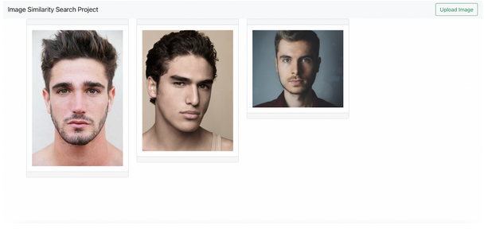
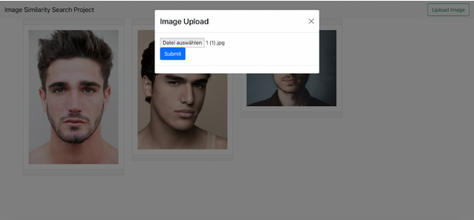

<h1>Image Similarity Search Project Dokumentation 01 - Kalenderwochen 43/44</h1>
<h2>Gruppenmitglieder (Joris Müller, Anne Schlangstedt, Julia Scherschinski, Paul Gronemeyer, Fabian Löffler, Luke Mikat)</h2>

<h2>Anforderungen</h2>

- Single Page Anwendung
- Dataset soll austauschbar sein
- Vergebung von Tokens für Sessions
- Die Anzahl der ähnlichen Bilder soll anpassbar sein
- Die Image-Map soll interaktiv erkundbar sein
- Image Upload
- vergleichen von hochgeladenen Bild mit dem Dataset

<h2>Tools</h2>

- React Frontend - Nutzung der D3.js Bibliothek zur Darstellung der interaktiven Map
- Python Server Backend - zunächst Flask
- Nutzung der FAISS Library und NumPy

<h2>Prototypen</h2>

Es wurden in der letzten Woche zwei interaktive Prototypen erstellt, die die spätere Funktionalität der Anwendung grafisch darstellen sollen.   
   
- <https://xd.adobe.com/view/41982007-401c-4e0d-803e-edce7190e816-14cb/?fullscreen>   
      
- <https://www.figma.com/proto/KRSOg1mhXzvA3hEeAfuyCK/Image-Similarity-Search-Project?node-id=3%3A4&scaling=min-zoom&page-id=0%3A1&starting-point-node-id=3%3A4>  

<h2>Fortschritte Frontend</h2>

<b>Anne</b> 
- React Server aufgesetzt
- Grundlegende Funktionalitäten implementiert
- Bilder von DB empfangen (Backend noch nicht verknüpft)
- Bilder hochladen
- Bilder auf der Hauptseite anzeigen
- Redux Store und Redux Thunk verknüpft
  

   
  

Beim Aufsetzen des React Frontends habe ich mich stark an den Codebeispielen von der Vorlesung “Web Engineering 2” von Prof. von Klinski orientiert. 
 

<b>Fabian</b> 
- Selbststudium React und D3.js
- Erstellung der Prototypen
  

<b>Paul</b> 
- Aneignen von React durch Videos aus Web Engineering 2
- Erstellung der Prototypen
  

<h2>Fortschritte Backend</h2>

<b>Joris</b>
- Optionen für Backend-Server in Python exploriert
- vorerst für Flask in Kombination mit Flask-RESTful entschieden
- Anaconda Environment aufgesetzt
- Einbindung von faiss-cpu, Flask und anderen packages
- plattformübergreifendes möglichst einfaches Aufsetzen der Umgebung
- Grundlegenden Flask-Server aufgesetzt mit (ausbaubaren) Funktionen wie:
- hochgeladene Bilder empfangen
- Bilder vom Server beziehen
- Erstellung der Prototypen
  

<b>Luke</b> 
- Erstellung der Prototypen
- Dokumentation
- Recherche und Auswahl eines Datasets zum Testen der Anwendung
- Mit der FAISS Dokumentation und NumPy beschäftigt 
  

<b>Julia</b> 
- Erstellung der Prototypen
- Mit der FAISS Dokumentation und NumPy beschäftigt 
 
 

<h2>Dataset</h2>
Wir haben uns für ein Gesichter Dataset entschieden, welches wir für die Entwicklung der Anwendung zunächst kleiner gehalten haben. Momentan befinden sich in unserem Dataset um die 500 Bilder von unterschiedlichen Gesichtern.

  
<b>Lizenz und Quelle :</b>
  
<https://www.kaggle.com/ashwingupta3012/human-faces/metadata> - CC0: Public Domain, No Copyright
 
 
