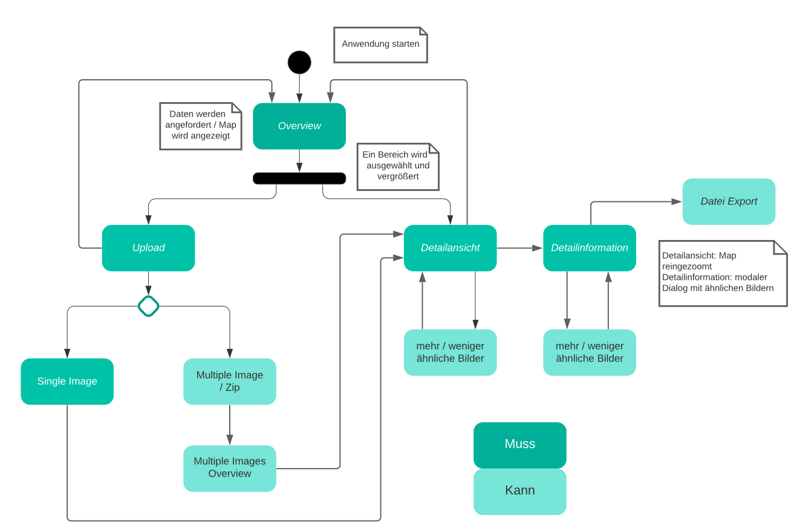

<h1>Image Similarity Search Project Dokumentation 02 - Kalenderwochen 45/46</h1>
<h2>Gruppenmitglieder (Joris Müller, Anne Schlangstedt, Julia Scherschinski, Paul Gronemeyer, Fabian Löffler, Luke Mikat)</h2>

<h2>Überarbeiteter Prototyp</h2>

- <https://xd.adobe.com/view/41982007-401c-4e0d-803e-edce7190e816-14cb/> 

<h2>Fortschritte</h2>
Das Frontend kann nun Anfragen an das Backend schicken und Bilder des Datensatzes auf einem Canvas mappen. 
Im Backend können die Bilder eines Datensatzes mit FAISS aufgrund ihrer RGB Werte verglichen werden. 
Die genauen Pfade zu den Bildern des Datensatzes können jetzt in einer MongoDB Datenbank gespeichert werden. 
Der Ablauf der verschiedenen Funktionen, wurde aus Sicht eines Nutzers detailliert in den User Stories beschrieben. 
Diese Abläufe werden ebenfalls in dem erstellten Aktivitätsdiagramm visuell dargestellt. 
Es wird momentan an einer Zoomfunktionalität in D3 gearbeitet, mit welcher es möglich sein soll, aus der Overview heraus verschiedene Bereiche der Map zu vergrößern. 

<h2>Fortschritte Frontend</h2>

<b>Anne</b> 
- Einarbeitung in D3
- D3 in React einbinden und Bilder gemäß ihrer Koordinaten auf den Canvas mappen
 

<b>Fabian</b> 
- Datensatz in D3 einbinden
- Selbststudium React
- Selbststudium D3.js

<b>Paul</b> 
- D3 Zoomfunktionalität
- Selbststudium React
- Selbststudium D3.js
  

<h2>Fortschritte Backend</h2>

<b>Joris</b>
- Umstrukturieren und Aufräumen des Server-Codes
- Explorieren von Optionen für eine passende Datenbank
- Aufsetzen der MongoDB/PyMongo Datenbank
- Anbindung von MongoDB/PyMongo Datenbank an das Backend
- Finalisierung der Rest API
- Basic FAISS Image Comparison
  

<b>Luke</b> 
- Überarbeitung des Prototypen
- User Stories
- Aktivitätsdiagramm
- Aneignung FAISS
- Dokumentation
- Anpassung des Datensatzes und Auslagerung in Cloud
  

<b>Julia</b> 
- Aktivitätsdiagramm
- Aneignung FAISS
- Einbindung FAISS
 
 

<h2>Aktivitätsdiagramm</h2>
 

   
 

<h2>User Stories</h2>

<b>1. Single Image Upload :</b>  

Der Nutzer startet die Anwendung und befindet sich zunächst in einer Overview des Datensatzes, 
welche die Bilder als eine Map darstellt.  
Es soll ein Bild für das Vergleichen mit dem Datensatz hochgeladen werden. Dafür klickt der 
Nutzer auf den „Upload Image“ - Button. Nun hat er die Möglichkeit sich zwischen einem Single 
oder Multiple Image Upload zu entscheiden. Er wählt „One Image“. 
Er kann die Bilder entweder durch ein Auswählen im Verzeichnis oder Drag&Drop einfügen. 
Nachdem der Nutzer sein Bild hochgeladen hat, wird dieses in der Overview dargestellt und 
farblich hervorgehoben. Er kann die Map nun frei erkunden. Durch einen Klick auf den Bereich in 
dem sich das hochgeladene Bild befindet, kann der Nutzer eine Detailansicht dieses Bereiches 
aufrufen. In dieser Detailansicht werden alle Bilder des Bereiches näher und erkennbarer 
dargestellt. 
Der Nutzer hat die Möglichkeit die Anzahl der ähnlichen Bilder mit einem Slider anzupassen. 
Er kann ebenfalls die detaillierten Informationen in einem Modal Dialog aufrufen, indem er den 
Informationsbutton betätigt. In dieser Ansicht werden das hochgeladene Bild und die ähnlichen 
Bilder mit wichtigen Informationen angezeigt. Der Nutzer hat zu jeder Zeit die Möglichkeit wieder 
in die vorherigen Ansichten zu wechseln, andere Bilder zum Vergleichen auszuwählen oder andere 
Bilder hochzuladen. ´
 

<b>2. Untersuchung des Datensatzes, ohne Upload :</b>  

Der Nutzer startet in der Overview des Datensatzes. Er kann den Datensatz frei erkunden. Bei 
Bedarf, können einzelne Bereiche des Datensatzes, durch ein klicken auf diese, im Detail 
aufgerufen werden. In dieser näheren Ansicht kann der Nutzer ein Bild auswählen und 
hervorheben. Zu diesem werden nun die ähnlichsten Bilder in dem Datensatz angezeigt.  
Die Anzahl dieser Bilder kann ebenfalls mit einem Slider angepasst werden. Der Nutzer benötigt 
mehr Informationen über diese Bilder und öffnet die Informationsansicht, welche durch ein klicken 
auf den Informationsbutton aufgerufen werden kann. In dieser Ansicht werden dem Nutzer unter 
anderem die Dateinamen der Bilder und ihre Ähnlichkeit zueinander mit einem bestimmten Wert 
angezeigt. Der Nutzer kann zu jeder Zeit in die Detailansicht und die Overview zurückkehren und 
ein anderes Bild zum Vergleichen auswählen. 
 

<b>3. Multiple Image Upload :</b>  

Der Nutzer möchte mehrere Bilder zum Vergleichen, mit dem Datensatz, hochladen. Dazu klickt er 
auf den „Upload Image“ - Button. Er wählt „Multiple Images“ aus. Diese erscheinen nach 
erfolgreichen Hochladen in der Overview des Datensatzes und werden farblich hervorgehoben. 
Nun können die Detailansichten der Bereiche in denen sich die hochgeladenen Bilder befinden, 
durch einen Klick aufgerufen werden. Es kann zwischen den hochgeladenen Bildern mit den 
Pfeilbuttons gewechselt werden. Zu jedem einzelnen Bild kann nun die Anzahl der ähnlichen 
Bilder angepasst werden und detaillierte Informationen zu diesen aufgerufen werden. Ebenso 
kann der Nutzer Bilder wieder aus der Auswahl entfernen.
 
