<h1>Image Similarity Search Project Dokumentation 03 - Kalenderwoche 47</h1>
<h2>Gruppenmitglieder (Joris Müller, Anne Schlangstedt, Julia Scherschinski, Paul Gronemeyer, Fabian Löffler, Luke Mikat)</h2>

<h2>Fortschritte Frontend</h2>

<h3>Anne (@s82881)</h3>

<b>#14 Informationsview</b> 

- Die Informationsview wurde angelegt. Dabei wurden Eventlistener an alle D3 Image Objekte angehangen. Da die Informationsview bislang noch mit Testdaten befüllt ist und bislang noch nicht über die Detailview sondern direkt über die Map erreichbar ist, ist das Issue noch nicht abgeschlossen.

<b>#20 Modal Dialog für Informationsview</b> 

Der Modaldialog für die Informationsview wurde angelegt. Notwendige Schritte waren : 
- hochauflösendes Bild in Modaldialog anzeigen 
- Slider einbauen Issue <b>#19</b> (closed) der bestimmt wie viele ähnliche Bilder angezeigt werden sollen 
- x ähnliche Bilder anzeigen 
- Informationen zum Bild anzeigen (Dateiname, Größe etc.) 
- Scrollbar einbauen beim Container mit ähnlichen Bildern Issue <b>#24</b> (closed) 
- Modaldialog mit echten Bildern aus dem Testdatensatz befüllen Issue <b>#25</b> 

<b>#19 Slider</b> 
- Slider wurde erfolgreich in den Modaldialog der Informationsview eingebaut, sodass die Anzahl der angezeigten, ähnlichen Bilder verändert werden kann.

<b>#24 Scrollbar</b> 
- Scrollbar wurde im Container eingebaut, der die ähnlichen Bilder zeigt.

 
*Aktueller Stand der Informationsview* 

 

<h3>Fabian (@s78278)</h3>

<b>#8 Datensatz in D3 einbinden</b>

- wurde in kleinere Issues aufgeteilt

<b>#26 fetch one image from database</b>

- Es wurde ein Thumbnail aus der dem Backend bezogen.
- Um das Thumbnail zu beziehen wurde die entsprechende URL hardcoded.
- Das Bild wurde vervielfältigt und mit randomisierten Koordinaten übergeben und dargestellt.

 
*Canvas mit einem Thumbnail* 

<b>#27 fetch thumbnails from database</b>

- Im zweiten Schritt konnte eine frei wählbare Menge an Thumbnails geladen und mit randomisierten Koordinaten übergeben und dargestellt werden.

 
*Canvas mit allen Thumbnails des Datensatzes* 

<b>#28 fetch thumbnails with meta-data from database</b>

- Im dritten Schritt wurden alle Thumbnails geladen und mit den errechneten Koordinaten übergeben und dargestellt. 
- Alle Koordinaten wurden für die Darstellung gleichermaßen verändert

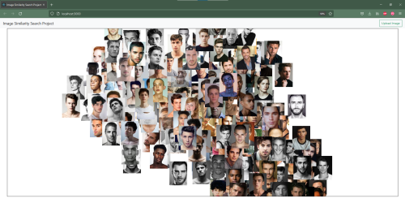 
*Alle Thumbnails des Datensatzes mit den im Backend berechneten Koordinaten* 

<h3>Paul (@s82130)</h3>

<b>#7 Basic Zoom und Pan mit D3 implementieren</b>

- Container "panable" machen und einfache Zoomfunktion zur Vergrößerung der Ansicht implementieren.
- Basic Zoom und Pan implementiert.
- Zoom muss verfeinert werden, damit Koordinaten sich beim Ranzoomen nicht überlappen, siehe Issue <b>#15</b> "Zoomfunktionalität"

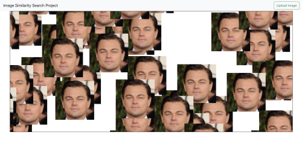

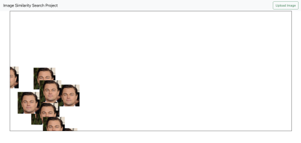 
*Zoomfunktionalität in der Overview* 

<b>#15 Zoomfunktionalität</b>

- D3 Canvas als Koordinatensystem umsetzen, um "dynamischen" Zoom zu implementieren. D.h., beim Ranzoomen werden die Bilder nicht größer, sondern das Koordinatensystem und somit die Abstände. So kann für User eine übersichtlichere Ansicht erzeugt werden.

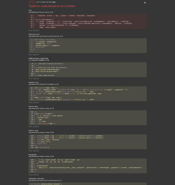 
*TypeError: scale.domain is not a function (noch nicht gelöst)

Ziel: D3 Canvas als Koordinatensystem umsetzen, um "dynamischen" Zoom zu implementieren. D.h., beim Ranzoomen werden die Bilder nicht größer, sondern das Koordinatensystem und somit die Abstände. So kann für User eine übersichtlichere Ansicht erzeugt werden.

  

<h2>Fortschritte Backend</h2>

<h3>Joris (@s81764)</h3>

<b>#14 Routen für den Download von mehreren Bildern / Metadaten / mehreren IDs erstellen</b>

Beim Bearbeiten ist aufgefallen, dass die Datenbankstruktur überarbeitet werden soll, siehe <b>#26</b> 
Es wurden drei neue Routen erstellt: 

- /images/thumbnails/all sendet alle thumbnails in der Datenbank als zip-Verzeichnis zurück
- /images/all/metadata sendet alle Metadaten von Bildern in der Datenbank zurück
- /images/ids sendet alle ids zurück

Weitergeführt in Issue <b>#27</b>, in welchem die Daten für eine andere Anzahl als “alle” und “nur 1” zurückgegeben werden sollen.

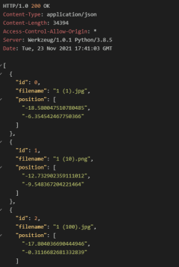 
*Ausschnitt der response mit allen Metadaten der Bilder*  

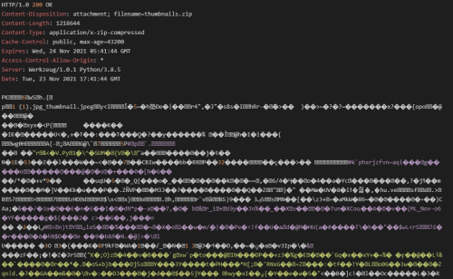 
*Ausschnitt der response mit allen thumbnails im zip-Verzeichnis (base64 encoded)*  

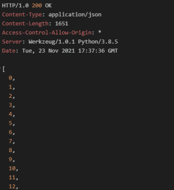 
*Ausschnitt der response mit allen IDs*  

<b>#26 Thumbnails und Metadaten in Datenbankstruktur einarbeiten</b>

Wie bei Issue <b>#14</b> genannt wurde währenddessen bemerkt, dass die Datenbankstruktur überarbeitet werden muss. 
Die Thumbnails wurden vorher beim Start der Applikation erstellt und in einem statischen Ordner gespeichert. 
Nun werden sie neben den Metadaten (siehe <b>#28</b>) in der Datenbank gespeichert. 
Um die Bilder zu speichern wurde [Gridfs](https://pymongo.readthedocs.io/en/stable/api/gridfs/index.html) benutzt. 
Es mussten einige Methoden in der Datenbank und Applikation umgeschrieben werden, um mit der neuen Speicherart umgehen zu können. 

<b>#29 Richtige Koordinaten beim Image Upload zurückgeben</b>

In <b>#23</b> wurde durch @s82765 durch Dimensionsreduktion mit t-SNE das Berechnen von 2D-Koordinaten für die Bilder in der Datenbank ermöglicht. 
- Unterpunkt von <b>16</b> 
- Speichern ist in <b>#22</b> beschrieben 
- Es wurde die Klasse in die Applikation eingebunden, indem beim Start der Applikationen Koordinaten berechnet werden und beim Upload eines einzelnen Bildes für das gesendete Bild Koordinaten auf Basis der anderen Koordinaten erstellt wurden. 

<b>#22 Koordinaten speichern</b>

@s82765 s Implementierung von t-SNE aus <b>#23</b> produziert Koordinaten, welche in der Datenbank neben Pfaden und Thumbnails gespeichert werden. 
Optimiert werden soll dies in <b>#33</b>, da dadurch bei einem unveränderten Datensatz die Bilder nicht immer neu geladen werden. 

<b>#8 Einbindung FAISS</b>

Es wurde ein Modul erstellt, welches eine Hülle für einen Faiss-Index ist.  

- Unterpunkt von <b>#16</b>
- Zur Zeit gibt es nur den IndexFlatL2, weitere Indizes sollen in <b>#30</b> umgesetzt werden. 

<b>#16 Bild zum Server schicken, für welches die nächsten Nachbarn und die Koordinaten zurückgegeben werden</b>

- Es sollte ein Bild an das Backend zusammen mit einer Zahl k, der Anzahl der zu suchenden Nachbarn, gesendet werden können.
- Zurück werden die Distanzen, Indizes und Ähnlichkeitsprozentwerte (siehe <b>#28</b>) der nächsten Nachbarn und die 2D-Koordinaten des geschickten Bildes gesendet. 

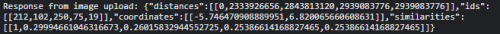 
*Response vom POST Requests von /upload*  

<b>#36 Route erstellen für das Finden der nächsten Nachbarn eines Bildes aus der Datenbank</b>

Es wurde eine Route erstellt, mit der die nächsten Nachbarn eines Bildes aus der Datenbank berechnet und zurückgegeben werden können. Diese Route baut vom Schema auf <b>#16</b> auf.

 
*Response des GET Requests von faiss/getNN/3*  

<h3>Luke (@s82765)</h3>

<b>#23 t-SNE Dimensionsreduktion</b>

- Berechnung der Koordinaten des Datensatzes wurde zunächst mit der TSNE-Methode des sklearn Packages umgesetzt.
- Die Koordinaten wurden zunächst in einem Streudigramm angezeigt, um diese auf ihre Korrektheit zu überprüfen.
- Da die TSNE-Methode des verwendeten Packages keine Integration von zusätzlichen Test-Points in die bestehende t-SNE Map zulässt, wurde nach Alternativen Implementierungen gesucht.
- Dabei stieß ich auf openTSNE - in dieser Implementierung ist es möglich auf einer bereits berechneten Map neue Testpunkte hinzuzufügen, was die Berechnungszeit für einen Upload <b>(#16 Image Upload)</b> stark reduziert.

- In dieser Darstellung wird der gesamte Datensatz (blau) und das hinzugefügte Testbild (rot) angezeigt. Ein berechnen der Koordinaten von mehreren Bildern <b>(#17 Multiple Upload)</b>, aufgrund der bestehenden Map ist ebenfalls nachträglich möglich.

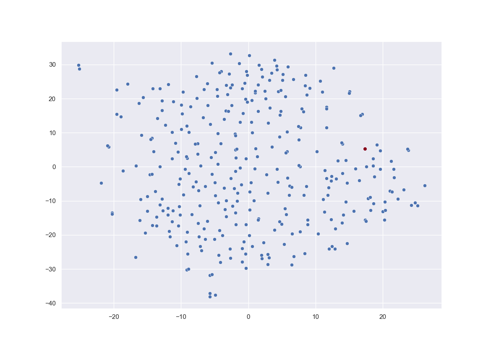  

<b>#22 Koordinaten speichern</b>

- Es wurde eine TSNE Klasse umgesetzt in welcher die Koordinaten zur Laufzeit gespeichert werden. Diese werden ebenfalls durch die von Joris (@s81764) implementierten Logik persistent in der Datenbank gespeichert, um bei einem Neustart der Anwendung unnötige Rechenzeiten zu verhindern.  

<b>#28 Weitere Metadaten / Ähnlichkeitswerte</b>

- Bei der Berechnung der Nächsten-Nachbarn durch faiss, wird die euclidean distance verwendet. Diese soll nun als Ähnlichkeitswert dargestellt werden, um den Nutzer einen besseren Eindruck der Ähnlichkeit der Bilder zu geben.

- Die euclidean distances werden in eine prozentuale Ähnlichkeit umgerechnet und können dem Nutzer im Frontend präsentiert werden.

- In der unteren Abbildung wurde die Berechnung getestet. Das Query-Image wurde drei mal in den Datensatz kopiert. Die dritte Kopie wurde in einer Bildbearbeitung verändert. Die ersten beiden Kopien geben eine 100 prozentige Ähnlichkeit zurück. Die bearbeitete Kopie eine Ähnlichkeit von 94%.  

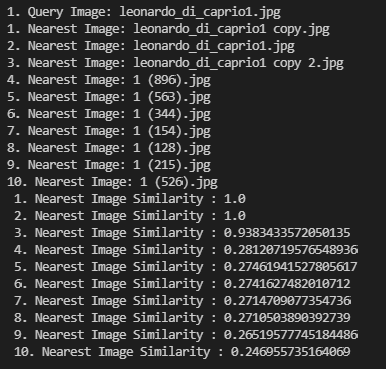  

- Das Modul similarities.py wurde in das api-package hinzugefügt, welches es ermöglicht die prozentuale Ähnlichkeit der nächsten Nachbarn zu dem Query-Image, mit einem Aufruf der 'get_similarities' Funktion zu erhalten. Dieser Funktion müssen die euclidean Distances 'D' und die Anzahl der nächsten Nachbarn 'k' übergeben werden. Die Funktion gibt ein Array der prozentualen Ähnlichkeiten zurück.
Es ist möglich eine Berechnung für mehrere Query-Images mit einem Aufruf der Funktion gleichzeitig durchzuführen.

<b>#35 Dokumentation KW 47</b>

- Dokumentation der letzten Fortschritte aller Gruppenmitglieder für die Präsentation am 24.11.21
  

<h3>Julia (@s75934)</h3> 

<b>#8 Einbindung FAISS</b>

- Es wurde sich ausgiebig mit Faiss mit Hilfe von Tutorials auseinander gesetzt und ein Dummie Code geschrieben der anhand von RGB Werten Bilder vergleicht
- Es gab kleine Probleme den Algorithmus auf unseren Code anzuwenden

<b>#24 Sift Algorithmus</b>

- Aneignung des SIFT Algorithmus anhand von Tutorials 
Abwägung, ob SIFT, SURF oder ORB am Besten - hier muss geschaut werden was am effizientesten oder von den Keypoints am detailliertesten für unseren Bildervergleich wäre.

- Beim Sift Algorithmus werden die Bilder erst in GrayScale konvertiert, um nicht RGB Werte mit einzubeziehen 
- Generierung/ Überprüfung der Keypoints/ Bildmerkmale  
- Generierung des Descriptors, der für einen eindeutigen Schlüsselpunkt steht, hier werden nun auch benachbarte Pixel, Größe und Ausrichtung hinzugezogen 

 
*Zuerst wurde ein Image aus unserer Datenbank verwendet, um die Keypoints erstmal ausgeben zu lassen und visuell dazustellen*

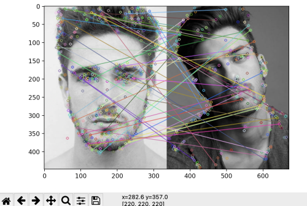 
*Danach wurden zwei Bilder aus der Datenbank verglichen und deren Ähnlichkeit anhand der übereinstimmenden Keypoints bestimmt*

- Die Linien beim Vergleich der Bilder stehen für Übereinstimmungen 
 
 
