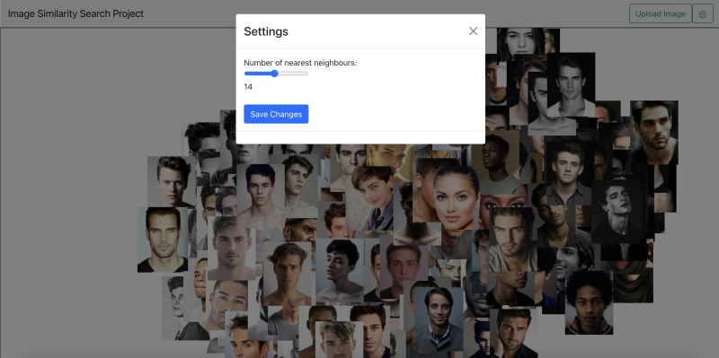
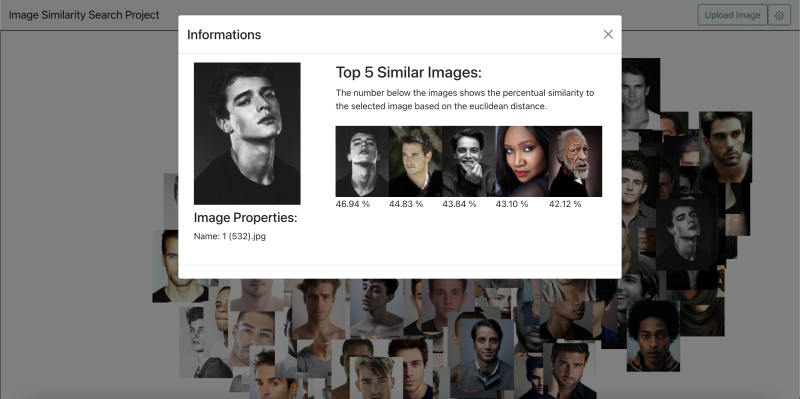
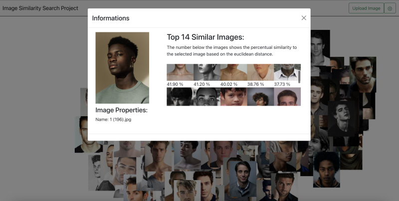
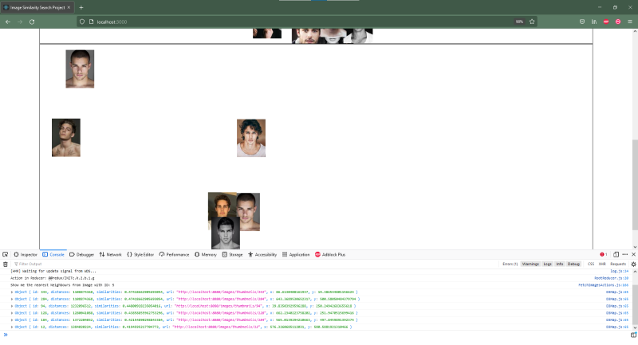
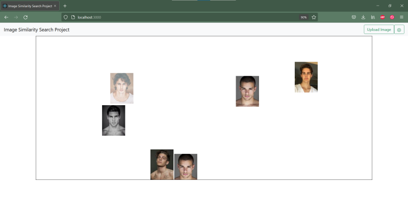
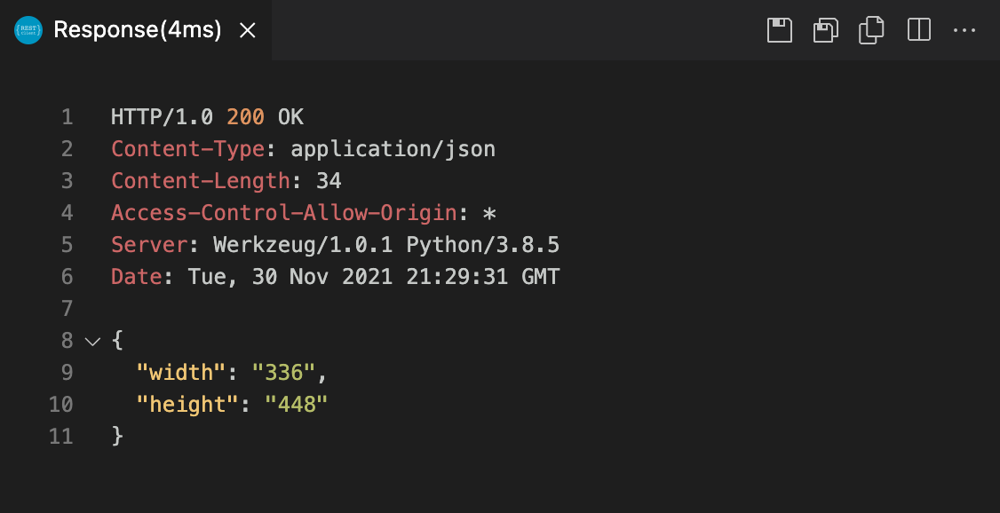
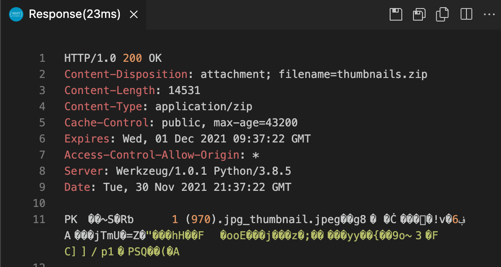
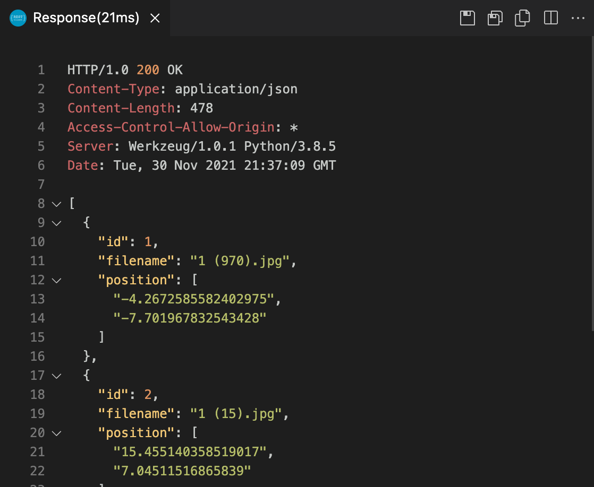
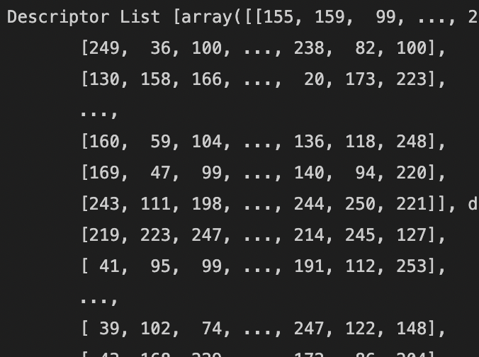
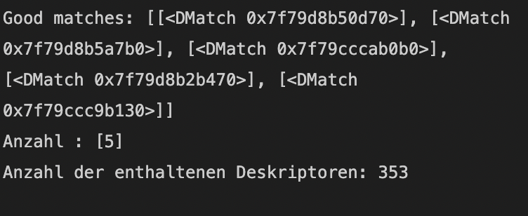

<h1>Image Similarity Search Project Dokumentation 04 - Kalenderwoche 48</h1>
<h2>Gruppenmitglieder (Joris Müller, Anne Schlangstedt, Julia Scherschinski, Paul Gronemeyer, Fabian Löffler, Luke Mikat)</h2>

<h2>Fortschritte Frontend</h2>

<h3>Anne (@s82881)</h3>

<b>[#31](https://gitlab.bht-berlin.de/image-similarity-search/image-similarity-search-frontend/-/issues/31) D3 Map: Settings-Button mit Slider für Anzahl der nächsten Nachbarn
</b> 

- Slider aus Informationsansicht entfernen und in separates Menü auslagern, sodass Setting einmal eingestellt werden kann und nicht unnötig viele Bilder aus der Datenbank geladen werden.

- neue SettingsButton Komponente geschrieben mit einem Slider, um die Anzahl der nächsten Nachbarn, die in der Informationsansicht dargestellt werden, verändern zu können

- sliderValue wird über den rootReducer zwischen Komponenten ausgetauscht (D3Map weiß, welcher Wert in den Settings eingestellt wurde)

 
*Settings* 

<b>[#30](https://gitlab.bht-berlin.de/image-similarity-search/image-similarity-search-frontend/-/issues/30) Informationsview: Nächte Nachbarn korrekt darstellen
</b> 

- Nächste Nachbarn des ausgewählten Bildes anzeigen, inclusive der Distanzen / prozentualen Ähnlichkeiten zum Ursprungsbild. 
- Branch responseHandling von Fabian in den d3_Informationsansicht Branch gemerged
- Code angepasst, sodass die Informationsview die nächsten Nachbarn eines Bildes mit der korrekten Bild-ID und der Anzahl k, die durch den Slider im Settings Menü eingestellt wurde, abrufen kann
- prozentuale Distanzen der nächsten Nachbarn zum Ursprungsbild erscheinen nun unter jedem Bild

 
*5 Nächste Nachbarn* 

<b>[#37](https://gitlab.bht-berlin.de/image-similarity-search/image-similarity-search-frontend/-/issues/37) BUG: Informationsansicht Slider Value</b> 

Beim Verändern des Slider Values über das Settings Menü, tritt daraufhin ein Fehler im Informations-Modal-Dialog auf.

- Bug fixed: Der Slider-Wert wurde als String an die fetchNearestNeighbours() Funktion übergeben, sodass ein internal server error auftrat. Nun wird der Wert mit parseInt() in einen Integer umgewandelt und das Problem ist behoben.

 
*14 Nächste Nachbarn* 

<b>[#38](https://gitlab.bht-berlin.de/image-similarity-search/image-similarity-search-frontend/-/issues/38) BUG: Zoom Funktion</b> 

D3 Zoom funktioniert nicht (Map bleibt statisch).
- alternative Implementierungsansätze ausprobiert
- bislang leider erfolglos

     

<h3>Fabian (@s78278)</h3>

<b>[#34](https://gitlab.bht-berlin.de/image-similarity-search/image-similarity-search-frontend/-/issues/34) Anpassung/Erweiterung der Anfragen an das Backend</b>

Anpassung der bisherigen Anfragen an das Backend und deren Handling  
folgende Funktionen wurden bearbeitet:
- fetchAllThumbnailMeta() + handleAllMetaResponse
- fetchOneThumbnailMeta() + handleOneMetaResponse()
- fetchOneImage() + handleImageResponse

Erweiterung durch die Anfrage der nächsten Nachbarn mit der Funktion:
	
- fetchNearestNeighbours() 
und der Handling-Funktion: 
- handleMetaNearestNeighboursResponse() 

<b>[#35](https://gitlab.bht-berlin.de/image-similarity-search/image-similarity-search-frontend/-/issues/35) Anpassung/Test der fetchNearestNeighbour Funktion</b>

- Anpassung des Request-Headers und des Response Handlings der fetchNearestNeighbours - Funktion
- Test der Darstellung der Bilder in einem Test-Container.
- Feststellung: -> Duplikate in der Datenbank -> Vergleichsalgorithmus funktioniert

 
*Nächste Nachbarn-Funktion im Test-Container* 

<b>[#36](https://gitlab.bht-berlin.de/image-similarity-search/image-similarity-search-frontend/-/issues/36) Markierung des ausgewählten Bildes</b>

- Ein ausgewähltes Bild soll beim auswählen via "click-event" markiert und bei erneutem “click” wieder in den Ausgangszustand zurückspringen

aktueller Stand:
- Bild ändert seine Opacity bei einem click, jedoch springt es noch nicht in den Ausgangszustand zurück

 
*Markierung von Bildern* 

<h3>Paul (@s82130)</h3>

  

<h2>Fortschritte Backend</h2>

<h3>Joris (@s81764)</h3>

<b>#27 Routen für flexible Menge an ids für Thumbnails/Metadaten erstellen und einbinden</b>

- Die Umsetzung erfolgte durch @s82765. Die von ihm erstellten Routen wurden in die bestehende Struktur eingearbeitet. Dafür gab es kleine Erweiterungen in der Datenbank.

<b>#17 Multiple Upload</b>

- Die Route /upload wurde von @s82765 bearbeitet und von mir in die Struktur der Applikation eingefügt.

<b>#33 Prüfung ob Änderungen am Datensatz vorgenommen wurden</b>

Ziel war es, unnötiges erneutes Laden und Speichern von Daten zu minimieren und somit einen wiederholten Serverstart schneller zu machen. 
Das t-SNE-Embedding wird nun gespeichert. 
Wird das Programm neu gestartet und erkennt keine Änderung in der Datenbank im Bezug auf den data-Ordner, werden die vorher gespeicherten Daten geladen. 
Erkennt das Programm einen Unterschied zwischen data-Ordner und Datenbank, wird alles neu geladen.
Ob dies effizienter passieren kann, wird in #45 exploriert

<b>#31 Größe der Bilder beim Upload checken und ggf. zuschneiden</b>

- Es wird nun beim ersten Laden der Bilder und beim Upload von Bildern aus dem Frontend überprüft, ob die Bildgrößen übereinstimmen
- Das Zuschneiden wurde nicht erledigt und wird in #44 weitergeführt

  
*Response auf get size*

<b>#39 BUG Route /faiss/getNN/<id> erlaubt keinen request body</b>

- Berichtet von @s78278
- Fälschlicherweise wurde statt POST GET in dieser Route benutzt, wodurch kein body mit dem request mitgegeben werden konnte. Diese und andere Routen mit einen ähnlichen Problem wurden zu POST geändert

<b>#40 BUG beim Aufruf von /faiss/getNN/284, Error 500</b>

- Berichtet von @s82881
- Durch im Datensatz vorhandene Duplikate entstanden im Programm Probleme, da die Bilder komplett gleich sind und somit, wenn mit faiss gesucht wird, das erste Bild im Index, das genauso aussieht, gefunden wird. Ruft man nun die faiss-Suche auf einem Bild (mit hoher id) auf und es existiert ein Duplikat mit kleinerer id, wird das Bild mit der kleineren id zuerst gefunden. Durch eine Prüfung im Code wurde dadurch eine Exception geworfen.
- Behoben wurde das Problem dadurch, dass nicht mehr davon ausgegangen wird, dass das erste Bild, dass faiss bei einer Suche zurückgibt, wenn das Bild selber schon im Index ist, das Bild selbst ist.

<h3>Luke (@s82765)</h3>

<b>#27 Routen für flexible Menge an ids für Metadaten, Thumbnails und Fullsize Images</b>

- Routen für multiple Metadaten und Thumbnails wurden implementiert und funktionieren. 
- Die Thumbnails werden in einer Zip-Datei komprimiert in der Response zurückgegeben.
- Zu diesen Routen wurden ebenfalls Tests in der test.http Datei hinzugefügt.
- Es stellte sich bei der Implementierung der MultipleFullsize Route heraus, dass diese keinen Vorteil gegenüber der wiederholten Anfrage auf OneFullsize hätte, denn die Fullsize Images werden nur in einer sehr begrenzten Anzahl, in der Informationsview, im Frontend benötigt.
Deshalb wird diese Funktion zunächst weggelassen.

  
*Response für mehrere Thumbnails - Zip komprimiert*

  
*Response für mehrere Metadaten*

<b>#17 Multiple Upload</b>

- Die Route und Funktion für den Multiple Upload wurde implementiert und orientiert sich sehr an dem Single Upload. Durch @s81764 wurde die MultipleUpload Route mit der Single Upload Route verbunden, so dass diese mit einer beliebigen Anzahl an hochgeladenen Bildern aufgerufen werden kann.

<b>#42 Dokumentation KW 48</b>

- Dokumentation der letzten Fortschritte aller Gruppenmitglieder für die Präsentation am 01.12.21
  

<h3>Julia (@s75934)</h3> 

<b>#24 Sift Algorithm</b>

- Code wurde generell nochmal etwas umgeschrieben und allgemeiner gehalten

  

- Mit Hilfe der ORB Funktionen wie zum Beispiel, detectAndCompute(), die Descriptoren der jeweiligen Bilder gespeichert, um darauf die Deskriptoren des Query Bildes und die aus der Datenbank zu vergleichen. 

  

- Bei Nutzung des "BFMatchers" und der Funktion knnMatch() enstand Problem: Es ließen sich die Anzahl der ähnlichsten Bilder (hier wurde eine Aussortierung vorgenommen, um nur die besten/ ähnlichsten Matches angezeigt zu bekommen), sowie die Ähnlichkeiten, welche in einem Int- Wert (siehe im Bild bei Good Matches, Beispiel: [<DMatch 0x7f79d8b50d70>]) angegeben wurden, ausgeben, jedoch gab es keine Auskunft, um welche Bilder es sich wirklich handelt. Deshalb habe ich versucht die Namen der Bilder mit den jeweiligen Deskriptoren mit Hilfe der zip Funktion zu einem Dictionary zu verbinden, um auch die Namen der ähnlichsten Bilder zurückzubekommen.

- Weiterer Lösungsansatz: Es wurden ebenfalls die Deskriptoren der Bilder gespeichert und sollten dann nicht mit dem BFMatcher und der knnMatch- Methode verglichen, sondern die euklidische Distanz zwischen den Deskriptoren, berechnet werden.

