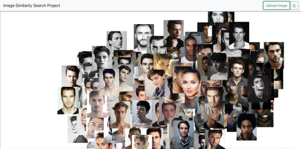
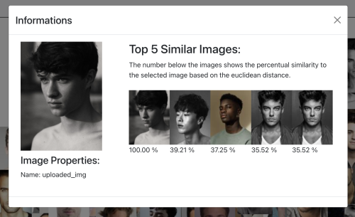
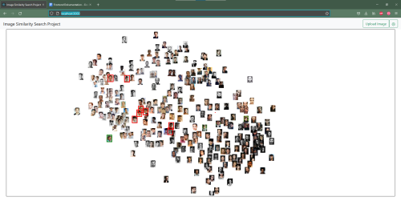
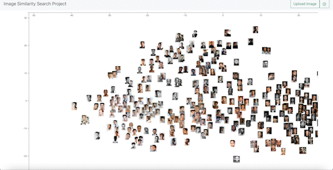
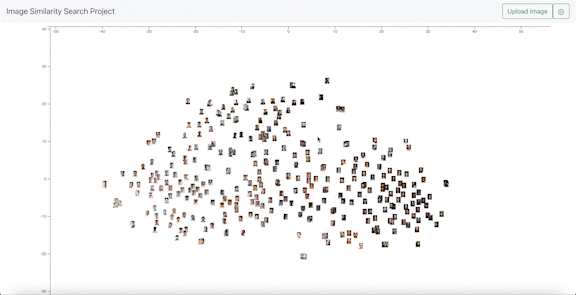
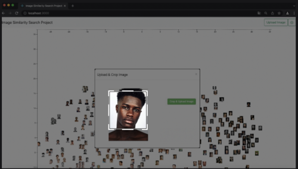
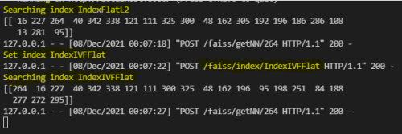

<h1>Image Similarity Search Project Dokumentation 05 - Kalenderwoche 49</h1>
<h2>Gruppenmitglieder (Joris Müller, Anne Schlangstedt, Julia Scherschinski, Paul Gronemeyer, Fabian Löffler, Luke Mikat)</h2>

<h2>Fortschritte Frontend</h2>

<h3>Anne (@s82881)</h3>

<b>[#44](https://gitlab.bht-berlin.de/image-similarity-search/image-similarity-search-frontend/-/issues/44) Store uploaded Image in Frontend</b> 

- Hochgeladene Bilder im Frontend zwischenspeichern, sodass sie in die Map eingefügt werden können.
- Bilder werden nun von der ImageUploadButton Komponente an den RootReducer geschickt und sind als Props in der D3 Map abrufbar 
- So werden nun in der D3 Map Komponente URLs zu jedem File, der hochgeladen wurde, erzeugt und im State der Komponente gespeichert. 

<b>[#21](https://gitlab.bht-berlin.de/image-similarity-search/image-similarity-search-frontend/-/issues/21) Display uploaded Image in Overview</b> 

- hochgeladene Bilder werden nun mit korrekter Größe und Koordinaten auf dem Canvas angezeigt
- bestehende Probleme: 
alte Uploads müssen noch von der Map entfernt werden, sobald neue Bilder hochgeladen werden  
Anzahl der angezeigten nächsten Nachbarn bei hochgeladenen Bildern nicht nachträglich veränderbar 

 
*Hochgeladenes Bild in der Overview anzeigen* 

 
*Informationsansicht eines hochgeladenen Bildes* 

<b>[#22](https://gitlab.bht-berlin.de/image-similarity-search/image-similarity-search-frontend/-/issues/22) Bild Upload</b> 

- multiple Image Upload funktioniert

<b>[#45](https://gitlab.bht-berlin.de/image-similarity-search/image-similarity-search-frontend/-/issues/45) Resize Images after Upload</b> 

- bislang ungelöst     

<h3>Fabian (@s78278)</h3>

<b>[#36](https://gitlab.bht-berlin.de/image-similarity-search/image-similarity-search-frontend/-/issues/36) Markierung des ausgewählten Bildes via "one-click"</b>

- Ein ausgewähltes Bild soll beim auswählen via "click-event" markiert und bei erneutem “click” wieder in den Ausgangszustand zurückspringen
- Bild ändert seine Opacity bei einem click, jedoch spricht es noch nicht in den ausgangszustand zurück
- Problem wurde mit einem "state", der jeweils vorher abgefragt wird gelöst
- Ausgangszustand wird jetzt beim zweiten click auch erreicht
- markStyle muss noch angapsst werden, leider nimmt das gewählte object nicht die zugewiesene border an. -> behandlung folgt in Issue #42 (closed)

<b>[#43](https://gitlab.bht-berlin.de/image-similarity-search/image-similarity-search-frontend/-/issues/43) Markieren der nächsten Nachbarn bei single-click</b>

- Wenn auf einem Bild ein "single-click" ausgeführt wird, soll das entsprechende Bild und deren eingestellte Anzahl an Nachbarn markiert werden.
erster Lösungsansatz, die gefundenen Nachbarn mit d3 genau wie das gewählte Bild zu manipulieren ist gescheiter
- zweite Idee: Sie über ihre eindeutige ID im DOM auszuwählen und darüber ihren Style zu ändern war die bessere Lösung
- nachträglich wurde dem svgCanvas noch eine klick-Funktion übergeben damit die Markierung der Bilder entfernt wird
- markStyle muss noch angepasst werden, leider nimmt das gewählte objekt nicht die zugewiesene border an. -> behandlung folgt in Issue #42 (closed)

<b>[#42](https://gitlab.bht-berlin.de/image-similarity-search/image-similarity-search-frontend/-/issues/42) markStyle des angeklickten Bildes anpassen</b>

- Problem aus Issue #36 (closed) und Issue #43 (closed)
- markStyle muss noch angepasst werden, leider nimmt das gewählte objekt nicht die zugewiesene Border an.
- Elemente haben keine "border"- style angenommen
- Erkenntnis: 
Die dargestellten Bilder sind SVG-Elemente, auf denen nicht alle CSS-Kommandos funktionieren
- Lösungsansatz: 
mit den Daten der gewählten Bilder (Größe und Position) ein Rechteck auf Canvas hinzufügen.

- fill-Attribut auf transparent setzen, damit ein Rahmen entsteht und das Bild darunter gesehen wird

 
*Markierung der nächsten Nachbarn in der Overview*  

<b>[#40](https://gitlab.bht-berlin.de/image-similarity-search/image-similarity-search-frontend/-/issues/40) wechsel in Informations-View via "double-click"</b>

- Per double-click auf ein Bild soll die Informations-View geöffnet werden.
- Nach kurzer Recherche konnte dies durch ein einfaches ändern des Parameters von "click" zu "dblclick" umgesetzt werden

<h3>Luke (@s82765)</h3>

*Diese Woche in das Frontend gewechselt*

<b>[#41](https://gitlab.bht-berlin.de/image-similarity-search/image-similarity-search-frontend/-/issues/41) Semantischer Zoom in der Overview</b>

- Dieser Zoom wird auf der Grundlage der bereits laufenden Issues [#15](https://gitlab.bht-berlin.de/image-similarity-search/image-similarity-search-frontend/-/issues/15) (closed) und [#38](https://gitlab.bht-berlin.de/image-similarity-search/image-similarity-search-frontend/-/issues/38) (closed) bearbeitet.
- Das Ziel ist es einen semantischen Zoom für die Overview zu implementieren, der es dem Nutzer erlaubt die angezeigten Bilder interaktiv zu erkunden. Dafür müssen die Bilder bei einer starken Vergrößerung eines Bereiches, ihre Größe verändern. Das Koordinatensystem muss je nach Zoom oder Verschieben des Streudiagrammes angepasst werden.

- Das Anpassen des Koordinatensystems aufgrund des Zooms oder der Verschiebung des Streudiagrammes funktioniert, nun muss die Größe der Bilder angepasst werden

 
*Semantischer Zoom, Größe der Bilder noch nicht berücksichtigt* 

- Die Größe der Bilder wird nun aufgrund der sich verändernden Zoom-Scale berechnet

 
*Semantischer Zoom, Größe der Bilder aufgrund der Zoom-Scale berechnet* 

- Nach der Implementierung des semantischen Zooms, trat ein Bug auf. Die Bilder reagieren nicht mehr auf die OnClick Events, da der Zoom-Layer diese Klicks blockiert. Der nächste Schritt ist es diesen Fehler zu beheben, indem das Click-Event an den unteren Layer weitergegeben wird oder die Struktur der Layers allgemein geändert werden muss.

- Die On-Click Events werden wieder aufgerufen. Die Bilder wurden auf den Zoom-Layer verschoben, um die Click-Events zu ermöglichen. Allerdings kann nun nicht mehr gezoomed werden, sobald der Cursor auf einem Bild liegt. Es wird versucht diesen Fehler zu beheben. Dieses Problem wird allerdings in einem anderen Issue behandelt - siehe Issue [#49](https://gitlab.bht-berlin.de/image-similarity-search/image-similarity-search-frontend/-/issues/49)

<b>#48 Dokumentation KW 49</b>

- Dokumentation der letzten Fortschritte aller Gruppenmitglieder für die Präsentation am 07.12.21

 

<h3>Julia (@s75934)</h3> 

*Diese Woche in das Frontend gewechselt*

<b>[#24](https://gitlab.bht-berlin.de/image-similarity-search/image-similarity-search-frontend/-/issues/24) SIFT/ORB Algorithm closed</b>

<b>[#45](https://gitlab.bht-berlin.de/image-similarity-search/image-similarity-search-frontend/-/issues/45) Resize Images after Upload</b>

- Realisierung des Zuschnitts von hochgeladenen Bildern
- User soll beim Nutzen der Applikation die Bilder anhand eines Rechtecks zuschneiden können
- Rechteck besitzt feste Größe
- Wie wird dies beim Multiupload umgesetzt?
Möglichkeit, wie es aussehen könnte:
(BildIUploadCrop)

- Andere Möglichkeit: Realisierung im Backend, was wiederum nicht ganz so benutzerfreundlich ist 

 
*Zuschneiden eines hochgeladenen Bildes*  

<b>[#47](https://gitlab.bht-berlin.de/image-similarity-search/image-similarity-search-frontend/-/issues/47) Einarbeitung React, D3</b>

- Wechsel zum Frontend
- lernen von React, D3 anhand von Tutorials, Dokumentationen und Dummie Code

<h3>Paul (@s82130)</h3>

- In dieser Kalenderwoche ebenfalls wegen Krankheit ausgefallen. Attest ist vorhanden.

 

<h2>Fortschritte Backend</h2>

<h3>Joris (@s81764)</h3>

<b>#30 Weitere Indizes für faiss zur Verfügung stellen</b>

- Vorher wurden die Entfernungen auf dem IndexFlatL2 berechnet.
- Struktur für Wechsel von Indizes zur Laufzeit aufgebaut, inkl. Routen
- IndexIVFFlat als ersten Test eingebunden

 
*Wechsel des FAISS-Index* 

<b>#49 Reduzieren der Größe des tsne Objekts</b>

- Es ist aufgefallen, dass die Größe des tsne-Embedding im Arbeitsspeicher zu groß ist, wodurch größere Datensätze nicht für eine Visualisierung in Frage kommen würden
- Das Embedding wurde vorher auf dem kompletten Datensatz berechnet
- Nun werden durch Hauptkomponentenanalyse (PCA) die Dimensionen zuerst auf (derzeit) 50 reduziert. Bessere Werte, auch für tsne, werden in #51 erforscht
- Dadurch ist die Berechnung wesentlich schneller, aber nicht so exakt wie vorher
- Durch Probleme mit dem pickeln von einigen dependency-Objekten wurde das Abspeichern und Laden des tsne-Embeddings wieder entfernt. Durch die schnelle Berechnung stellt dies jedoch kein Problem dar. 

<b>#21 faiss-Index speichern und laden</b>

- Ziel war es, zur Laufzeit den Index wechseln zu können
- Da die Indizes gerade bei sehr vielen Bildern sehr groß wurden, sollten diese Zwischengespeichert und geladen werden
- Aufgrund der Größe der Indizes war dieses Laden und Speichern sehr langsam und eignete sich nicht für einen Wechsel zur Laufzeit
- In #52 wird ein Wechsel zwischen Indizes implementiert, bei welchem die Indizes gleichzeitig im Arbeitsspeicher sind. Dafür müssen einige Änderungen aus #21 wieder auf den Stand - von #30 gebracht werden.
- Da der Arbeitsspeicher begrenzt ist, können so nur wenige Indizes gleichzeitig geladen sein.

