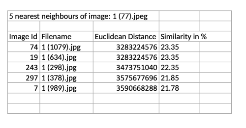
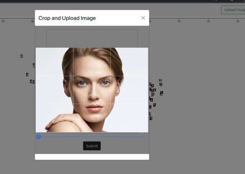
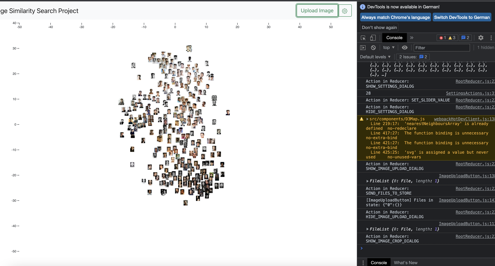
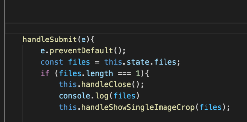

<h1>Image Similarity Search Project Dokumentation 06 - Kalenderwoche 2 2022</h1>
<h2>Gruppenmitglieder (Joris Müller, Anne Schlangstedt, Julia Scherschinski, Paul Gronemeyer, Fabian Löffler, Luke Mikat)</h2>

<h2>Fortschritte Frontend</h2>

<h3>Anne (@s82881)</h3>

<b>[#18](https://gitlab.bht-berlin.de/image-similarity-search/image-similarity-search-frontend/-/issues/18) Datenexport</b> 

Anforderung: 

- k-Nächste-Nachbarn eines ausgewählten Bildes als Excel-Dokument exportieren. 

Umsetzung: 
- Button in Informationsview eingefügt
- nächste Nachbarn bearbeitet: nach Update von Joris(@s81764) filenames in NN ergänzt
- xlsx-Export funktioniert
- ausgegeben werden: ID, Name, euklidische Distanz, prozentuale Ähnlichkeit
- zukünftige Ergänzungen: ggf. Bilder einfügen

 

 

<h3>Fabian (@s78278)</h3>

<b>[#60](https://gitlab.bht-berlin.de/image-similarity-search/image-similarity-search-frontend/-/issues/60) Transformation zur Markierung hinzufügen</b>

Das ausgewählte Bild und deren Nachbarn werden an der Z-Achse verschoben und damit hervorgehoben.
- Umsetzung durch eigene CSS-Klassen
- benötigte Attribute: transition und transform
- zusätzlich wurde noch ein Transition-Delay hinzugefügt

<b>[#61](https://gitlab.bht-berlin.de/image-similarity-search/image-similarity-search-frontend/-/issues/61) Hochgeladene Bilder markieren</b>

- hochgeladene Bilder werden zur Übersichtlichkeit farblich markiert.

- Umsetzung durch eigene Klasse und entsprechendes styling via CSS
- Markierung wird durch einen klick auf den Canvas entfernt

Bug: 
- absturz des Programm beim Auswählen eines hochgeladenen Bildes

Bugfix:
- Bug entstand durch eine ältere Version der Anwendung wodurch nicht abgefragt wurde ob das Bild eine Hochgeladenes Bild ist

<b>[#65](https://gitlab.bht-berlin.de/image-similarity-search/image-similarity-search-frontend/-/issues/65) Aufruf der Informationsview durch andere Eingabe</b>

Da es immer wieder Komplikationen mit dem "click-events" gab war die erste Idee die Informationsview nicht mehr mit einem Doppelklick zu öffnen sondern mit einem Rechtsklick. 
- Umsetzung durch ersetzen von "dblclick" in "contextmenu"  
Bug: 
- Zoom hat nicht mehr funktioniert. Fehler lag an einer veralteten Version der Anwendung  
aktuelle Lösung: 
- Informationsansicht kann durch ein erneutes klicken eines markierten Bildes geöffnet werden. Dies passiert in der gleichen Methode, durch eine zusätzlich Abfrage und einem entsprechenden State.  
Vorteil: 
- nur noch ein onclick-event

<h3>Luke (@s82765)</h3>

<b>[#62](https://gitlab.bht-berlin.de/image-similarity-search/image-similarity-search-frontend/-/issues/62) Fetch all thumbnails with single request</b>

- Es sollen alle Thumbnails mit einem Request aus dem Backend angefragt werden. Für das entpacken des Zip-Verzeichnisses wird JSZip verwendet. Die Bilder kommen in der richtigen Reihenfolge an und können so mit den Metadaten zusammengeführt werden. Diese müssen noch für eine korrekte Verwendung in die D3 Map eigebunden werden. 
- Nach dem erfolgreichen Einbinden werden Tests durchgeführt, welche Methode effizienter ist. Dafür sollte auch in Zukunft mit einem größeren Datensatz getestet werden.
- Der Download der Bilder per Zip-Verzeichnis benötigt 528ms also ca. eine halbe Sekunde.
- Der Download aller Bilder per einzelner Anfrage für jedes Thumbnail beträgt ca. 19 Sekunden. Dieses Ergebnis schwankt allerdings oft.

 
*Entpacktes Zip-Verzeichnis mit den Thumbnails* 

<b>#61 Dokumentation KW 02</b>

- Dokumentation der letzten Fortschritte aller Gruppenmitglieder für die Präsentation am 12.01.22

<b>Aufgrund einer Corona-Infektion konnte ich diese Woche leider nicht die übliche Bearbeitungszeit in das Projekt investieren.</b>

 

<h3>Julia (@s75934)</h3>    

<b>[#45](https://gitlab.bht-berlin.de/image-similarity-search/image-similarity-search-frontend/-/issues/45) Resize Images after Upload</b>

- Problem : State dieses Features war nicht ganz optimal -> Zweiter Modaldialog (Crop) wurde beim Starten direkt geöffnet

 

- Es lassen sich nicht 2 Modaldialoge in einer Datei behandeln, wenn diese im Redux enthalten sind, da entweder alle Modaldialoge oder nur einer angezeigt wird.

- Hier auf dem Screenshot und durch ausgiebiger Recherche wird das Problem deutlicher: 

 

 
- Auch der Versuch den Modaldialog erst beim Erfüllen dieser Bedingung anzeigen zu lassen hat nicht funktioniert

-> Da es aufwändiger wäre die komplette Datei samt Redux usw. neu aufzusetzen, habe ich mich entschieden nach einer Alternative zum Modaldialog zu schauen

<h3>Paul (@s82130)</h3>

<b>[#23](https://gitlab.bht-berlin.de/image-similarity-search/image-similarity-search-frontend/-/issues/23)  Bilder Stack-Ansicht (D3 Collision Detection)</b>

Soll etwa so aussehen:

 

- Force Layout Bilder implementieren, damit sie sich nicht mehr überlappen und überlappende Bilder “zusammengefasst” werden
- forceCollide von D3 ist nur für Kreise geeignet, daher eigene Funktion entwickelt, die sich auf Bilder übertragen lässt
- Formel aufgestellt, für wenn sich 2 Rechtecke, also 2 Bilder überlappen
- Orientierung: https://lvngd.com/blog/rectangular-collision-detection-d3-force-layouts/
- imgCollide Funktion geschrieben, für den Fall, dass sich 2 Bilder überlappen
- Problem: Muss sich an den durch Zoom und Pan ständig ändernden Korrdinaten der Bilder orientieren
- Nächster Schritt: Body für Bedingung schreiben, wenn sich 2 Bilder überlappen

 

<h2>Fortschritte Backend</h2>

<h3>Joris (@s81764)</h3>

<b>#60 Bei nächster Nachbarn Suche filenames zurückgeben</b>

- Von @s81881 (Anne) wird der Daten-Export implementiert. Dafür sind die filenames der nächsten Nachbarn benötigt
- /upload und /faiss/getNN geben jetzt die filenames der nächsten Nachbarn zurück

<b>#59 Umsetzen clustering mit k-means, Rückgabe von Cluster-IDs o.ä.</b>

- scikit-learn k-means clustering wurde eingebunden
- Es wurden Routen für das Beziehen der Clusterzentren und ändern der Menge an Clusterzentren implementiert
- Clusterzentrum-ID wurde in Datenbank und Metadaten-Routen eingebunden
- swagger Dokumentation wurde angepasst

 
*Ausschnitt aus kmeans.py* 

 
*Rückgabe von /upload mit Clusterzentren-IDs* 

