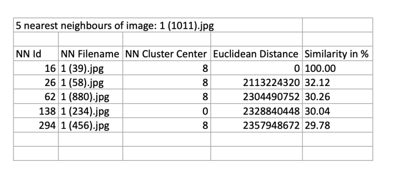
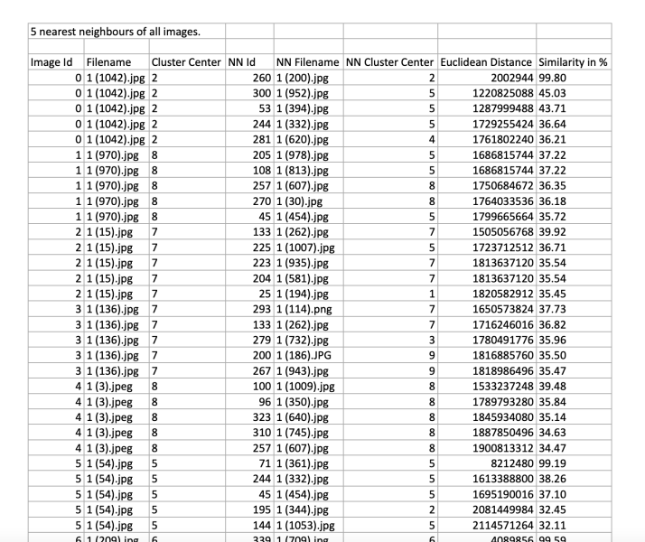
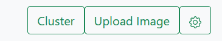
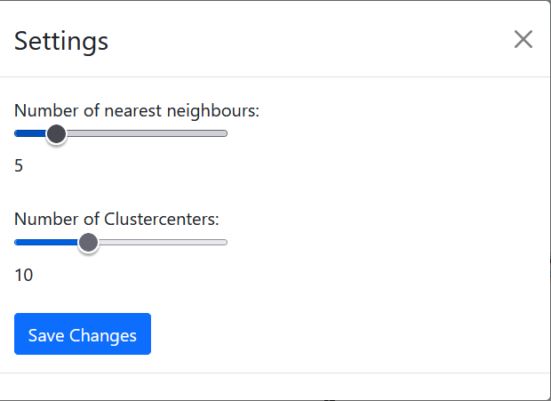
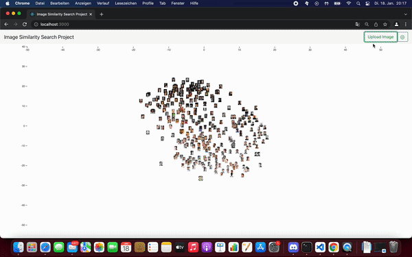
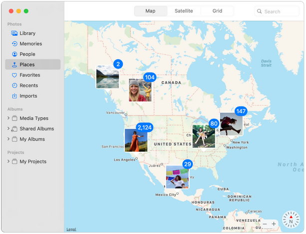

<h1>Image Similarity Search Project Dokumentation 07 - Kalenderwoche 3 2022</h1>
<h2>Gruppenmitglieder<br>(Joris Müller, Anne Schlangstedt, Julia Scherschinski, Paul Gronemeyer, Fabian Löffler, Luke Mikat)</h2>

<h2>Fortschritte Frontend</h2>

<h3>Anne (@s82881)</h3>

<b>[#18](https://gitlab.bht-berlin.de/image-similarity-search/image-similarity-search-frontend/-/issues/18) Datenexport</b> 

*Anforderung:* 

- k-Nächste-Nachbarn eines ausgewählten Bildes als Excel-Dokument exportieren.

*Umsetzung:*

- Excel-Export-Button im Header eingefügt
- durch Klick auf den Export-Button im Header können nun k-NN aller Bilder in der Datenbank exportiert werden.
- Cluster Center dank Update im Backend durch Joris verfügbar 
- -> Cluster Center abgerufen (NN-Methoden geupdated)

<b>Excel Export in Infoview:</b>

<br>

*ausgegeben werden:*<br>
- ID im Dokumentheader 
- NN ID, NN Filename, NN Cluster Center, euklidische Distanz, prozentuale Ähnlichkeit

<b>Excel Export im Header:</b>

<br>

*ausgegeben werden:*<br>
- Image ID, Filename, Cluster Center, NN ID, NN Filename, NN Cluster Center, euklidische Distanz, prozentuale Ähnlichkeit
- Daten werden in Chunks von 100 IDs an das Backend gesendet, um das Backend bei sehr großen Anfragen nicht zu überlasten. 
<br><br>
*offene ToDos:*<br>
- Excel Export in Infoview: Cluster Center und Image Id bei ausgewähltem Bild in den Header des Dokumentes einfügen. (Warten auf Fetch der Cluster Center für alle Bilder auf dem Canvas durch Fabian(@s78278)).
<br>

<b>[#70](https://gitlab.bht-berlin.de/image-similarity-search/image-similarity-search-frontend/-/issues/70) Bugfix Image Upload</b> 

- Problem: Beim Klick auf hochgeladene Bilder, stürzt die Anwendung ab.
- Lösung: Durch diverse Updates der Response, die das Backend auf der /upload Route zurückgibt, funktionierte der Klick auf hochgeladene Bilder nicht mehr, da auf die falschen Parameter zugegriffen wurde. Durch Anpassen und Hinzufügen von Parametern, konnte das Problem gelöst werden.


<h3>Fabian (@s78278)</h3>

<b>[#63](https://gitlab.bht-berlin.de/image-similarity-search/image-similarity-search-frontend/-/issues/63) Instructions/Settings</b>

- Anzeigen von Cluster

*Erster Ansatz:*<br>

- Cluster sollen beim Starten der Anwendung abgefragt werden und dann für die jeweilige `id` des Clusters eine farblicher Rahmen als angehangen werden.

*Problem:*<br>

- der Zugriff auf die Bilder war nicht möglich weil sie noch nicht alle aus der Datenbank geladen wurden

*Zweiter Ansatz:*<br>

- Über einen Button im Header sollen die Cluster der auf der Map angezeigt werden.
- Button zum Aktivieren der Cluster wurde im Header implementiert
- Slider zum verstellen der Anzahl der Cluster wurder im Settingsbutton integriert

*Problem:*<br>

-  fehlender Zugriff auf die Images in der Cluster Button-Komponente

<br>
<br>


<h3>Luke (@s82765)</h3>

<b>[#62](https://gitlab.bht-berlin.de/image-similarity-search/image-similarity-search-frontend/-/issues/62) Fetch all thumbnails with single request</b>

- Die mit JSZip entpackten Bilder sollen nun als Blob generiert werden. Sie erhalten eine temporäre URL über die sie während der Session aufgerufen werden können. Bei der Generierung dieser Blobs kam es zu einem größeren Fehler.
- Der Fehler lag an einer falschen Dekompression des Zip-Verzeichnisses. Die Bilder mussten zunächst als `arraybuffer` behandelt werden und mit dem korrekten Dateityp(`.png, .jpg, ...`) als Blob generiert werden. Dieser Dateityp wird per regular expression aus dem Dateinamen geholt. Die Bilder werden nun korrekt angezeigt.

- Das Einbinden der Thumbnails durch eine Anfrage mit Zip-Komprimierung verkürtzt die Response-Time erheblich. 
- Download der Bilder per Zip-Verzeichnis benötigt 528ms also ca. eine halbe Sekunde.
- Zum Vergleich: Download aller Bilder per einzelner Anfrage für jedes Thumbnail beträgt ca. 19 Sekunden.

```javascript
   request({
    method : "GET",
    headers :  {'Api-Session-Token': sessionToken},
    url : restUrl,
    encoding: null // <- this one is important!
}, function(error, response, body) {
     JSZip.loadAsync(body).then(function(zip) {
        var imageUrls = [];
        var regex = /(?:\.([^.]+))?$/;
        for(let zipEntry in zip.files) {
            var url = zip.file(zipEntry).async("arraybuffer").then(function (data) {
                var ext = regex.exec(zipEntry)[0];
                var type = "image/" + ext.split('.')[1];
                var buffer = new Uint8Array(data);
                var blob = new Blob([buffer.buffer], {type: type});
                let url = URL.createObjectURL(blob)
                return url
               });
            imageUrls.push(url)
        }
        return callback(imageUrls, sessionToken)
        })
    });
```
_Request All Thumbnails - Entpacken des Zip-Verzeichnises, Erstellen der Blobs und der temporären URLs_
<br><br>

<b>[#68](https://gitlab.bht-berlin.de/image-similarity-search/image-similarity-search-frontend/-/issues/68) Access Token in request und response behandeln</b>

- Es soll bei jedem Request ein im Backend generiertes Access-Token zur Identifizierung des Clients mitgeschickt werden.

- Das Session Token wird nach dem Start der Anwendung direkt aus dem Backend über die Route `/authenticate` angefragt. Dieses Session Token wird dann in den Props und in dem lokalen State der D3Map für zukünftige Anfragen gespeichert.

- Die Axios-Requests werden nun mit einem default Header "Api-Session-Token" verschickt. Allerdings wurden noch nicht alle Anfragen in Axios umgeschrieben, weshalb bei manchen Anfragen das Session Token manuell angehangen wird. Die Anfragen der Fullsize Bilder in der Infoansicht gehen momentan noch nur über die URL, weshalb bei dieser Anfrage momentan kein Token mitgeschickt werden kann. Das Umschreiben dieser fetch-Requests wird in einem neuen Issue behandelt.

- Die Implementierung der Methode getSessionToken in AuthenticationActions wurde in Zusammenarbeit mit Joris (@s81764) bearbeitet. Er gab ebenfalls den  Hinweis auf die Axios Default-Header.

```javascript
if (sessionToken) {
    const {setSessionToken} = this.props;
    this.setState({sessionToken: sessionToken})
    setSessionToken(sessionToken)
    axios.defaults.headers.common['Api-Session-Token'] = sessionToken;
} else {
    axios.defaults.headers.common['Api-Session-Token'] = null;
}
```
_Setzen des default Headers 'Api-Session-Token' für alle Axios Requests_

<b>#68 Dokumentation KW 03</b>

- Dokumentation der letzten Fortschritte aller Gruppenmitglieder für die Präsentation am 19.01.22

<br>

<h3>Julia (@s75934)</h3>    

<b>[#45](https://gitlab.bht-berlin.de/image-similarity-search/image-similarity-search-frontend/-/issues/45) Resize Images after Upload</b>
<br>
Problem von letzter Woche gelöst:<br>
- Modaldialog öffnet sich nicht direkt nach dem Öffnen der Seite, da dieses Feature nun in eine eigene Komponente ausgelagert wurde 

<br>
*Image muss noch an Modaldialog angepasst werden*

<h3>Paul (@s82130)</h3>

<b>[#23](https://gitlab.bht-berlin.de/image-similarity-search/image-similarity-search-frontend/-/issues/23)  Bilder Stack-Ansicht (D3 Collision Detection)</b>

Soll etwa so aussehen:

<br>

<br>

<h2>Fortschritte Backend</h2>

<h3>Joris (@s81764)</h3>

<b>#64 Anzahl der Clusterzentren durch eine Route beziehen</b>

+ Es wurde eine Route implementiert, über welche mit GET die Anzahl und Position der Clusterzentren aus #59 zurückgeben wird. 
+ Mit POST kann zur Laufzeit die Anzahl der Clusterzentren verändert werden  
```json
{
  "nr_of_centroids": 10,
  "cluster_centers": [
    {
      "id": 0,
      "cluster_center": [
        7.316447440723418,
        -1.5392057776407855
      ]
    },
    {
      "id": 1,
      "cluster_center": [
        -15.61662626312452,
        -9.611044041414424
      ]
    },
    {
      "id": 2,
      "cluster_center": [
        16.531871700518007,
        -0.9594768206022769
      ]
    },
…
}
```  
_Ausschnitt aus der Response von `/kmeans/centroids`_ 

<b>#63 ID für hochgeladene Bilder im Backend erstellen  </b>

+ Hochgeladenen Bildern soll abhängig von der Session eine fortlaufende ID zugewiesen werden
+ `/upload` gibt nun durch den Session Token aus #19 korrekte IDs zurück  
```python
def get_next_ids(self, key, amount=1):
    current_next_value = self._db["sessions"].find_one_and_update(
        { "key": key }, { "$inc": { "value": amount } }
    )
    if current_next_value is not None and "value" in current_next_value:
        current_next_value = int(current_next_value["value"])
        if amount == 1:
            return [current_next_value]
        else:
            return list(range(current_next_value, current_next_value + amount))
```  
_Ausschnitt aus `db.py`, in dem abhängig von der Session (`key`) neue IDs berechnet werden_  

<b>#19 Access Token</b>

+ Sessions sollen durch einen individuellen Token identifiziert werden, um Funktionen wie die fortlaufenden IDs (#63) zu verwirklichen
+ Mit  [M2Crypto](https://pypi.org/project/M2Crypto/) werden zufällige bytes erzeugt, welche anschließend base64 encoded werden
+ Vor Anfragen wird überprüft, ob das `Api-Session-Token` im Header ist und das gleiche Token wird in der Response wieder abgeschickt
+ Sessions werden in der Datenbank gespeichert  
+ Die Auslagerung der Generierung der Token und Einbindung in alle Routen wird derzeit in #65 in Zusammenarbeit mit Luke (@s82765) angepasst
```txt
access-control-allow-origin: http://localhost:8080 
access-control-expose-headers: Api-Session-Token,Content-Length,Content-Type 
Api-Session-Token: jfjtJ88/JRUzF2VaZHYzVA==
content-length: 37 
content-type: application/json 
```  
_Header einer Response von `/upload`_  

<b>#62 Route für mehrere/alle nächste Nachbarn der Bilder in der Datenbank</b>

+ Für den Datenexport von Anne (@s82881) werden die nächsten Nachbarn von allen `k` nächsten Nachbarn in der Datenbank benötigt.
+ Um den Traffic zu verringern wurde die Route `/faiss/getNN/multiple/k`erstellt, welche für alle (mit GET) oder die in einem Array von IDs spezifizierten (mit POST) Bilder in der Datenbank die nächsten `k` Nachbarn zurück gibt.  
```json
[
  {
    "id": 1,
    "filename": "1 (10).png",
    "position": {
      "x": "17.023328849888312",
      "y": "-4.958710797823259"
    },
    "cluster_center": "2",
    "neighbour_ids": [
      235,
      301,
      155
    ],
    "distances": [
      1997754496,
      2043924736,
      2043924736
    ],
    "similarities": [
      0.3335829973220825,
      0.3285232186317444,
      0.3285232186317444
    ],
    "neighbour_filenames": [
      "1 (661).jpg",
      "1 (878).jpg",
      "1 (433).jpg"
    ],
    "neighbour_cluster_centers": [
      2,
      2,
      2
    ]
  },
  {
    "id": 2,
…
  },
…
]
```  
_Ausschnitt aus der Response von `/faiss/getNN/multiple/3_ 

<b>#66 Clusterzentren in Rückgabe von Routen mit nächste Nachbarn-Berechnung</b>

+ Für den Datenexport von Anne (@s82881) werden die Clusterzentren der Bilder und der nächsten Nachbarn benötigt
+ Die Routen `/upload`, `faiss/getNN` und `faiss/getNN/multiple` geben nun die Clusterzentren der angefragten Bilder und der nächsten Nachbarn zurück  
```json
"neighbour_cluster_centers": [
    [
      5,
      1,
      2
    ],
    [
      2,
      1,
      9
    ]
```  
_Ausschnitt aus der Response von `/upload` mit den Clusterzentren der nächsten Nachbarn_

<b>#67 Datenbankabfragen für Spalten gesammelt ausführen</b>

+ Zuvor wurden Anfragen an die Datenbank oft entweder für jede Spalte oder jeden Datenpunkt einzeln ausgeführt
+ Nun können über eine Methode der Datenbank anhand der IDs beliebig viele Spalten und Dokumente in einer Abfrage ausgelesen werden
+ Dies verringert den Traffic und die Anfragezeiten  
```python
result = database.ids_to_various(ids, filename=True, cluster_center=True)
```  
_Möglicher Aufruf der Funktion mit den zu suchenden Spalten als kwargs_ 


