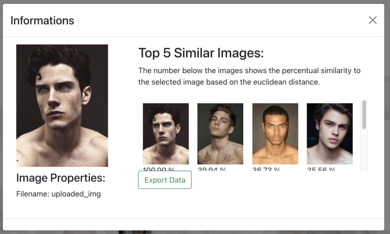
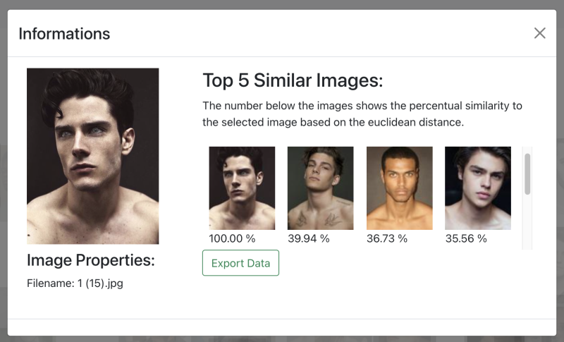
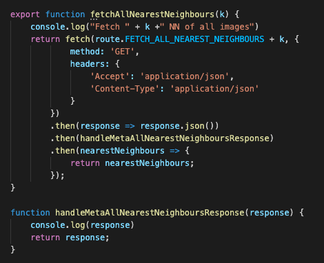
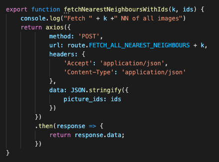
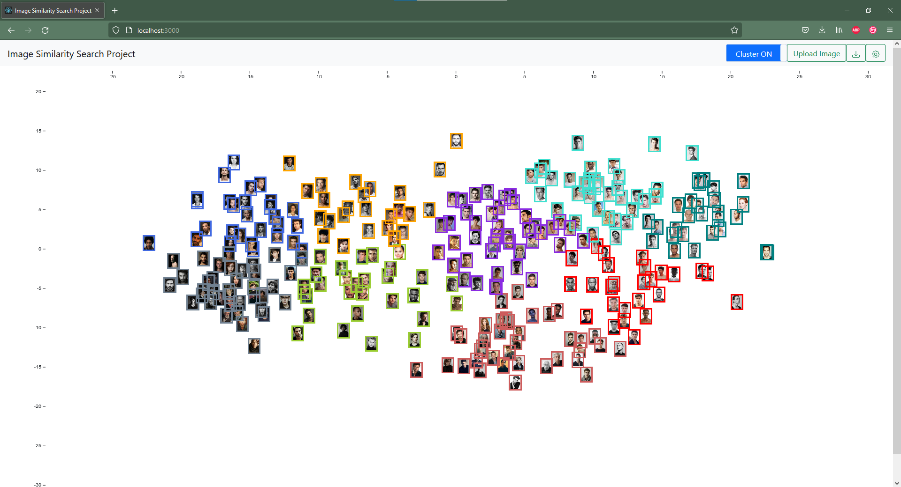
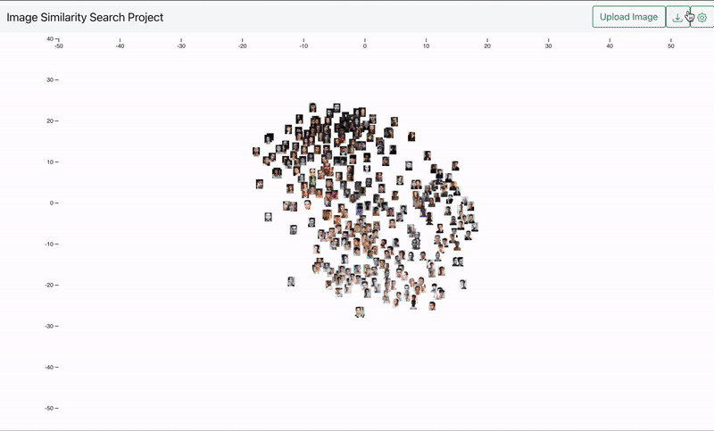
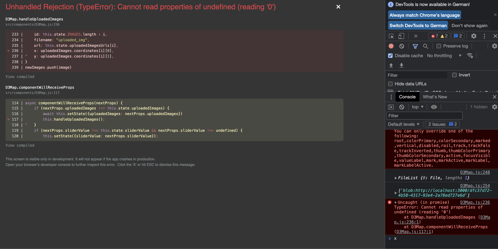
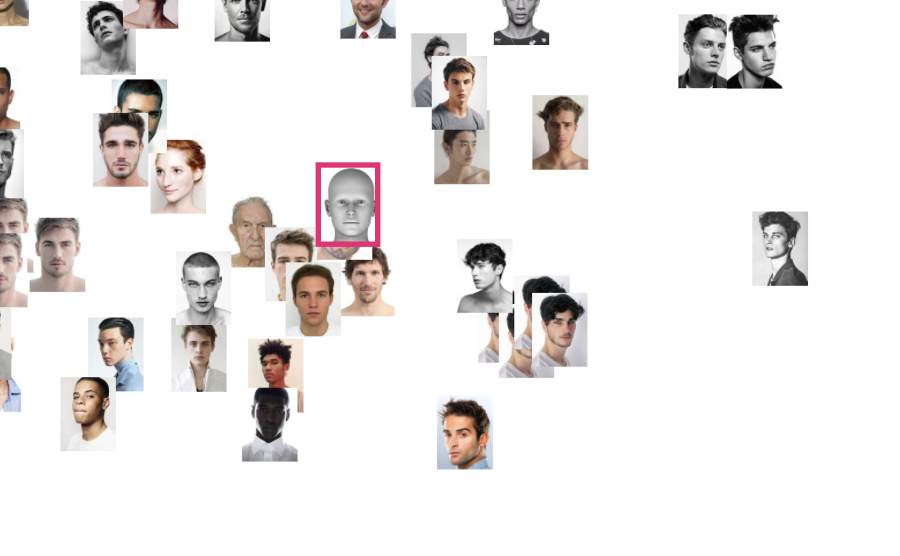
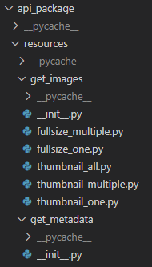

<h1>Image Similarity Search Project Dokumentation 08 - Kalenderwoche 4 2022</h1>
<h2>Gruppenmitglieder<br>(Joris Müller, Anne Schlangstedt, Julia Scherschinski, Paul Gronemeyer, Fabian Löffler, Luke Mikat)</h2>

<h2>Fortschritte Frontend</h2>

<h3>Anne (@s82881)</h3>

<b>[#69](https://gitlab.bht-berlin.de/image-similarity-search/image-similarity-search-frontend/-/issues/69) Ids & Filenames der uploaded images</b> 

*Problem:*<br>

Ids und Filenames von hochgeladenen Bildern wurden bislang nur im Frontend gesetzt:<br>

- Ids: wurden per for-loop fortgeführt
- Filenames: hardgecoded zu “uploaded_img” -> jedes hochgeladene Bild hatte identischen filename
Dank eines Updates von Joris (@s81764) werden neue Ids vom Backend generiert und zurückgegeben ebenso wie die ursprünglichen Filenames der Bilder. Diese wurden nun im Frontend integriert und werden in der Infoansicht sowie im Excel-Export benutzt.

<br>

<br>

<b>[#72](https://gitlab.bht-berlin.de/image-similarity-search/image-similarity-search-frontend/-/issues/72) Axios</b> 

*Problem:*<br>

- Requests an das Backend sollen angeglichen werden und alle mit Axios erfolgen. Bis auf “fetchAllThumbnails”.
- Requests erfolgen nun alle mit Axios. Überflüssige Methoden wurden entfernt.

<br>

<br>

<b>[#45](https://gitlab.bht-berlin.de/image-similarity-search/image-similarity-search-frontend/-/issues/45) Resize images after upload</b> 

- Zusammen mit Julia (@s75934) den state-Bug behoben, nachdem ein Bild gecropped wurde.


<h3>Fabian (@s78278)</h3>

<b>[#77](https://gitlab.bht-berlin.de/image-similarity-search/image-similarity-search-frontend/-/issues/77) Bugfixes Markierung nach Merge</b> 

- nach dem Merge mit den anderen Funktionen gab es lags bei der Markierfunktion
- außerdem behalten hochgeladen Bilder ihre Markierung nachdem Bilder markiert/demarkiert wurden

<b>[#63](https://gitlab.bht-berlin.de/image-similarity-search/image-similarity-search-frontend/-/issues/63) Cluster anzeigen</b> 

- Zugriff auf die Bilddaten konnte hergestellt werden
- über einen Switch im Header können jetzt die Cluster aktiviert werden
- Slider für das verstellen der Anzahl der Cluster wurde mit Anfrage an das Backend verbunden und verstellt die Anzahl
- Map wird noch nicht nach dem verstellen aktualisiert
- nach einem manuellen Refresh wird die zuvor gewählte Anzahl an Cluster übernommen und nach Aktivierung angezeigt

<br>
*Cluster-Ansicht*


<h3>Luke (@s82765)</h3>

<b>[#71](https://gitlab.bht-berlin.de/image-similarity-search/image-similarity-search-frontend/-/issues/71) Alle Bilder als blob einbinden, Sessiontokens in jeder Anfrage</b>

- Es werden nun alle Bilder als Blob eingebunden. 
- Alle Anfragen werden mit Session Token geschickt. 
- Zusätzlich werden die Thumbnails in der Info-View nun per Zip eingebunden. Dazu wird die von Joris (@s81764) im Backend zur Verfügung gestellte Route für multiple Thumbnails verwendet.
- Das asynchrone Entpacken der Zip-Verzeichnisse erschwerte das Einbinden der hochgeladenen Bilder, weshalb es zu mehreren Fehlern kam.
- Die Fehler wurden behoben. Unter anderem wurde auf die Next Neighbours zugegriffen, bevor diese im State gesetzt wurden.

```javascript
  /*
 * This function fetches on image.
 * @returns one fullsize image blob url 
 */
export function fetchOneImage(id, sessionToken) {
    var restUrl = route.FETCH_ONE_IMAGE + id;
    console.log("Fetch One Image from: " + restUrl);

    return fetch(restUrl, { 
        method: 'GET',
    headers: {
        'Api-Session-Token': sessionToken
    }})
        .then(response => response.blob())
        .then(blob => {
            return URL.createObjectURL(blob)
        })
}
```
_Request One Fullsize-Image - Erstellen des Blobs und der temporären URL_

<b>[#57](https://gitlab.bht-berlin.de/image-similarity-search/image-similarity-search-frontend/-/issues/57) Responsive Canvas</b>

- Ziel: Aktualisierung der Canvas-Size nach einem Resize des Windows

- Es wurden die Attribute

```javascript
.attr("viewBox", `0 0 ${canvasWidth} ${canvasHeight}`)
.attr("preserveAspectRatio", "xMinYMin meet")
```

dem `svgCanvas` Objekt hinzugefügt, um das gesamte Diagramm responsiv zu machen.
- Die Attribute `width` und `height` wurden durch die Viewbox ersetzt.
- Die Attribute `canvasWidth` und `canvasHeight` werden zum Start der Anwendung, wie zuvor von der Window-Size geholt.

<b>[#75](https://gitlab.bht-berlin.de/image-similarity-search/image-similarity-search-frontend/-/issues/75) Fix Bugs after Merge</b>

- Aufgrund einer falschen Reihenfolge der URLs aus der MultipleThumbnails-Zip, wurden die multipleThumbnail fetches zunächst entfernt. In Zukunft könnten diese jedoch wieder hinzugefügt werden.
- Des Weiteren musste das State-Attribut `uploadedImageCount` hinzugefügt werden, um die `ids` der hochgeladenen Bilder beim erstellen des `nN`-Objektes anzupassen, da die `ids` bei jedem hochgeladenen Bild erhöht wurden, jedoch die alten `uploadedImages` aus dem State entfernt wurden. So hatte jedes hochgeladene Bild eine zu hohe `id`, ab dem zweiten Hochladen von Bildern.

<b>[#66](https://gitlab.bht-berlin.de/image-similarity-search/image-similarity-search-frontend/-/issues/66) Submit Button - Error Handling (bei keinem Image)</b>

- Es erscheint eine Fehlermeldung, wenn der Sumbit Button betätigt, aber kein Image ausgewählt wurde.
- Wurde behoben :

```javascript
handleSubmit(e){
        e.preventDefault();
        const files = this.state.files;
        if (files === undefined){
            return
        }...
```

<b>#72 Dokumentation KW 04</b>

- Dokumentation der letzten Fortschritte aller Gruppenmitglieder für die Präsentation am 26.01.22

<h3>Julia (@s75934)</h3>    

<b>[#45](https://gitlab.bht-berlin.de/image-similarity-search/image-similarity-search-frontend/-/issues/45) Resize Images after Upload</b>
<br>

*UPDATE:*<br>

Problem von letzter Woche gelöst: <br>

- Modaldialog öffnet sich nicht direkt nach dem Öffnen der Seite, da dieses Feature nun in eine eigene Komponente ausgelagert wurde
- "Zuschneidungsrechteck" in richtiger Größe
- An Modaldialog anhand von CSS angepasst

<br>

- Nun öffnet sich der Modaldialog genau passend, wenn nur ein Bild ausgewählt wurde und nicht direkt beim Öffnen der Single Page App
- Nur leider konnte das Bild nicht hochgeladen werden, Filename usw. wurden erkannt, aber dennoch trat ein Problem auf, welches ich mit der Gruppe besprochen habe 

<br>
<br>

- Joris (@s81764) hatte hier den Fehler behoben

*Weiterer Bug:*<br>

- Wenn man ein Bild ausgewählt hat, sich aber dann doch nochmal für ein anderes Bild entscheidet, erscheint dennoch die erste Auswahl.
- In Rücksprache mit Anne (@s82881) Fabian (@s78278) und Joris (@s81764) wurde das Problem mit dem State gelöst 

<br>
*hochgeladenes gecropptes Image*

<b>[#76](https://gitlab.bht-berlin.de/image-similarity-search/image-similarity-search-frontend/-/issues/76) Instructions/ Settings </b>

- Die Bedienungsanleitung ist gerade in Bearbeitung 

<h3>Paul (@s82130)</h3>

<b>[#23](https://gitlab.bht-berlin.de/image-similarity-search/image-similarity-search-frontend/-/issues/23) Bilder Stack-Ansicht (D3 Collision Detection) </b>

- Bisher wird über jede Zelle iteriert bei jeder neuen gelieferten Bildkoordinate
- Implementierung ausdenken, bei dem selektiver iteriert wird
- Quadtrees ausprobiert, aber dann hat man keine Kontrolle darüber, wie und wann welche Bilder angezeigt werden
- Bisher noch keine Lösung gefunden
- Aktueller Baustelle: Bilder nach Zellen gruppieren und berechnen, welches angezeigt wird und welches nicht

<br>

<h2>Fortschritte Backend</h2>

### Joris (@s81764)

#### **#65 Access Token für alle Routen**

+ Zuvor wurde das Token nur in der Route `/upload` verwendet
+ Das Token wird nun über die eigene Route `/authenticate` generiert und im header `Api-Session-Token` übergeben
+ Durch Einbindung des Tokens im Frontend durch Luke (@s82765) kann das Token nun in jeder Route übergeben werden  

```HTTP
HTTP/1.0 200 OK
Content-Type: text/html; charset=utf-8
Content-Length: 7
Api-Session-Token: Takukm9Xdx2DkS6j0bB7Rw==
Access-Control-Allow-Origin: *
Access-Control-Expose-Headers: Api-Session-Token, Content-Length, Content-Type
```  

__Ausschnitt aus den Response-Header von `/authenticate`__  

#### **#69 Refactor von Resourcen in app.py**

+ Zuvor wurden alle Resourcen in `app.py` angelegt
  + Dadurch wirkt die Datei unleserlich und ist unübersichtlich
+ Die Resourcen wurden in das Package `resources` in `api_package` ausgelagert und werden in app.py nur noch importiert  

<br>
__Ausschnitt aus der neuen Dateistruktur__  

#### **#70 Docstrings und typing**

+ Zum besseren Verständnis und um eine mögliche Weiterarbeit mit dem Backend zu ermöglichen, sollen in der finalen Version verschiedene Dokumentationsformen benutzt werden:
  + swagger: Dokumentation aller Routen mit Möglichkeit zum Testen
  + typing: Parameter und Rückgabewerte kennzeichnen
  + docstrings: Beschreibung von der Funktion aller Module, Packages, Klassen und Funktionen
  + pydoc: Aus docstrings generierte Übersicht aller Bestandteile des Backends
+ Die swagger-Dokumentation wurde in #47 realisiert
+ typing und docstrings wurden in diesem Issue bearbeitet
+ die pydoc-Dokumentation wird in #71 bearbeitet  

```py
def search(self, images: np.ndarray, k: int) -> 'Union[Tuple[np.ndarray, np.ndarray], None]':
    """Returns the k nearest neighbours and distances of the flat images in the images array using the current faiss index

    Args:
        images (np.ndarray): array containing the flat images, whose neighbours shall be found
        k (int): value indicating, how many neighbours shall be found. Should be 0 < k < Faiss.get_instance().faiss_index.ntotal

    Returns:
        np.array: Distances to the nearest neighbours
        np.array: Indices of the nearest neighbours
    """
    if not self.has_index: 
        print("No index present!")
        return None
    ...
```

__Ausschnitt aus `faiss.py` als Beispiel für typing und docstring__
