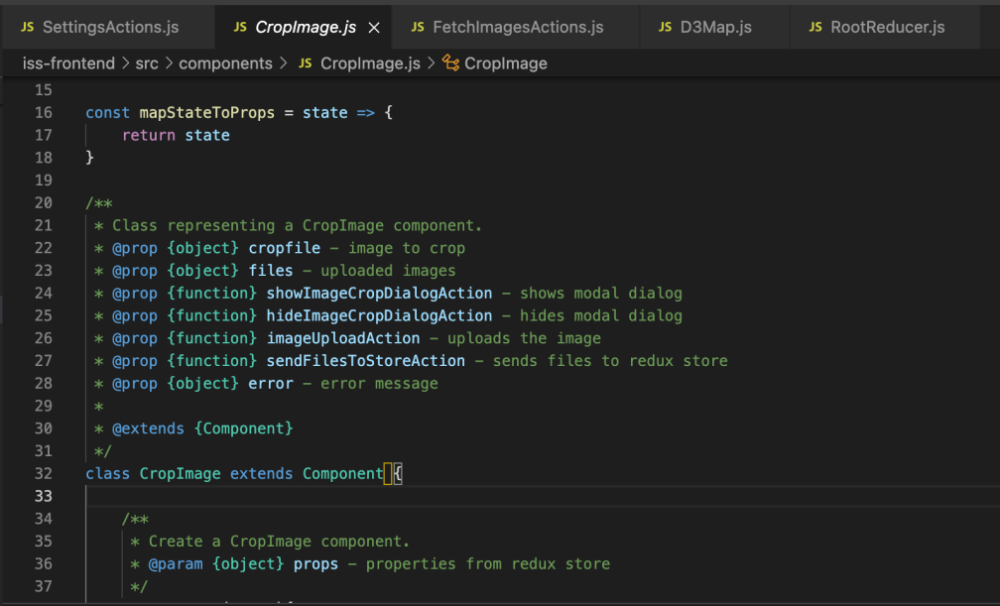
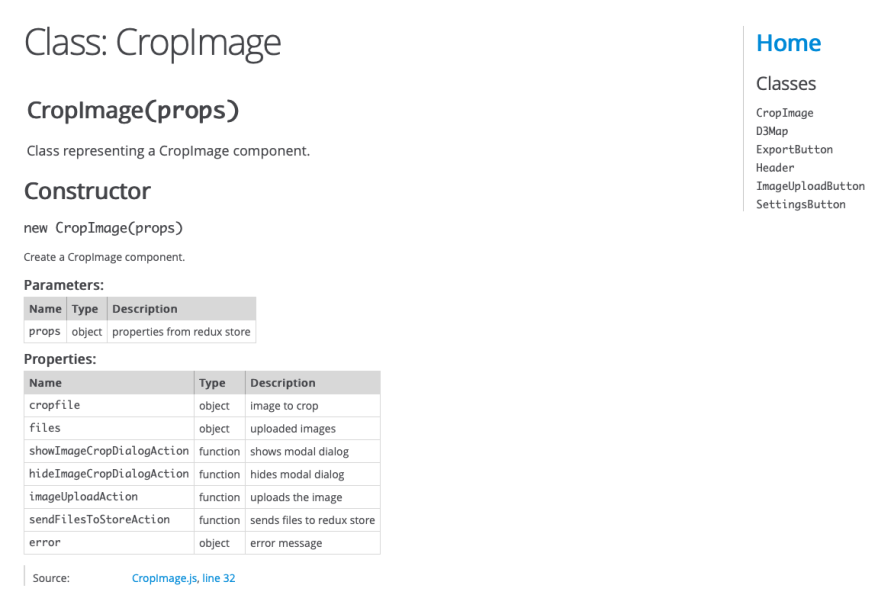
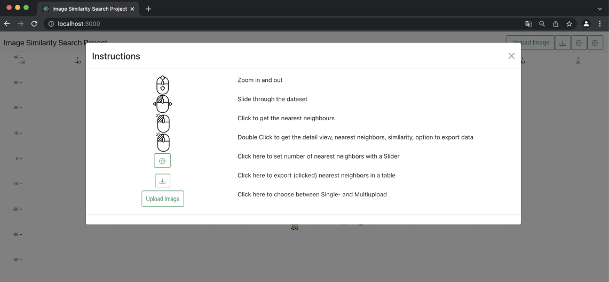

<h1>Image Similarity Search Project Dokumentation 09 - Kalenderwoche 5 2022</h1>
<h2>Gruppenmitglieder<br>(Joris Müller, Anne Schlangstedt, Julia Scherschinski, Paul Gronemeyer, Fabian Löffler, Luke Mikat)</h2>

<h2>Fortschritte Frontend</h2>

<h3>Anne (@s82881)</h3>

<b>[#80](https://gitlab.bht-berlin.de/image-similarity-search/image-similarity-search-frontend/-/issues/80) Code kommentieren</b> 

- Code mit Jsdoc dokumentiert
- Jsdoc Dokumentation erzeugt

<br>

<br>

<b>[#81](https://gitlab.bht-berlin.de/image-similarity-search/image-similarity-search-frontend/-/issues/81) Frontend Meeting</b> 

- aktuelle Branches gemerged
- Fehler in Clusteransicht besprochen

<h3>Fabian (@s78278)</h3>

<b>[#74](https://gitlab.bht-berlin.de/image-similarity-search/image-similarity-search-frontend/-/issues/74) Markierung entfernen falls auf anderes Bild geklickt wird</b> 

- mit einer weiteren if-else-Bedingung in der markImage-Funktion gelöst

<b>[#78](https://gitlab.bht-berlin.de/image-similarity-search/image-similarity-search-frontend/-/issues/78) Legende</b> 

- Legende wurde am rechten oberen Rand des Canvas hinzugefügt
- Legende beinhaltet Informationen zu den Markierungsfarben, Anzahl der eingestellten Cluster und deren Farbe
- Legende aktualisiert sich eigenständig sobald die Anzahl der der Cluster geändert wird
- Style der Legende wurde dem Style der Anwendung angepasst


<br>
*Legende*

<b>[#63](https://gitlab.bht-berlin.de/image-similarity-search/image-similarity-search-frontend/-/issues/63) Cluster anzeigen</b>

- Aktualisierungsproblem konnte durch asynchrone Funktion behoben werden.
- wurde in #81 (Frontend Meeting) gemeinsam berarbeit
- noch bestehender Bug:  beim Hochladen von Bildern werden die Images aus den props geschmissen und somit kommt es zu einem Absturz beim aktivieren der Cluster

<b>[#85](https://gitlab.bht-berlin.de/image-similarity-search/image-similarity-search-frontend/-/issues/85) Überarbeitung der StyleSheets</b>

Umsetzung mit SCSS:<br>
- vertikale Scrollbar im body wurde entfernt
- erstellen einer color-scheme-datei (in bearbeitung)
- bisher wurden folgen Dateien angepasst: marksStyle, legendStyle und clusterStyle^

<h3>Luke (@s82765)</h3>

<b>[#79](https://gitlab.bht-berlin.de/image-similarity-search/image-similarity-search-frontend/-/issues/79) fetchmultipleThumbnails in der Infoview</b>

- Das Entpacken und Einbinden wurde bereits implementiert. Es ist allerdings aufgefallen, dass die Thumbnails in einer falschen Reihenfolge ankamen und das zu falschen Darstellung führt.
- Die Thumbnails werden jetzt in korrekter Reihenfolge eingebunden. Die in der Zip mitgeschickten Filenames (die ebenfalls die Ids enthalten) werden nun mit den Ids verglichen, so das diese übereinstimmen.

```javascript
var thumbnailId = regexId.exec(zipEntry)[0];
...
let url = URL.createObjectURL(blob)
var thumbnailData = {url: url, thumbnailId: thumbnailId}
return thumbnailData
```
*Die `thumbnailId` wird aus jeder `zipEntry` gelesen und mit zurückgegeben. Dadurch wird garantiert, dass das Bild mit der Id übereinstimmt.*<br>

<b>#13 Flowchart - Diagramm für die Präsentation</b>

- Ablaufdiagramm erstellt, zur besseren Übersicht der gesamten Anwendung und deren Prozesse


<b>[#81](https://gitlab.bht-berlin.de/image-similarity-search/image-similarity-search-frontend/-/issues/81) Frontend Meeting</b> 

- aktuelle Branches gemerged
- Fehler in Clusteransicht besprochen

<b>#73 Dokumentation KW 05</b>

- Dokumentation der letzten Fortschritte aller Gruppenmitglieder für die Präsentation am 02.02.22

<h3>Julia (@s75934)</h3>    

<b>[#76](https://gitlab.bht-berlin.de/image-similarity-search/image-similarity-search-frontend/-/issues/76) Instructions/ Settings </b>

- Neue Komponente mit Modaldialog erstellt
- In der Navigationsleiste anklickbar
- Kleine Bedienungsanleitung

<br>
*Instructions*

<h3>Paul (@s82130)</h3>

<b>[#23](https://gitlab.bht-berlin.de/image-similarity-search/image-similarity-search-frontend/-/issues/23) Bilder Stack-Ansicht (D3 Collision Detection) </b>

26.01.2022:

- Einfachere Implementierung von Quadtree nach Tutorialreihe: https://youtu.be/OJxEcs0w_kE
- Neuer Ansatz: Raster + Quadtree kombinieren
- Einarbeitung in https://github.com/d3/d3-quadtree
- Fehler bei Erstellung des Rasters:

- Fehler zunächst ignoriert und mit Quadtree Implementierung weitergemacht.
- Zunächst habe ich einen D3.js Quadtree implementiert und die Daten der Bilder eingefügt
- Neuer Fehler:

- Fehler durch Entfernen einer alten Funktion gefixt.
- Bilderdaten erfolgreich in Quadtree eingefügt, aber suche nach Bildern in bestimmten Rechteck gibt Fehler zurück:

- Entsprechende Funktion fürs erste auskommentiert, um an Zeichnung des Quadtrees zu arbeiten
- Fehler nach Implementierung von Zeichenfunktion: 


<br>

<h2>Fortschritte Backend</h2>

### Joris (@s81764)

#### **#71 pydoc Dokumentation**

+ Als zusätzliche Dokumentationsform soll [Sphinx](https://www.sphinx-doc.org/en/master/) verwendet werden.
+ Dokumentation wird aus den docstrings generiert, welche teilweise noch angepasst werden müssen

_Noch nicht abgeschlossen_

#### **#74 Server-Start mit Makefile**

+ Für einfacheres Starten des Servers und Bearbeiten der Umgebung werden Befehle in einem Makefile gesammelt.

_Noch nicht abgeschlossen_
