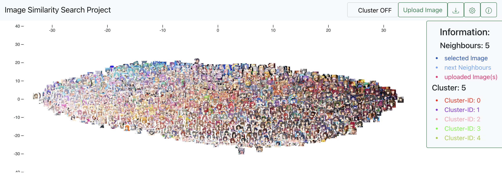
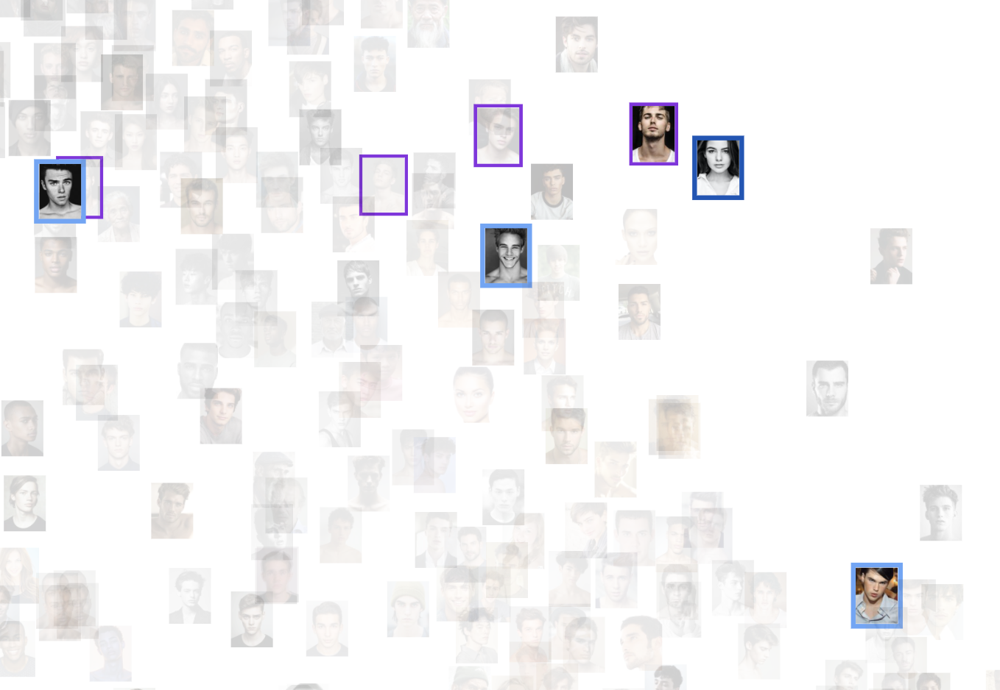
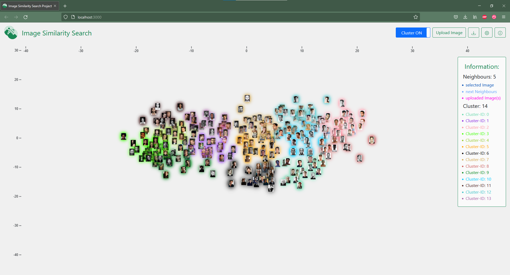
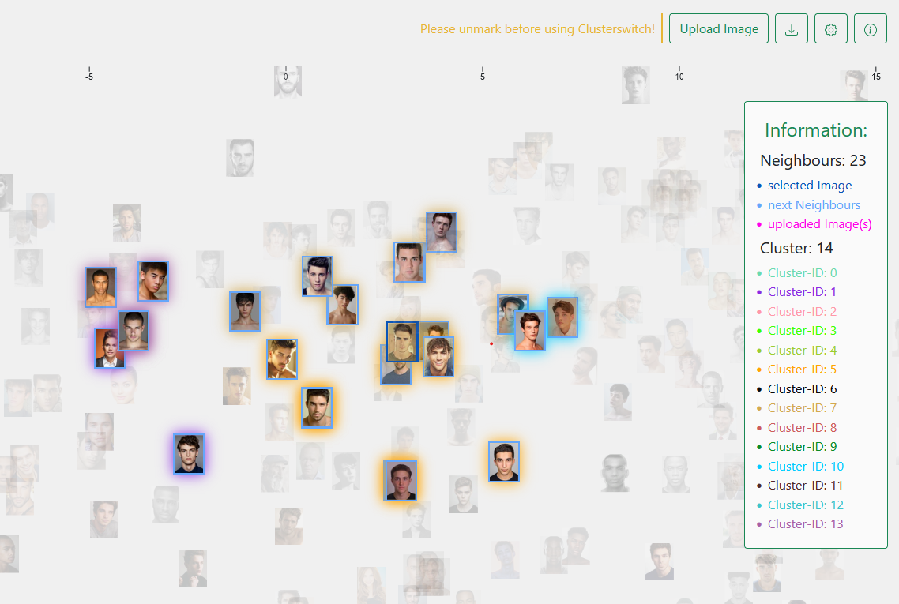
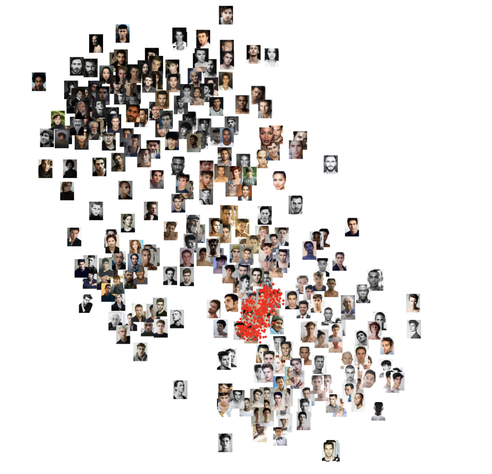
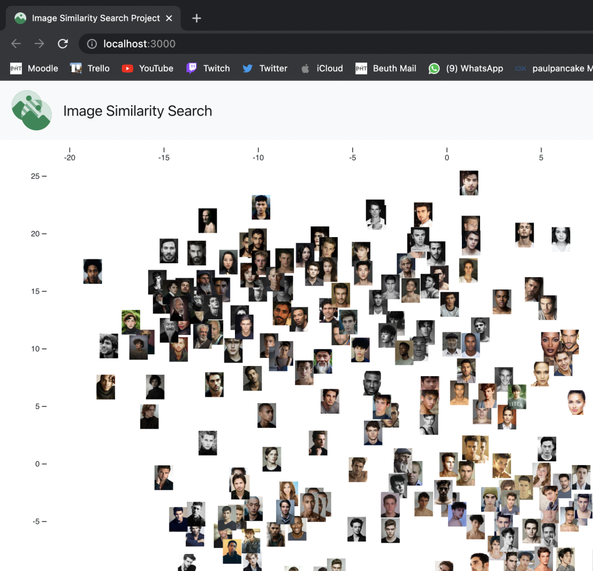

<h1>Image Similarity Search Project Dokumentation 10 - Kalenderwoche 6 2022</h1>
<h2>Gruppenmitglieder<br>(Joris Müller, Anne Schlangstedt, Julia Scherschinski, Paul Gronemeyer, Fabian Löffler, Luke Mikat)</h2>

<h2>Fortschritte Frontend</h2>

<h3>Anne (@s82881)</h3>

<b>[#88](https://gitlab.bht-berlin.de/image-similarity-search/image-similarity-search-frontend/-/issues/63) Clusterzentren im Excel Export</b>

- beim Excel Export in der Informationsview wird nun das Clusterzentrum des ausgewählten Bildes im Dokumentheader angezeigt
- bei hochgeladenen Bildern wird kein Clusterzentrum angezeigt


<b>[#80](https://gitlab.bht-berlin.de/image-similarity-search/image-similarity-search-frontend/-/issues/80) Code kommentieren</b>

- fehlende Kommentare ergänzt die durch neue Updates und Merges entstanden sind

Backend:<br>

<b>#75: Anderen Datensatz verwenden</b>

- Datensatz: https://www.kaggle.com/scribbless/another-anime-face-dataset
- ursprünglich 38.000 Bilder verwendet -> Serverabsturz
- mit 9000 Bildern: ca. 45 min. Ladezeit im Backend, Anwendung nicht mehr navigierbar (sehr langsam / verzögert)



- mit ca. 2000 Bildern: noch gut benutzbar / navigierbar


<h3>Fabian (@s78278)</h3>

<b>[#63](https://gitlab.bht-berlin.de/image-similarity-search/image-similarity-search-frontend/-/issues/63) Clusterzentren im Excel Export</b>

- letzter bug beim hochladen von Bildern konnte behoben werden. 

- beim Bildupload wurde der aktuelle State nicht mit an den Redux-Store gesendet

<b>[#90](https://gitlab.bht-berlin.de/image-similarity-search/image-similarity-search-frontend/-/issues/90) Anpassung der Clusteranzeige und Konfliktlösung beim aktualisieren </b>

- Beim Markieren von Bildern im Cluster-Modus sollen die anderen Clustermarkierungen entfallen.
- Wenn die Anzahl der Cluster über den Slider in den Setting verstellt wird, gibt es Probleme mit den Clustermarkierungen, da diese nicht richtig aktualisiert werden. Generell gibt viele Überschneidungen zwischen Clustermarkierungen und der Markierung der nächsten Nachbarn.
- Nachdem ich selbst zu keiner Lösung kommen konnte, wurde das Problem im Team-Metting #86 (closed) besprochen und gemeinsam an einer Lösung gearbeitet
- Problemlösung: verhindern des verstellens der Cluster- und Nachbaranzahl während die Markierfunktion aktiviert ist.




<b>[#85](https://gitlab.bht-berlin.de/image-similarity-search/image-similarity-search-frontend/-/issues/85) Überarbeitung der StyleSheets </b>

- Color scheme wurde überarbeitet fertiggestellt
- Im Header wurden die Positionen der Icons, Schrift und Hintergrund angepasst
- Farbe der Überschrift und Position der Items und der Legende wurde geändert
- Folgende Modaldialoge wurden überarbeitet: Informationsview-, Imageupload -, Settings- und Cropmodal 
- Tooltips wurden den Iconbuttons angehängt




Beim überarbeiten des Stylesheets habe ich mich mit Paul (@s82130) gemeinsam abgesprochen.<br>
Dabei sind wir auf die Markiermethode der Cluster und eine andere Möglichkeit dies über Dropshadows umzusetzen gekommen.<br>
Leider war dies nicht kompatibel mit dem interagieren des Datensatzen. Zoom und pan konnte nicht mehr ruckelfrei ausgeführt werden.<br>
<br>



Leider habe ich bis zu dem Zeitpunkt der Deadline keine Möglichkeit gefunden den Style des Clustersliders zu verändern. Generell gab es auch immer wieder Überschneidungen mit Bootstrap und der eigenen Anpassung der Komponenten.

<h3>Luke (@s82765)</h3>

<b>[#87](https://gitlab.bht-berlin.de/image-similarity-search/image-similarity-search-frontend/-/issues/87) Merge development and cluster</b>

- Viele Überschneidungen im Code
- u.A falsches Markieren oder falsche Farben der Cluster-Zentren
- Infoview konnte nicht geöffnet werden aufgrund von der uploaded Image id
- Die Fehler wurden in der neusten Version gelöst

<b>#86 Frontend Meeting</b>

- Es wurde zusammen versucht Probleme bei der Markierungsfunktion zu lösen.
- Besonders die Cluster-Markierungen wurden besprochen.

<b>#73 Dokumentation KW 05</b>

- Dokumentation der letzten Fortschritte aller Gruppenmitglieder für die Präsentation am 02.02.22

<b>#75: Anderen Datensatz verwenden</b>

- Pokemon Datensatz: https://www.kaggle.com/vishalsubbiah/pokemon-images-and-types
- 810 Bilder werden verwendet -> sehr flüssige Nutzung der Anwendung


<h3>Julia (@s75934)</h3>    

<b>[#76](https://gitlab.bht-berlin.de/image-similarity-search/image-similarity-search-frontend/-/issues/76) Instructions/ Settings </b>

- Kleines Update nach letzter Woche 
- Hinzufügen eines Icons, der darauf hinweisen soll, dass der Modaldialog scrollbar ist
- Detailliertere Formulierungen
- Anpassen der Schriftgröße
- Hinzufügen allgemeiner Hinweise

    <br>
    *Instructions*

<b>[#98](https://gitlab.bht-berlin.de/image-similarity-search/image-similarity-search-frontend/-/issues/98) Frontend Merge CSS </b>

<b>[#83](https://gitlab.bht-berlin.de/image-similarity-search/image-similarity-search-frontend/-/issues/83) Vorbereitung der Abschlusspräsentation </b>


<h3>Paul (@s82130)</h3>

<b>[#23](https://gitlab.bht-berlin.de/image-similarity-search/image-similarity-search-frontend/-/issues/23) Bilder Stack-Ansicht (D3 Collision Detection) </b>

- Mapping von Koordinaten muss angepasst werden, da Koordinaten der Bilder nicht zu den Quadtree Koordinaten passen
- Fehler: Koordinaten werden nicht richtig im Quadtree gespeichert.
- Lösung: Koordinaten müssen als Tupel gespeichert werden.
- Fehler: Nach Mapping werden Koordinaten nicht mehr im Quadtree gespeichert und Der Quadtree bleibt ein leeres Array

<br>

- Fix: Koordinaten sind original Strings und wurden daher fehlerhaft geremapt, werden nun zu Number geparst.
- Fehler: Geremapte Koordinaten entsprechen nicht den Bildkoordinaten (Rote Kreise wurden zur Darstellung an den geremapten Koordinaten gezeichnet):

<br>

- Damit ich die Koordinaten der Bilder richtig für den Quadtree remappen kann, muss ich irgendwie den Scale der D3 Canvas verändern, auf welcher der Quadtree angelegt wird. Sonst sind die Punkte viel enger beieinander, als es die eigentlichen Bilder sind.
04.02.2022: Feature aufgegeben, da das Problem so kurz vor Ende des Projekts nicht mehr gelöst werden konnte.


<b>[#82](https://gitlab.bht-berlin.de/image-similarity-search/image-similarity-search-frontend/-/issues/82) CSS/Logo/fav icon </b>


Logo Varianten erstellt:<br>

<br>

<br>

<br>


Logo und favicon eingessetzt:<br>



- Instructions Aufteilung überarbeitet
- Eigene Icons für Anwendung erstellt und eingesetzt:

<br>


<h2>Fortschritte Backend</h2>

### Joris (@s81764)

#### **#71 pdoc Dokumentation**  

+ Statt sphinx wurde nun [pdoc3](https://pdoc3.github.io/pdoc/doc/pdoc/#gsc.tab=0) für die Dokumentation verwendet.
+ Zusätzlich wurde das Modul `doc.py` geschrieben, welches mit den Funktionen von pdoc die Dokumentation aus den docstrings erstellt und die richtige Ordnerstruktur erzeugt. Durch Ausführung dieses Moduls kann die Dokumentation immer wieder erzeugt werden.  

```python
def recursive_htmls(mod):
    yield mod.name, mod.html()
    for submod in mod.submodules():
        yield from recursive_htmls(submod)
```

_Generator-Funktion für das Erzeugen von html Dokumentationen mit pdoc3_

<br> 

_Screenshot einer Seite der Dokumentation_  

#### **#74 Server-Start mit Makefile**  

+ Das Makefile wurde angelegt und funktioniert auf Windows wie erwartet.
+ Probleme bei Computern mit MacOS konnten nicht behoben werden. Deshalb ist hier der Start über `run.py` weiterhin benötigt.  

```shell
run:
	@echo $(ROOT_DIR)run.py
	$(PYRUN) $(ROOT_DIR)run.py
```

_Ausschnitt aus dem Makefile_

