<h1 id="image-similarity-search-project-documentation">Image Similarity Search Project Documentation</h1>

<h2>Gruppenmitglieder<br>(Joris Müller, Anne Schlangstedt, Julia Scherschinski, Paul Gronemeyer, Fabian Löffler, Luke Mikat)</h2>

<h3>Inhaltsverzeichnis</h3>

- [Einleitung](#einleitung)<br>
- [Dokumentation 01](#dokumentation-01-kalenderwochen-4344)<br>
- [Dokumentation 02](#dokumentation-02-kalenderwochen-4546)<br>
- [Dokumentation 03](#dokumentation-03-kalenderwoche-47)<br>
- [Dokumentation 04](#dokumentation-04-kalenderwoche-48)<br>
- [Dokumentation 05](#dokumentation-05-kalenderwoche-49)<br>
- [Dokumentation 06](#dokumentation-06-kalenderwoche-2)<br>
- [Dokumentation 07](#dokumentation-07-kalenderwoche-3)<br>
- [Dokumentation 08](#dokumentation-08-kalenderwoche-4)<br>
- [Dokumentation 09](#dokumentation-09-kalenderwoche-5)<br>
- [Dokumentation 10](#dokumentation-10-kalenderwoche-6)<br>
- [Fazit](#fazit)<br>

<h1 id="einleitung">Einleitung</h1>

[Zurück zum Inhaltsverzeichnis](#image-similarity-search-project-documentation)<br>

<h1 id="dokumentation-01-kalenderwochen-4344">Dokumentation 01 - Kalenderwochen 43/44</h1>

[Zurück zum Inhaltsverzeichnis](#image-similarity-search-project-documentation)<br>

<h2>Anforderungen</h2>

- Single Page Anwendung
- Dataset soll austauschbar sein
- Vergebung von Tokens für Sessions
- Die Anzahl der ähnlichen Bilder soll anpassbar sein
- Die Image-Map soll interaktiv erkundbar sein
- Image Upload
- vergleichen von hochgeladenen Bild mit dem Dataset

<h2>Tools</h2>

- React Frontend - Nutzung der D3.js Bibliothek zur Darstellung der interaktiven Map
- Python Server Backend - zunächst Flask
- Nutzung der FAISS Library und NumPy

<h2>Prototypen</h2>

Es wurden in der letzten Woche zwei interaktive Prototypen erstellt, die die spätere Funktionalität der Anwendung grafisch darstellen sollen.<br><br><br>
<br><br><br>
- <https://xd.adobe.com/view/41982007-401c-4e0d-803e-edce7190e816-14cb/?fullscreen><br><br><br>
<br><br><br>   
- <https://www.figma.com/proto/KRSOg1mhXzvA3hEeAfuyCK/Image-Similarity-Search-Project?node-id=3%3A4&scaling=min-zoom&page-id=0%3A1&starting-point-node-id=3%3A4><br><br>

<h2>Fortschritte Frontend</h2>

<b>Anne</b><br>
- React Server aufgesetzt
- Grundlegende Funktionalitäten implementiert
- Bilder von DB empfangen (Backend noch nicht verknüpft)
- Bilder hochladen
- Bilder auf der Hauptseite anzeigen
- Redux Store und Redux Thunk verknüpft
<br><br>

<br>
<br>

Beim Aufsetzen des React Frontends habe ich mich stark an den Codebeispielen von der Vorlesung “Web Engineering 2” von Prof. von Klinski orientiert. 
<br>

<b>Fabian</b> 
- Selbststudium React und D3.js
- Erstellung der Prototypen
<br><br>

<b>Paul</b> 
- Aneignen von React durch Videos aus Web Engineering 2
- Erstellung der Prototypen
<br><br>

<h2>Fortschritte Backend</h2>

<b>Joris</b>
- Optionen für Backend-Server in Python exploriert
- vorerst für Flask in Kombination mit Flask-RESTful entschieden
- Anaconda Environment aufgesetzt
- Einbindung von faiss-cpu, Flask und anderen packages
- plattformübergreifendes möglichst einfaches Aufsetzen der Umgebung
- Grundlegenden Flask-Server aufgesetzt mit (ausbaubaren) Funktionen wie:
- hochgeladene Bilder empfangen
- Bilder vom Server beziehen
- Erstellung der Prototypen
<br><br>

<b>Luke</b> 
- Erstellung der Prototypen
- Dokumentation
- Recherche und Auswahl eines Datasets zum Testen der Anwendung
- Mit der FAISS Dokumentation und NumPy beschäftigt 
<br><br>

<b>Julia</b> 
- Erstellung der Prototypen
- Mit der FAISS Dokumentation und NumPy beschäftigt 
<br>
<br>


<h2>Dataset</h2>
Wir haben uns für ein Gesichter Dataset entschieden, welches wir für die Entwicklung der Anwendung zunächst kleiner gehalten haben. Momentan befinden sich in unserem Dataset um die 500 Bilder von unterschiedlichen Gesichtern.

<br><br>
<b>Lizenz und Quelle :</b>
<br><br>
<https://www.kaggle.com/ashwingupta3012/human-faces/metadata> - CC0: Public Domain, No Copyright
<br>
<br>

<h1 id="dokumentation-02-kalenderwochen-4546">Dokumentation 02 - Kalenderwochen 45/46</h1>

[Zurück zum Inhaltsverzeichnis](#image-similarity-search-project-documentation)<br>

<h2>Überarbeiteter Prototyp</h2>

- <https://xd.adobe.com/view/41982007-401c-4e0d-803e-edce7190e816-14cb/><br>


<h2>Fortschritte</h2>
Das Frontend kann nun Anfragen an das Backend schicken und Bilder des Datensatzes auf einem Canvas mappen.<br>
Im Backend können die Bilder eines Datensatzes mit FAISS aufgrund ihrer RGB Werte verglichen werden.<br>
Die genauen Pfade zu den Bildern des Datensatzes können jetzt in einer MongoDB Datenbank gespeichert werden.<br>
Der Ablauf der verschiedenen Funktionen, wurde aus Sicht eines Nutzers detailliert in den User Stories beschrieben.<br>
Diese Abläufe werden ebenfalls in dem erstellten Aktivitätsdiagramm visuell dargestellt.<br>
Es wird momentan an einer Zoomfunktionalität in D3 gearbeitet, mit welcher es möglich sein soll, aus der Overview heraus verschiedene Bereiche der Map zu vergrößern.<br>


<h2>Fortschritte Frontend</h2>

<b>Anne</b><br>
- Einarbeitung in D3
- D3 in React einbinden und Bilder gemäß ihrer Koordinaten auf den Canvas mappen
<br>

<b>Fabian</b> 
- Datensatz in D3 einbinden
- Selbststudium React
- Selbststudium D3.js


<b>Paul</b> 
- D3 Zoomfunktionalität
- Selbststudium React
- Selbststudium D3.js
<br><br>

<h2>Fortschritte Backend</h2>

<b>Joris</b>
- Umstrukturieren und Aufräumen des Server-Codes
- Explorieren von Optionen für eine passende Datenbank
- Aufsetzen der MongoDB/PyMongo Datenbank
- Anbindung von MongoDB/PyMongo Datenbank an das Backend
- Finalisierung der Rest API
- Basic FAISS Image Comparison
<br><br>

<b>Luke</b> 
- Überarbeitung des Prototypen
- User Stories
- Aktivitätsdiagramm
- Aneignung FAISS
- Dokumentation
- Anpassung des Datensatzes und Auslagerung in Cloud
<br><br>

<b>Julia</b> 
- Aktivitätsdiagramm
- Aneignung FAISS
- Einbindung FAISS
<br>
<br>

<h2>Aktivitätsdiagramm</h2>
<br>

<br><br><br>
<br>

<h2>User Stories</h2>

<b>1. Single Image Upload :</b> <br>

Der Nutzer startet die Anwendung und befindet sich zunächst in einer Overview des Datensatzes, 
welche die Bilder als eine Map darstellt.  
Es soll ein Bild für das Vergleichen mit dem Datensatz hochgeladen werden. Dafür klickt der 
Nutzer auf den „Upload Image“ - Button. Nun hat er die Möglichkeit sich zwischen einem Single 
oder Multiple Image Upload zu entscheiden. Er wählt „One Image“. 
Er kann die Bilder entweder durch ein Auswählen im Verzeichnis oder Drag&Drop einfügen. 
Nachdem der Nutzer sein Bild hochgeladen hat, wird dieses in der Overview dargestellt und 
farblich hervorgehoben. Er kann die Map nun frei erkunden. Durch einen Klick auf den Bereich in 
dem sich das hochgeladene Bild befindet, kann der Nutzer eine Detailansicht dieses Bereiches 
aufrufen. In dieser Detailansicht werden alle Bilder des Bereiches näher und erkennbarer 
dargestellt. 
Der Nutzer hat die Möglichkeit die Anzahl der ähnlichen Bilder mit einem Slider anzupassen. 
Er kann ebenfalls die detaillierten Informationen in einem Modal Dialog aufrufen, indem er den 
Informationsbutton betätigt. In dieser Ansicht werden das hochgeladene Bild und die ähnlichen 
Bilder mit wichtigen Informationen angezeigt. Der Nutzer hat zu jeder Zeit die Möglichkeit wieder 
in die vorherigen Ansichten zu wechseln, andere Bilder zum Vergleichen auszuwählen oder andere 
Bilder hochzuladen. ´
<br>

<b>2. Untersuchung des Datensatzes, ohne Upload :</b> <br>

Der Nutzer startet in der Overview des Datensatzes. Er kann den Datensatz frei erkunden. Bei 
Bedarf, können einzelne Bereiche des Datensatzes, durch ein klicken auf diese, im Detail 
aufgerufen werden. In dieser näheren Ansicht kann der Nutzer ein Bild auswählen und 
hervorheben. Zu diesem werden nun die ähnlichsten Bilder in dem Datensatz angezeigt.  
Die Anzahl dieser Bilder kann ebenfalls mit einem Slider angepasst werden. Der Nutzer benötigt 
mehr Informationen über diese Bilder und öffnet die Informationsansicht, welche durch ein klicken 
auf den Informationsbutton aufgerufen werden kann. In dieser Ansicht werden dem Nutzer unter 
anderem die Dateinamen der Bilder und ihre Ähnlichkeit zueinander mit einem bestimmten Wert 
angezeigt. Der Nutzer kann zu jeder Zeit in die Detailansicht und die Overview zurückkehren und 
ein anderes Bild zum Vergleichen auswählen. 
<br>

<b>3. Multiple Image Upload :</b> <br>

Der Nutzer möchte mehrere Bilder zum Vergleichen, mit dem Datensatz, hochladen. Dazu klickt er 
auf den „Upload Image“ - Button. Er wählt „Multiple Images“ aus. Diese erscheinen nach 
erfolgreichen Hochladen in der Overview des Datensatzes und werden farblich hervorgehoben. 
Nun können die Detailansichten der Bereiche in denen sich die hochgeladenen Bilder befinden, 
durch einen Klick aufgerufen werden. Es kann zwischen den hochgeladenen Bildern mit den 
Pfeilbuttons gewechselt werden. Zu jedem einzelnen Bild kann nun die Anzahl der ähnlichen 
Bilder angepasst werden und detaillierte Informationen zu diesen aufgerufen werden. Ebenso 
kann der Nutzer Bilder wieder aus der Auswahl entfernen.
<br>

<h1 id="dokumentation-03-kalenderwoche-47">Dokumentation 03 - Kalenderwoche 47</h1>

[Zurück zum Inhaltsverzeichnis](#image-similarity-search-project-documentation)<br>

<h2>Fortschritte Frontend</h2>

<h3>Anne (@s82881)</h3>

<b>#[#14](https://gitlab.bht-berlin.de/image-similarity-search/image-similarity-search-frontend/-/issues/14) Informationsview</b> 

- Die Informationsview wurde angelegt. Dabei wurden Eventlistener an alle D3 Image Objekte angehangen. Da die Informationsview bislang noch mit Testdaten befüllt ist und bislang noch nicht über die Detailview sondern direkt über die Map erreichbar ist, ist das Issue noch nicht abgeschlossen.

<b>[#20](https://gitlab.bht-berlin.de/image-similarity-search/image-similarity-search-frontend/-/issues/20) Modal Dialog für Informationsview</b><br>

Der Modaldialog für die Informationsview wurde angelegt. Notwendige Schritte waren :<br>
- hochauflösendes Bild in Modaldialog anzeigen<br>
- Slider einbauen Issue <b>[#19](https://gitlab.bht-berlin.de/image-similarity-search/image-similarity-search-frontend/-/issues/19)</b> (closed) der bestimmt wie viele ähnliche Bilder angezeigt werden sollen<br>
- x ähnliche Bilder anzeigen<br>
- Informationen zum Bild anzeigen (Dateiname, Größe etc.)<br>
- Scrollbar einbauen beim Container mit ähnlichen Bildern Issue <b>[#24](https://gitlab.bht-berlin.de/image-similarity-search/image-similarity-search-frontend/-/issues/24)</b> (closed)<br>
- Modaldialog mit echten Bildern aus dem Testdatensatz befüllen Issue <b>#25</b><br>

<b>[#19](https://gitlab.bht-berlin.de/image-similarity-search/image-similarity-search-frontend/-/issues/19) Slider</b> 
- Slider wurde erfolgreich in den Modaldialog der Informationsview eingebaut, sodass die Anzahl der angezeigten, ähnlichen Bilder verändert werden kann.

<b>[#24](https://gitlab.bht-berlin.de/image-similarity-search/image-similarity-search-frontend/-/issues/24) Scrollbar</b> 
- Scrollbar wurde im Container eingebaut, der die ähnlichen Bilder zeigt.


<br>
*Aktueller Stand der Informationsview*<br>


<br>

<h3>Fabian (@s78278)</h3>

<b>[#8](https://gitlab.bht-berlin.de/image-similarity-search/image-similarity-search-frontend/-/issues/8) Datensatz in D3 einbinden</b>

- wurde in kleinere Issues aufgeteilt

<b>[#26](https://gitlab.bht-berlin.de/image-similarity-search/image-similarity-search-frontend/-/issues/26) fetch one image from database</b>

- Es wurde ein Thumbnail aus der dem Backend bezogen.
- Um das Thumbnail zu beziehen wurde die entsprechende URL hardcoded.
- Das Bild wurde vervielfältigt und mit randomisierten Koordinaten übergeben und dargestellt.

<br>
*Canvas mit einem Thumbnail*<br>

<b>[#27](https://gitlab.bht-berlin.de/image-similarity-search/image-similarity-search-frontend/-/issues/27) fetch thumbnails from database</b>

- Im zweiten Schritt konnte eine frei wählbare Menge an Thumbnails geladen und mit randomisierten Koordinaten übergeben und dargestellt werden.

<br>
*Canvas mit allen Thumbnails des Datensatzes*<br>

<b>[#28](https://gitlab.bht-berlin.de/image-similarity-search/image-similarity-search-frontend/-/issues/28) fetch thumbnails with meta-data from database</b>

- Im dritten Schritt wurden alle Thumbnails geladen und mit den errechneten Koordinaten übergeben und dargestellt. 
- Alle Koordinaten wurden für die Darstellung gleichermaßen verändert

<br>
*Alle Thumbnails des Datensatzes mit den im Backend berechneten Koordinaten*<br>


<h3>Paul (@s82130)</h3>

<b>[#7](https://gitlab.bht-berlin.de/image-similarity-search/image-similarity-search-frontend/-/issues/7) Basic Zoom und Pan mit D3 implementieren</b>

- Container "panable" machen und einfache Zoomfunktion zur Vergrößerung der Ansicht implementieren.
- Basic Zoom und Pan implementiert.
- Zoom muss verfeinert werden, damit Koordinaten sich beim Ranzoomen nicht überlappen, siehe Issue <b>[#15](https://gitlab.bht-berlin.de/image-similarity-search/image-similarity-search-frontend/-/issues/15)</b> "Zoomfunktionalität"


<br>
*Zoomfunktionalität in der Overview*<br>


<b>[#15](https://gitlab.bht-berlin.de/image-similarity-search/image-similarity-search-frontend/-/issues/15) Zoomfunktionalität</b>

- D3 Canvas als Koordinatensystem umsetzen, um "dynamischen" Zoom zu implementieren. D.h., beim Ranzoomen werden die Bilder nicht größer, sondern das Koordinatensystem und somit die Abstände. So kann für User eine übersichtlichere Ansicht erzeugt werden.

<br>
*TypeError: scale.domain is not a function (noch nicht gelöst)


Ziel: D3 Canvas als Koordinatensystem umsetzen, um "dynamischen" Zoom zu implementieren. D.h., beim Ranzoomen werden die Bilder nicht größer, sondern das Koordinatensystem und somit die Abstände. So kann für User eine übersichtlichere Ansicht erzeugt werden.

<br><br>

<h2>Fortschritte Backend</h2>

<h3>Joris (@s81764)</h3>

<b>#14 Routen für den Download von mehreren Bildern / Metadaten / mehreren IDs erstellen</b>

Beim Bearbeiten ist aufgefallen, dass die Datenbankstruktur überarbeitet werden soll, siehe <b>#26</b><br>
Es wurden drei neue Routen erstellt:<br>

- /images/thumbnails/all sendet alle thumbnails in der Datenbank als zip-Verzeichnis zurück
- /images/all/metadata sendet alle Metadaten von Bildern in der Datenbank zurück
- /images/ids sendet alle ids zurück

Weitergeführt in Issue <b>#27</b>, in welchem die Daten für eine andere Anzahl als “alle” und “nur 1” zurückgegeben werden sollen.

<br>
*Ausschnitt der response mit allen Metadaten der Bilder*<br><br>

<br>
*Ausschnitt der response mit allen thumbnails im zip-Verzeichnis (base64 encoded)*<br><br>


<br>
*Ausschnitt der response mit allen IDs*<br><br>

<b>#26 Thumbnails und Metadaten in Datenbankstruktur einarbeiten</b>

Wie bei Issue <b>#14</b> genannt wurde währenddessen bemerkt, dass die Datenbankstruktur überarbeitet werden muss.<br>
Die Thumbnails wurden vorher beim Start der Applikation erstellt und in einem statischen Ordner gespeichert.<br>
Nun werden sie neben den Metadaten (siehe <b>#28</b>) in der Datenbank gespeichert.<br>
Um die Bilder zu speichern wurde [Gridfs](https://pymongo.readthedocs.io/en/stable/api/gridfs/index.html) benutzt.<br>
Es mussten einige Methoden in der Datenbank und Applikation umgeschrieben werden, um mit der neuen Speicherart umgehen zu können.<br>

<b>#29 Richtige Koordinaten beim Image Upload zurückgeben</b>

In <b>#23</b> wurde durch @s82765 durch Dimensionsreduktion mit t-SNE das Berechnen von 2D-Koordinaten für die Bilder in der Datenbank ermöglicht.<br>
- Unterpunkt von <b>16</b><br>
- Speichern ist in <b>#22</b> beschrieben<br>
- Es wurde die Klasse in die Applikation eingebunden, indem beim Start der Applikationen Koordinaten berechnet werden und beim Upload eines einzelnen Bildes für das gesendete Bild Koordinaten auf Basis der anderen Koordinaten erstellt wurden.<br>

<b>#22 Koordinaten speichern</b>

@s82765 s Implementierung von t-SNE aus <b>#23</b> produziert Koordinaten, welche in der Datenbank neben Pfaden und Thumbnails gespeichert werden.<br>
Optimiert werden soll dies in <b>#33</b>, da dadurch bei einem unveränderten Datensatz die Bilder nicht immer neu geladen werden.<br>

<b>#8 Einbindung FAISS</b>

Es wurde ein Modul erstellt, welches eine Hülle für einen Faiss-Index ist. <br>

- Unterpunkt von <b>#16</b>
- Zur Zeit gibt es nur den IndexFlatL2, weitere Indizes sollen in <b>#30</b> umgesetzt werden.<br>

<b>#16 Bild zum Server schicken, für welches die nächsten Nachbarn und die Koordinaten zurückgegeben werden</b>

- Es sollte ein Bild an das Backend zusammen mit einer Zahl k, der Anzahl der zu suchenden Nachbarn, gesendet werden können.
- Zurück werden die Distanzen, Indizes und Ähnlichkeitsprozentwerte (siehe <b>#28</b>) der nächsten Nachbarn und die 2D-Koordinaten des geschickten Bildes gesendet.<br>

<br>
*Response vom POST Requests von /upload*<br><br>


<b>#36 Route erstellen für das Finden der nächsten Nachbarn eines Bildes aus der Datenbank</b>

Es wurde eine Route erstellt, mit der die nächsten Nachbarn eines Bildes aus der Datenbank berechnet und zurückgegeben werden können. Diese Route baut vom Schema auf <b>#16</b> auf.

<br>
*Response des GET Requests von faiss/getNN/3*<br><br>

<h3>Luke (@s82765)</h3>

<b>#23 t-SNE Dimensionsreduktion</b>

- Berechnung der Koordinaten des Datensatzes wurde zunächst mit der TSNE-Methode des sklearn Packages umgesetzt.
- Die Koordinaten wurden zunächst in einem Streudigramm angezeigt, um diese auf ihre Korrektheit zu überprüfen.
- Da die TSNE-Methode des verwendeten Packages keine Integration von zusätzlichen Test-Points in die bestehende t-SNE Map zulässt, wurde nach Alternativen Implementierungen gesucht.
- Dabei stieß ich auf openTSNE - in dieser Implementierung ist es möglich auf einer bereits berechneten Map neue Testpunkte hinzuzufügen, was die Berechnungszeit für einen Upload <b>(#16 Image Upload)</b> stark reduziert.

- In dieser Darstellung wird der gesamte Datensatz (blau) und das hinzugefügte Testbild (rot) angezeigt. Ein berechnen der Koordinaten von mehreren Bildern <b>(#17 Multiple Upload)</b>, aufgrund der bestehenden Map ist ebenfalls nachträglich möglich.

<br><br>

<b>#22 Koordinaten speichern</b>

- Es wurde eine TSNE Klasse umgesetzt in welcher die Koordinaten zur Laufzeit gespeichert werden. Diese werden ebenfalls durch die von Joris (@s81764) implementierten Logik persistent in der Datenbank gespeichert, um bei einem Neustart der Anwendung unnötige Rechenzeiten zu verhindern.<br><br>

<b>#28 Weitere Metadaten / Ähnlichkeitswerte</b>

- Bei der Berechnung der Nächsten-Nachbarn durch faiss, wird die euclidean distance verwendet. Diese soll nun als Ähnlichkeitswert dargestellt werden, um den Nutzer einen besseren Eindruck der Ähnlichkeit der Bilder zu geben.

- Die euclidean distances werden in eine prozentuale Ähnlichkeit umgerechnet und können dem Nutzer im Frontend präsentiert werden.

- In der unteren Abbildung wurde die Berechnung getestet. Das Query-Image wurde drei mal in den Datensatz kopiert. Die dritte Kopie wurde in einer Bildbearbeitung verändert. Die ersten beiden Kopien geben eine 100 prozentige Ähnlichkeit zurück. Die bearbeitete Kopie eine Ähnlichkeit von 94%.<br><br>

<br><br>

- Das Modul similarities.py wurde in das api-package hinzugefügt, welches es ermöglicht die prozentuale Ähnlichkeit der nächsten Nachbarn zu dem Query-Image, mit einem Aufruf der 'get_similarities' Funktion zu erhalten. Dieser Funktion müssen die euclidean Distances 'D' und die Anzahl der nächsten Nachbarn 'k' übergeben werden. Die Funktion gibt ein Array der prozentualen Ähnlichkeiten zurück.
Es ist möglich eine Berechnung für mehrere Query-Images mit einem Aufruf der Funktion gleichzeitig durchzuführen.

<b>#35 Dokumentation KW 47</b>

- Dokumentation der letzten Fortschritte aller Gruppenmitglieder für die Präsentation am 24.11.21
<br><br>

<h3>Julia (@s75934)</h3> 

<b>#8 Einbindung FAISS</b>

- Es wurde sich ausgiebig mit Faiss mit Hilfe von Tutorials auseinander gesetzt und ein Dummie Code geschrieben der anhand von RGB Werten Bilder vergleicht
- Es gab kleine Probleme den Algorithmus auf unseren Code anzuwenden

<b>#24 Sift Algorithmus</b>

- Aneignung des SIFT Algorithmus anhand von Tutorials 
Abwägung, ob SIFT, SURF oder ORB am Besten - hier muss geschaut werden was am effizientesten oder von den Keypoints am detailliertesten für unseren Bildervergleich wäre.

- Beim Sift Algorithmus werden die Bilder erst in GrayScale konvertiert, um nicht RGB Werte mit einzubeziehen 
- Generierung/ Überprüfung der Keypoints/ Bildmerkmale  
- Generierung des Descriptors, der für einen eindeutigen Schlüsselpunkt steht, hier werden nun auch benachbarte Pixel, Größe und Ausrichtung hinzugezogen 

<br>
*Zuerst wurde ein Image aus unserer Datenbank verwendet, um die Keypoints erstmal ausgeben zu lassen und visuell dazustellen*

<br>
*Danach wurden zwei Bilder aus der Datenbank verglichen und deren Ähnlichkeit anhand der übereinstimmenden Keypoints bestimmt*

- Die Linien beim Vergleich der Bilder stehen für Übereinstimmungen 
<br>
<br>


<h1 id="dokumentation-04-kalenderwoche-48">Dokumentation 04 - Kalenderwoche 48</h1>

[Zurück zum Inhaltsverzeichnis](#image-similarity-search-project-documentation)<br>

<h2>Fortschritte Frontend</h2>

<h3>Anne (@s82881)</h3>

<b>[#31](https://gitlab.bht-berlin.de/image-similarity-search/image-similarity-search-frontend/-/issues/31) D3 Map: Settings-Button mit Slider für Anzahl der nächsten Nachbarn
</b> 

- Slider aus Informationsansicht entfernen und in separates Menü auslagern, sodass Setting einmal eingestellt werden kann und nicht unnötig viele Bilder aus der Datenbank geladen werden.

- neue SettingsButton Komponente geschrieben mit einem Slider, um die Anzahl der nächsten Nachbarn, die in der Informationsansicht dargestellt werden, verändern zu können

- sliderValue wird über den rootReducer zwischen Komponenten ausgetauscht (D3Map weiß, welcher Wert in den Settings eingestellt wurde)


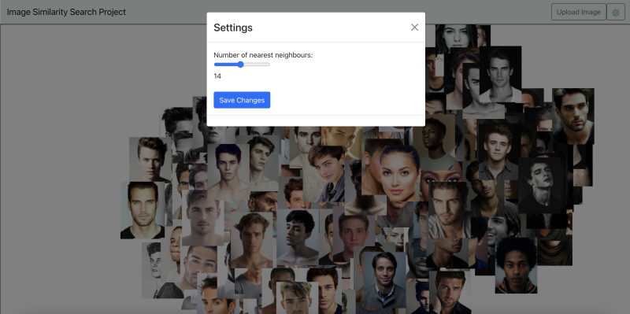<br>
*Settings*<br>


<b>[#30](https://gitlab.bht-berlin.de/image-similarity-search/image-similarity-search-frontend/-/issues/30) Informationsview: Nächte Nachbarn korrekt darstellen
</b><br>

- Nächste Nachbarn des ausgewählten Bildes anzeigen, inclusive der Distanzen / prozentualen Ähnlichkeiten zum Ursprungsbild.<br>
- Branch responseHandling von Fabian in den d3_Informationsansicht Branch gemerged
- Code angepasst, sodass die Informationsview die nächsten Nachbarn eines Bildes mit der korrekten Bild-ID und der Anzahl k, die durch den Slider im Settings Menü eingestellt wurde, abrufen kann
- prozentuale Distanzen der nächsten Nachbarn zum Ursprungsbild erscheinen nun unter jedem Bild


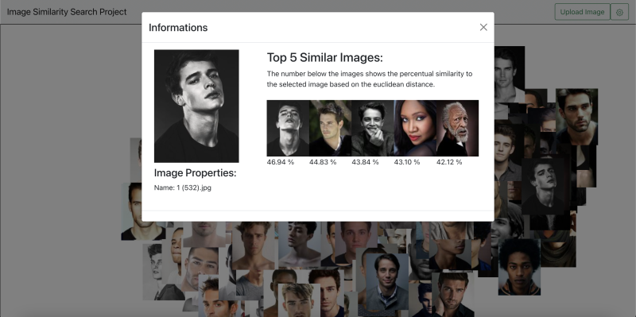<br>
*5 Nächste Nachbarn*<br>

<b>[#37](https://gitlab.bht-berlin.de/image-similarity-search/image-similarity-search-frontend/-/issues/37) BUG: Informationsansicht Slider Value</b> 

Beim Verändern des Slider Values über das Settings Menü, tritt daraufhin ein Fehler im Informations-Modal-Dialog auf.

- Bug fixed: Der Slider-Wert wurde als String an die fetchNearestNeighbours() Funktion übergeben, sodass ein internal server error auftrat. Nun wird der Wert mit parseInt() in einen Integer umgewandelt und das Problem ist behoben.

<br>
*14 Nächste Nachbarn*<br>


<b>[#38](https://gitlab.bht-berlin.de/image-similarity-search/image-similarity-search-frontend/-/issues/38) BUG: Zoom Funktion</b> 

D3 Zoom funktioniert nicht (Map bleibt statisch).
- alternative Implementierungsansätze ausprobiert
- bislang leider erfolglos


<br>    

<h3>Fabian (@s78278)</h3>

<b>[#34](https://gitlab.bht-berlin.de/image-similarity-search/image-similarity-search-frontend/-/issues/34) Anpassung/Erweiterung der Anfragen an das Backend</b>

Anpassung der bisherigen Anfragen an das Backend und deren Handling<br><br>
folgende Funktionen wurden bearbeitet:
- fetchAllThumbnailMeta() + handleAllMetaResponse
- fetchOneThumbnailMeta() + handleOneMetaResponse()
- fetchOneImage() + handleImageResponse

Erweiterung durch die Anfrage der nächsten Nachbarn mit der Funktion:
	
- fetchNearestNeighbours()<br>
und der Handling-Funktion:<br>
- handleMetaNearestNeighboursResponse()<br>


<b>[#35](https://gitlab.bht-berlin.de/image-similarity-search/image-similarity-search-frontend/-/issues/35) Anpassung/Test der fetchNearestNeighbour Funktion</b>

- Anpassung des Request-Headers und des Response Handlings der fetchNearestNeighbours - Funktion
- Test der Darstellung der Bilder in einem Test-Container.
- Feststellung: -> Duplikate in der Datenbank -> Vergleichsalgorithmus funktioniert

<br>
*Nächste Nachbarn-Funktion im Test-Container*<br>

<b>[#36](https://gitlab.bht-berlin.de/image-similarity-search/image-similarity-search-frontend/-/issues/36) Markierung des ausgewählten Bildes</b>

- Ein ausgewähltes Bild soll beim auswählen via "click-event" markiert und bei erneutem “click” wieder in den Ausgangszustand zurückspringen

aktueller Stand:
- Bild ändert seine Opacity bei einem click, jedoch springt es noch nicht in den Ausgangszustand zurück

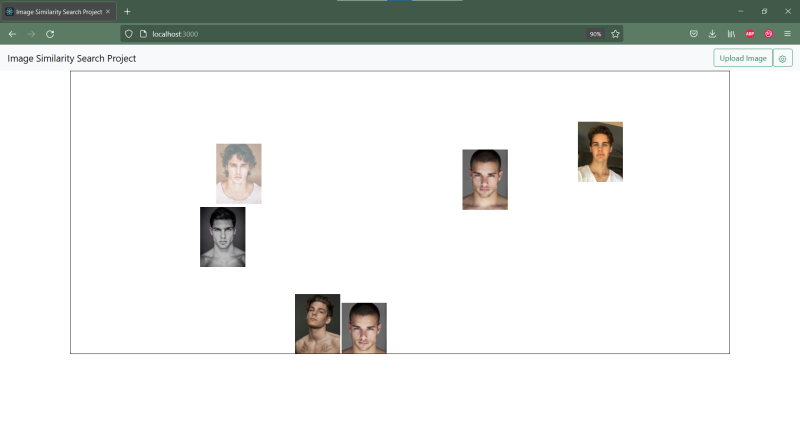<br>
*Markierung von Bildern*<br>

<h3>Paul (@s82130)</h3>

<b>[#15](https://gitlab.bht-berlin.de/image-similarity-search/image-similarity-search-frontend/-/issues/15) Zoomfunktionalität</b>

- Map immer noch statisch
- D3MapNeu.js durchgetestet, trotzdem den Versursacher des Bugs nicht gefunden
- andere Implementierung ausprobiert, gleiches Problem.

<b>[#23](https://gitlab.bht-berlin.de/image-similarity-search/image-similarity-search-frontend/-/issues/23) Zoomfunktionalität</b>

- Recherche, wie man folgende Stack Ansicht mit D3.js umsetzen könnte:

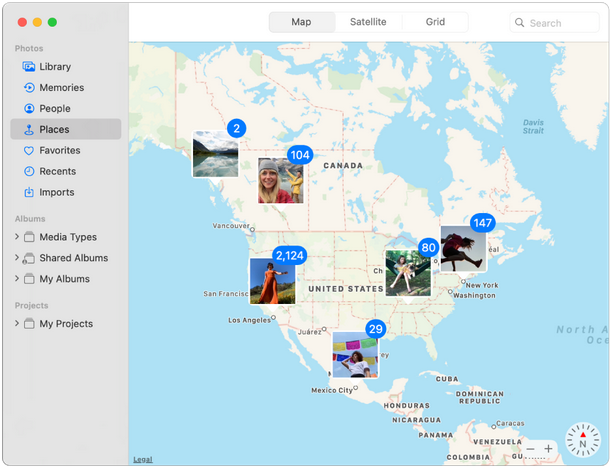<br>
*Mögliche Stack-Ansicht in der Overview*<br>

- Sonst habe ich keinen weiteren Fortschritt erreicht, da ich vom 29.11. - 01.12. an einer starken Mandelentzündung erkrankt bin.

<br><br>

<h2>Fortschritte Backend</h2>

<h3>Joris (@s81764)</h3>

<b>#27 Routen für flexible Menge an ids für Thumbnails/Metadaten erstellen und einbinden</b>

- Die Umsetzung erfolgte durch @s82765. Die von ihm erstellten Routen wurden in die bestehende Struktur eingearbeitet. Dafür gab es kleine Erweiterungen in der Datenbank.

<b>#17 Multiple Upload</b>

- Die Route /upload wurde von @s82765 bearbeitet und von mir in die Struktur der Applikation eingefügt.

<b>#33 Prüfung ob Änderungen am Datensatz vorgenommen wurden</b>

Ziel war es, unnötiges erneutes Laden und Speichern von Daten zu minimieren und somit einen wiederholten Serverstart schneller zu machen. 
Das t-SNE-Embedding wird nun gespeichert. 
Wird das Programm neu gestartet und erkennt keine Änderung in der Datenbank im Bezug auf den data-Ordner, werden die vorher gespeicherten Daten geladen. 
Erkennt das Programm einen Unterschied zwischen data-Ordner und Datenbank, wird alles neu geladen.
Ob dies effizienter passieren kann, wird in #45 exploriert


<b>#31 Größe der Bilder beim Upload checken und ggf. zuschneiden</b>

- Es wird nun beim ersten Laden der Bilder und beim Upload von Bildern aus dem Frontend überprüft, ob die Bildgrößen übereinstimmen
- Das Zuschneiden wurde nicht erledigt und wird in #44 weitergeführt

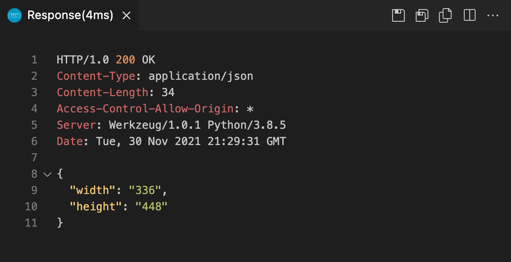<br>
*Response auf get size*

<b>#39 BUG Route /faiss/getNN/<id> erlaubt keinen request body</b>

- Berichtet von @s78278
- Fälschlicherweise wurde statt POST GET in dieser Route benutzt, wodurch kein body mit dem request mitgegeben werden konnte. Diese und andere Routen mit einen ähnlichen Problem wurden zu POST geändert


<b>#40 BUG beim Aufruf von /faiss/getNN/284, Error 500</b>

- Berichtet von @s82881
- Durch im Datensatz vorhandene Duplikate entstanden im Programm Probleme, da die Bilder komplett gleich sind und somit, wenn mit faiss gesucht wird, das erste Bild im Index, das genauso aussieht, gefunden wird. Ruft man nun die faiss-Suche auf einem Bild (mit hoher id) auf und es existiert ein Duplikat mit kleinerer id, wird das Bild mit der kleineren id zuerst gefunden. Durch eine Prüfung im Code wurde dadurch eine Exception geworfen.
- Behoben wurde das Problem dadurch, dass nicht mehr davon ausgegangen wird, dass das erste Bild, dass faiss bei einer Suche zurückgibt, wenn das Bild selber schon im Index ist, das Bild selbst ist.

<h3>Luke (@s82765)</h3>

<b>#27 Routen für flexible Menge an ids für Metadaten, Thumbnails und Fullsize Images</b>

- Routen für multiple Metadaten und Thumbnails wurden implementiert und funktionieren. 
- Die Thumbnails werden in einer Zip-Datei komprimiert in der Response zurückgegeben.
- Zu diesen Routen wurden ebenfalls Tests in der test.http Datei hinzugefügt.
- Es stellte sich bei der Implementierung der MultipleFullsize Route heraus, dass diese keinen Vorteil gegenüber der wiederholten Anfrage auf OneFullsize hätte, denn die Fullsize Images werden nur in einer sehr begrenzten Anzahl, in der Informationsview, im Frontend benötigt.
Deshalb wird diese Funktion zunächst weggelassen.

<br>
*Response für mehrere Thumbnails - Zip komprimiert*

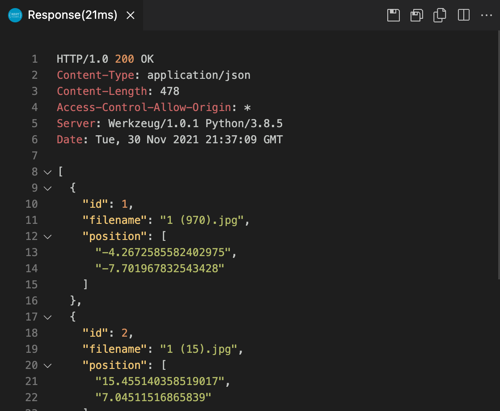<br>
*Response für mehrere Metadaten*


<b>#17 Multiple Upload</b>

- Die Route und Funktion für den Multiple Upload wurde implementiert und orientiert sich sehr an dem Single Upload. Durch @s81764 wurde die MultipleUpload Route mit der Single Upload Route verbunden, so dass diese mit einer beliebigen Anzahl an hochgeladenen Bildern aufgerufen werden kann.


<b>#42 Dokumentation KW 48</b>

- Dokumentation der letzten Fortschritte aller Gruppenmitglieder für die Präsentation am 01.12.21
<br><br>

<h3>Julia (@s75934)</h3> 

<b>#24 Sift Algorithm</b>

- Code wurde generell nochmal etwas umgeschrieben und allgemeiner gehalten

<br>

- Mit Hilfe der ORB Funktionen wie zum Beispiel, detectAndCompute(), die Descriptoren der jeweiligen Bilder gespeichert, um darauf die Deskriptoren des Query Bildes und die aus der Datenbank zu vergleichen. 

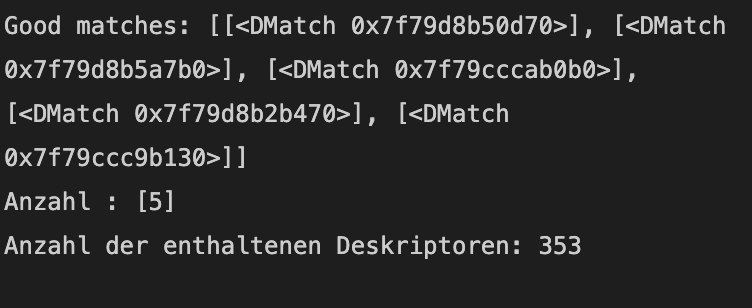<br>

- Bei Nutzung des "BFMatchers" und der Funktion knnMatch() enstand Problem: Es ließen sich die Anzahl der ähnlichsten Bilder (hier wurde eine Aussortierung vorgenommen, um nur die besten/ ähnlichsten Matches angezeigt zu bekommen), sowie die Ähnlichkeiten, welche in einem Int- Wert (siehe im Bild bei Good Matches, Beispiel: [<DMatch 0x7f79d8b50d70>]) angegeben wurden, ausgeben, jedoch gab es keine Auskunft, um welche Bilder es sich wirklich handelt. Deshalb habe ich versucht die Namen der Bilder mit den jeweiligen Deskriptoren mit Hilfe der zip Funktion zu einem Dictionary zu verbinden, um auch die Namen der ähnlichsten Bilder zurückzubekommen.

- Weiterer Lösungsansatz: Es wurden ebenfalls die Deskriptoren der Bilder gespeichert und sollten dann nicht mit dem BFMatcher und der knnMatch- Methode verglichen, sondern die euklidische Distanz zwischen den Deskriptoren, berechnet werden.

<h1 id="dokumentation-05-kalenderwoche-49">Dokumentation 05 - Kalenderwoche 49</h1>

[Zurück zum Inhaltsverzeichnis](#documentation)<br>

<h2>Fortschritte Frontend</h2>

<h3>Anne (@s82881)</h3>

<b>[#44](https://gitlab.bht-berlin.de/image-similarity-search/image-similarity-search-frontend/-/issues/44) Store uploaded Image in Frontend</b> 

- Hochgeladene Bilder im Frontend zwischenspeichern, sodass sie in die Map eingefügt werden können.
- Bilder werden nun von der ImageUploadButton Komponente an den RootReducer geschickt und sind als Props in der D3 Map abrufbar 
- So werden nun in der D3 Map Komponente URLs zu jedem File, der hochgeladen wurde, erzeugt und im State der Komponente gespeichert.<br>


<b>[#21](https://gitlab.bht-berlin.de/image-similarity-search/image-similarity-search-frontend/-/issues/21) Display uploaded Image in Overview</b><br>

- hochgeladene Bilder werden nun mit korrekter Größe und Koordinaten auf dem Canvas angezeigt
- bestehende Probleme:<br>
alte Uploads müssen noch von der Map entfernt werden, sobald neue Bilder hochgeladen werden<br> 
Anzahl der angezeigten nächsten Nachbarn bei hochgeladenen Bildern nicht nachträglich veränderbar<br>


<br>
*Hochgeladenes Bild in der Overview anzeigen*<br>

<br>
*Informationsansicht eines hochgeladenen Bildes*<br>

<b>[#22](https://gitlab.bht-berlin.de/image-similarity-search/image-similarity-search-frontend/-/issues/22) Bild Upload</b> 

- multiple Image Upload funktioniert

<b>[#45](https://gitlab.bht-berlin.de/image-similarity-search/image-similarity-search-frontend/-/issues/45) Resize Images after Upload</b> 

- bislang ungelöst<br>    

<h3>Fabian (@s78278)</h3>

<b>[#36](https://gitlab.bht-berlin.de/image-similarity-search/image-similarity-search-frontend/-/issues/36) Markierung des ausgewählten Bildes via "one-click"</b>

- Ein ausgewähltes Bild soll beim auswählen via "click-event" markiert und bei erneutem “click” wieder in den Ausgangszustand zurückspringen
- Bild ändert seine Opacity bei einem click, jedoch spricht es noch nicht in den ausgangszustand zurück
- Problem wurde mit einem "state", der jeweils vorher abgefragt wird gelöst
- Ausgangszustand wird jetzt beim zweiten click auch erreicht
- markStyle muss noch angapsst werden, leider nimmt das gewählte object nicht die zugewiesene border an. -> behandlung folgt in Issue [#42](https://gitlab.bht-berlin.de/image-similarity-search/image-similarity-search-frontend/-/issues/42) (closed)

<b>[#43](https://gitlab.bht-berlin.de/image-similarity-search/image-similarity-search-frontend/-/issues/43) Markieren der nächsten Nachbarn bei single-click</b>

- Wenn auf einem Bild ein "single-click" ausgeführt wird, soll das entsprechende Bild und deren eingestellte Anzahl an Nachbarn markiert werden.
erster Lösungsansatz, die gefundenen Nachbarn mit d3 genau wie das gewählte Bild zu manipulieren ist gescheiter
- zweite Idee: Sie über ihre eindeutige ID im DOM auszuwählen und darüber ihren Style zu ändern war die bessere Lösung
- nachträglich wurde dem svgCanvas noch eine klick-Funktion übergeben damit die Markierung der Bilder entfernt wird
- markStyle muss noch angepasst werden, leider nimmt das gewählte objekt nicht die zugewiesene border an. -> behandlung folgt in Issue [#42](https://gitlab.bht-berlin.de/image-similarity-search/image-similarity-search-frontend/-/issues/42) (closed)

<b>[#42](https://gitlab.bht-berlin.de/image-similarity-search/image-similarity-search-frontend/-/issues/42) markStyle des angeklickten Bildes anpassen</b>

- Problem aus Issue [#36](https://gitlab.bht-berlin.de/image-similarity-search/image-similarity-search-frontend/-/issues/36) (closed) und Issue [#43](https://gitlab.bht-berlin.de/image-similarity-search/image-similarity-search-frontend/-/issues/43) (closed)
- markStyle muss noch angepasst werden, leider nimmt das gewählte objekt nicht die zugewiesene Border an.
- Elemente haben keine "border"- style angenommen
- Erkenntnis: 
Die dargestellten Bilder sind SVG-Elemente, auf denen nicht alle CSS-Kommandos funktionieren
- Lösungsansatz: 
mit den Daten der gewählten Bilder (Größe und Position) ein Rechteck auf Canvas hinzufügen.

- fill-Attribut auf transparent setzen, damit ein Rahmen entsteht und das Bild darunter gesehen wird

<br>
*Markierung der nächsten Nachbarn in der Overview*<br><br>

<b>[#40](https://gitlab.bht-berlin.de/image-similarity-search/image-similarity-search-frontend/-/issues/40) wechsel in Informations-View via "double-click"</b>

- Per double-click auf ein Bild soll die Informations-View geöffnet werden.
- Nach kurzer Recherche konnte dies durch ein einfaches ändern des Parameters von "click" zu "dblclick" umgesetzt werden

<h3>Luke (@s82765)</h3>

*Diese Woche in das Frontend gewechselt*

<b>[#41](https://gitlab.bht-berlin.de/image-similarity-search/image-similarity-search-frontend/-/issues/41) Semantischer Zoom in der Overview</b>

- Dieser Zoom wird auf der Grundlage der bereits laufenden Issues [#15](https://gitlab.bht-berlin.de/image-similarity-search/image-similarity-search-frontend/-/issues/15) (closed) und [#38](https://gitlab.bht-berlin.de/image-similarity-search/image-similarity-search-frontend/-/issues/38) (closed) bearbeitet.
- Das Ziel ist es einen semantischen Zoom für die Overview zu implementieren, der es dem Nutzer erlaubt die angezeigten Bilder interaktiv zu erkunden. Dafür müssen die Bilder bei einer starken Vergrößerung eines Bereiches, ihre Größe verändern. Das Koordinatensystem muss je nach Zoom oder Verschieben des Streudiagrammes angepasst werden.

- Das Anpassen des Koordinatensystems aufgrund des Zooms oder der Verschiebung des Streudiagrammes funktioniert, nun muss die Größe der Bilder angepasst werden

<br>
*Semantischer Zoom, Größe der Bilder noch nicht berücksichtigt*<br>

- Die Größe der Bilder wird nun aufgrund der sich verändernden Zoom-Scale berechnet

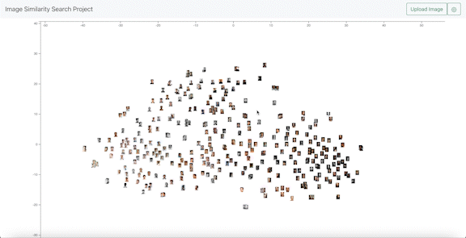<br>
*Semantischer Zoom, Größe der Bilder aufgrund der Zoom-Scale berechnet*<br>


- Nach der Implementierung des semantischen Zooms, trat ein Bug auf. Die Bilder reagieren nicht mehr auf die OnClick Events, da der Zoom-Layer diese Klicks blockiert. Der nächste Schritt ist es diesen Fehler zu beheben, indem das Click-Event an den unteren Layer weitergegeben wird oder die Struktur der Layers allgemein geändert werden muss.

- Die On-Click Events werden wieder aufgerufen. Die Bilder wurden auf den Zoom-Layer verschoben, um die Click-Events zu ermöglichen. Allerdings kann nun nicht mehr gezoomed werden, sobald der Cursor auf einem Bild liegt. Es wird versucht diesen Fehler zu beheben. Dieses Problem wird allerdings in einem anderen Issue behandelt - siehe Issue [#49](https://gitlab.bht-berlin.de/image-similarity-search/image-similarity-search-frontend/-/issues/49)


<b>#48 Dokumentation KW 49</b>

- Dokumentation der letzten Fortschritte aller Gruppenmitglieder für die Präsentation am 07.12.21

<br>

<h3>Julia (@s75934)</h3> 

*Diese Woche in das Frontend gewechselt*

<b>#24 SIFT/ORB Algorithm closed</b>

<b>[#45](https://gitlab.bht-berlin.de/image-similarity-search/image-similarity-search-frontend/-/issues/45) Resize Images after Upload</b>

- Realisierung des Zuschnitts von hochgeladenen Bildern
- User soll beim Nutzen der Applikation die Bilder anhand eines Rechtecks zuschneiden können
- Rechteck besitzt feste Größe
- Wie wird dies beim Multiupload umgesetzt?
Möglichkeit, wie es aussehen könnte:
(BildIUploadCrop)

- Andere Möglichkeit: Realisierung im Backend, was wiederum nicht ganz so benutzerfreundlich ist<br>


<br>
*Zuschneiden eines hochgeladenen Bildes*<br><br>

<b>[#47](https://gitlab.bht-berlin.de/image-similarity-search/image-similarity-search-frontend/-/issues/47) Einarbeitung React, D3</b>

- Wechsel zum Frontend
- lernen von React, D3 anhand von Tutorials, Dokumentationen und Dummie Code


<h3>Paul (@s82130)</h3>

- In dieser Kalenderwoche ebenfalls wegen Krankheit ausgefallen. Attest ist vorhanden.

<br>

<h2>Fortschritte Backend</h2>

<h3>Joris (@s81764)</h3>

<b>#30 Weitere Indizes für faiss zur Verfügung stellen</b>

- Vorher wurden die Entfernungen auf dem IndexFlatL2 berechnet.
- Struktur für Wechsel von Indizes zur Laufzeit aufgebaut, inkl. Routen
- IndexIVFFlat als ersten Test eingebunden

<br>
*Wechsel des FAISS-Index*<br>

<b>#49 Reduzieren der Größe des tsne Objekts</b>

- Es ist aufgefallen, dass die Größe des tsne-Embedding im Arbeitsspeicher zu groß ist, wodurch größere Datensätze nicht für eine Visualisierung in Frage kommen würden
- Das Embedding wurde vorher auf dem kompletten Datensatz berechnet
- Nun werden durch Hauptkomponentenanalyse (PCA) die Dimensionen zuerst auf (derzeit) 50 reduziert. Bessere Werte, auch für tsne, werden in #51 erforscht
- Dadurch ist die Berechnung wesentlich schneller, aber nicht so exakt wie vorher
- Durch Probleme mit dem pickeln von einigen dependency-Objekten wurde das Abspeichern und Laden des tsne-Embeddings wieder entfernt. Durch die schnelle Berechnung stellt dies jedoch kein Problem dar. 

<b>#21 faiss-Index speichern und laden</b>

- Ziel war es, zur Laufzeit den Index wechseln zu können
- Da die Indizes gerade bei sehr vielen Bildern sehr groß wurden, sollten diese Zwischengespeichert und geladen werden
- Aufgrund der Größe der Indizes war dieses Laden und Speichern sehr langsam und eignete sich nicht für einen Wechsel zur Laufzeit
- In #52 wird ein Wechsel zwischen Indizes implementiert, bei welchem die Indizes gleichzeitig im Arbeitsspeicher sind. Dafür müssen einige Änderungen aus #21 wieder auf den Stand - von #30 gebracht werden.
- Da der Arbeitsspeicher begrenzt ist, können so nur wenige Indizes gleichzeitig geladen sein.


<h1 id="dokumentation-06-kalenderwoche-2">Dokumentation 06 - Kalenderwoche 2</h1>

[Zurück zum Inhaltsverzeichnis](#image-similarity-search-project-documentation)<br>

<h2>Fortschritte Frontend</h2>

<h3>Anne (@s82881)</h3>

<b>[#18](https://gitlab.bht-berlin.de/image-similarity-search/image-similarity-search-frontend/-/issues/18) Datenexport</b> 

Anforderung: 

- k-Nächste-Nachbarn eines ausgewählten Bildes als Excel-Dokument exportieren.<br>

Umsetzung:<br>
- Button in Informationsview eingefügt
- nächste Nachbarn bearbeitet: nach Update von Joris(@s81764) filenames in NN ergänzt
- xlsx-Export funktioniert
- ausgegeben werden: ID, Name, euklidische Distanz, prozentuale Ähnlichkeit
- zukünftige Ergänzungen: ggf. Bilder einfügen

<br>

<br>

<h3>Fabian (@s78278)</h3>

<b>[#60](https://gitlab.bht-berlin.de/image-similarity-search/image-similarity-search-frontend/-/issues/60) Transformation zur Markierung hinzufügen</b>

Das ausgewählte Bild und deren Nachbarn werden an der Z-Achse verschoben und damit hervorgehoben.
- Umsetzung durch eigene CSS-Klassen
- benötigte Attribute: transition und transform
- zusätzlich wurde noch ein Transition-Delay hinzugefügt

<b>[#61](https://gitlab.bht-berlin.de/image-similarity-search/image-similarity-search-frontend/-/issues/61) Hochgeladene Bilder markieren</b>

- hochgeladene Bilder werden zur Übersichtlichkeit farblich markiert.

- Umsetzung durch eigene Klasse und entsprechendes styling via CSS
- Markierung wird durch einen klick auf den Canvas entfernt

Bug: 
- absturz des Programm beim Auswählen eines hochgeladenen Bildes

Bugfix:
- Bug entstand durch eine ältere Version der Anwendung wodurch nicht abgefragt wurde ob das Bild eine Hochgeladenes Bild ist

<b>[#65](https://gitlab.bht-berlin.de/image-similarity-search/image-similarity-search-frontend/-/issues/65) Aufruf der Informationsview durch andere Eingabe</b>

Da es immer wieder Komplikationen mit dem "click-events" gab war die erste Idee die Informationsview nicht mehr mit einem Doppelklick zu öffnen sondern mit einem Rechtsklick.<br>
- Umsetzung durch ersetzen von "dblclick" in "contextmenu"<br><br>
Bug:<br>
- Zoom hat nicht mehr funktioniert. Fehler lag an einer veralteten Version der Anwendung<br><br>
aktuelle Lösung:<br>
- Informationsansicht kann durch ein erneutes klicken eines markierten Bildes geöffnet werden. Dies passiert in der gleichen Methode, durch eine zusätzlich Abfrage und einem entsprechenden State.<br><br>
Vorteil:<br>
- nur noch ein onclick-event


<h3>Luke (@s82765)</h3>

<b>[#62](https://gitlab.bht-berlin.de/image-similarity-search/image-similarity-search-frontend/-/issues/62) Fetch all thumbnails with single request</b>

- Es sollen alle Thumbnails mit einem Request aus dem Backend angefragt werden. Für das entpacken des Zip-Verzeichnisses wird JSZip verwendet. Die Bilder kommen in der richtigen Reihenfolge an und können so mit den Metadaten zusammengeführt werden. Diese müssen noch für eine korrekte Verwendung in die D3 Map eigebunden werden. 
- Nach dem erfolgreichen Einbinden werden Tests durchgeführt, welche Methode effizienter ist. Dafür sollte auch in Zukunft mit einem größeren Datensatz getestet werden.
- Der Download der Bilder per Zip-Verzeichnis benötigt 528ms also ca. eine halbe Sekunde.
- Der Download aller Bilder per einzelner Anfrage für jedes Thumbnail beträgt ca. 19 Sekunden. Dieses Ergebnis schwankt allerdings oft.

<br>
*Entpacktes Zip-Verzeichnis mit den Thumbnails*<br>

<b>#61 Dokumentation KW 02</b>

- Dokumentation der letzten Fortschritte aller Gruppenmitglieder für die Präsentation am 12.01.22


<b>Aufgrund einer Corona-Infektion konnte ich diese Woche leider nicht die übliche Bearbeitungszeit in das Projekt investieren.</b>

<br>

<h3>Julia (@s75934)</h3>    

<b>[#45](https://gitlab.bht-berlin.de/image-similarity-search/image-similarity-search-frontend/-/issues/45) Resize Images after Upload</b>

- Problem : State dieses Features war nicht ganz optimal -> Zweiter Modaldialog (Crop) wurde beim Starten direkt geöffnet

<br>

- Es lassen sich nicht 2 Modaldialoge in einer Datei behandeln, wenn diese im Redux enthalten sind, da entweder alle Modaldialoge oder nur einer angezeigt wird.

- Hier auf dem Screenshot und durch ausgiebiger Recherche wird das Problem deutlicher: 

<br>

<br>
- Auch der Versuch den Modaldialog erst beim Erfüllen dieser Bedingung anzeigen zu lassen hat nicht funktioniert

-> Da es aufwändiger wäre die komplette Datei samt Redux usw. neu aufzusetzen, habe ich mich entschieden nach einer Alternative zum Modaldialog zu schauen

<h3>Paul (@s82130)</h3>

<b>[#23](https://gitlab.bht-berlin.de/image-similarity-search/image-similarity-search-frontend/-/issues/23)  Bilder Stack-Ansicht (D3 Collision Detection)</b>

Soll etwa so aussehen:

<br>

- Force Layout Bilder implementieren, damit sie sich nicht mehr überlappen und überlappende Bilder “zusammengefasst” werden
- forceCollide von D3 ist nur für Kreise geeignet, daher eigene Funktion entwickelt, die sich auf Bilder übertragen lässt
- Formel aufgestellt, für wenn sich 2 Rechtecke, also 2 Bilder überlappen
- Orientierung: https://lvngd.com/blog/rectangular-collision-detection-d3-force-layouts/
- imgCollide Funktion geschrieben, für den Fall, dass sich 2 Bilder überlappen
- Problem: Muss sich an den durch Zoom und Pan ständig ändernden Korrdinaten der Bilder orientieren
- Nächster Schritt: Body für Bedingung schreiben, wenn sich 2 Bilder überlappen


<br>

<h2>Fortschritte Backend</h2>

<h3>Joris (@s81764)</h3>

<b>#60 Bei nächster Nachbarn Suche filenames zurückgeben</b>

- Von @s81881 (Anne) wird der Daten-Export implementiert. Dafür sind die filenames der nächsten Nachbarn benötigt
- /upload und /faiss/getNN geben jetzt die filenames der nächsten Nachbarn zurück

<b>#59 Umsetzen clustering mit k-means, Rückgabe von Cluster-IDs o.ä.</b>

- scikit-learn k-means clustering wurde eingebunden
- Es wurden Routen für das Beziehen der Clusterzentren und ändern der Menge an Clusterzentren implementiert
- Clusterzentrum-ID wurde in Datenbank und Metadaten-Routen eingebunden
- swagger Dokumentation wurde angepasst

<br>
*Ausschnitt aus kmeans.py*<br>

<br>
*Rückgabe von /upload mit Clusterzentren-IDs*<br>

<h1 id="dokumentation-07-kalenderwoche-3">Dokumentation 07 - Kalenderwoche 3</h1>

[Zurück zum Inhaltsverzeichnis](#image-similarity-search-project-documentation)<br>

<h2>Fortschritte Frontend</h2>

<h3>Anne (@s82881)</h3>

<b>[#18](https://gitlab.bht-berlin.de/image-similarity-search/image-similarity-search-frontend/-/issues/18) Datenexport</b> 

*Anforderung:* 

- k-Nächste-Nachbarn eines ausgewählten Bildes als Excel-Dokument exportieren.

*Umsetzung:*

- Excel-Export-Button im Header eingefügt
- durch Klick auf den Export-Button im Header können nun k-NN aller Bilder in der Datenbank exportiert werden.
- Cluster Center dank Update im Backend durch Joris verfügbar 
- -> Cluster Center abgerufen (NN-Methoden geupdated)

<b>Excel Export in Infoview:</b>

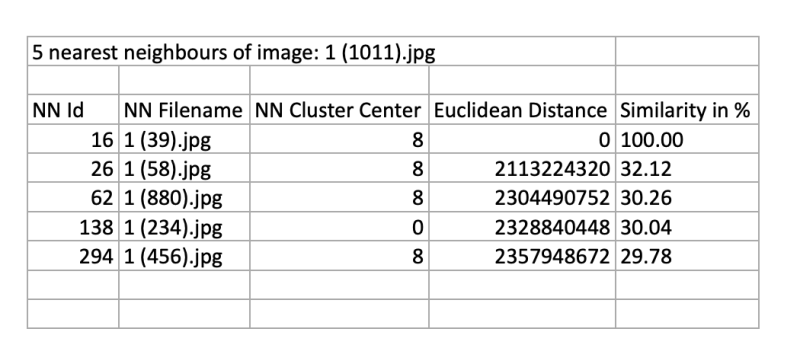<br>

*ausgegeben werden:*<br>
- ID im Dokumentheader 
- NN ID, NN Filename, NN Cluster Center, euklidische Distanz, prozentuale Ähnlichkeit

<b>Excel Export im Header:</b>

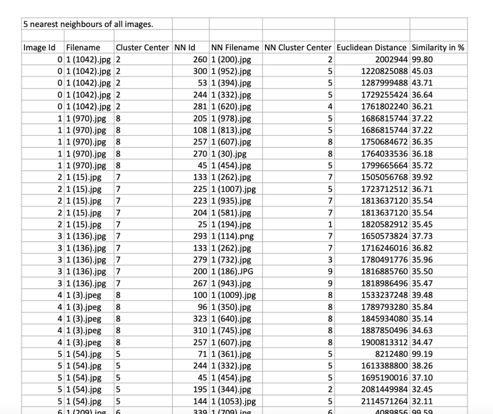<br>

*ausgegeben werden:*<br>
- Image ID, Filename, Cluster Center, NN ID, NN Filename, NN Cluster Center, euklidische Distanz, prozentuale Ähnlichkeit
- Daten werden in Chunks von 100 IDs an das Backend gesendet, um das Backend bei sehr großen Anfragen nicht zu überlasten. 
<br><br>
*offene ToDos:*<br>
- Excel Export in Infoview: Cluster Center und Image Id bei ausgewähltem Bild in den Header des Dokumentes einfügen. (Warten auf Fetch der Cluster Center für alle Bilder auf dem Canvas durch Fabian(@s78278)).
<br>

<b>[#70](https://gitlab.bht-berlin.de/image-similarity-search/image-similarity-search-frontend/-/issues/70) Bugfix Image Upload</b> 

- Problem: Beim Klick auf hochgeladene Bilder, stürzt die Anwendung ab.
- Lösung: Durch diverse Updates der Response, die das Backend auf der /upload Route zurückgibt, funktionierte der Klick auf hochgeladene Bilder nicht mehr, da auf die falschen Parameter zugegriffen wurde. Durch Anpassen und Hinzufügen von Parametern, konnte das Problem gelöst werden.


<h3>Fabian (@s78278)</h3>

<b>[#63](https://gitlab.bht-berlin.de/image-similarity-search/image-similarity-search-frontend/-/issues/63) Instructions/Settings</b>

- Anzeigen von Cluster

*Erster Ansatz:*<br>

- Cluster sollen beim Starten der Anwendung abgefragt werden und dann für die jeweilige `id` des Clusters eine farblicher Rahmen als angehangen werden.

*Problem:*<br>

- der Zugriff auf die Bilder war nicht möglich weil sie noch nicht alle aus der Datenbank geladen wurden

*Zweiter Ansatz:*<br>

- Über einen Button im Header sollen die Cluster der auf der Map angezeigt werden.
- Button zum Aktivieren der Cluster wurde im Header implementiert
- Slider zum verstellen der Anzahl der Cluster wurder im Settingsbutton integriert

*Problem:*<br>

-  fehlender Zugriff auf die Images in der Cluster Button-Komponente

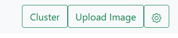<br>
<br>


<h3>Luke (@s82765)</h3>

<b>[#62](https://gitlab.bht-berlin.de/image-similarity-search/image-similarity-search-frontend/-/issues/62) Fetch all thumbnails with single request</b>

- Die mit JSZip entpackten Bilder sollen nun als Blob generiert werden. Sie erhalten eine temporäre URL über die sie während der Session aufgerufen werden können. Bei der Generierung dieser Blobs kam es zu einem größeren Fehler.
- Der Fehler lag an einer falschen Dekompression des Zip-Verzeichnisses. Die Bilder mussten zunächst als `arraybuffer` behandelt werden und mit dem korrekten Dateityp(`.png, .jpg, ...`) als Blob generiert werden. Dieser Dateityp wird per regular expression aus dem Dateinamen geholt. Die Bilder werden nun korrekt angezeigt.

- Das Einbinden der Thumbnails durch eine Anfrage mit Zip-Komprimierung verkürtzt die Response-Time erheblich. 
- Download der Bilder per Zip-Verzeichnis benötigt 528ms also ca. eine halbe Sekunde.
- Zum Vergleich: Download aller Bilder per einzelner Anfrage für jedes Thumbnail beträgt ca. 19 Sekunden.

```javascript
   request({
    method : "GET",
    headers :  {'Api-Session-Token': sessionToken},
    url : restUrl,
    encoding: null // <- this one is important!
}, function(error, response, body) {
     JSZip.loadAsync(body).then(function(zip) {
        var imageUrls = [];
        var regex = /(?:\.([^.]+))?$/;
        for(let zipEntry in zip.files) {
            var url = zip.file(zipEntry).async("arraybuffer").then(function (data) {
                var ext = regex.exec(zipEntry)[0];
                var type = "image/" + ext.split('.')[1];
                var buffer = new Uint8Array(data);
                var blob = new Blob([buffer.buffer], {type: type});
                let url = URL.createObjectURL(blob)
                return url
               });
            imageUrls.push(url)
        }
        return callback(imageUrls, sessionToken)
        })
    });
```
_Request All Thumbnails - Entpacken des Zip-Verzeichnises, Erstellen der Blobs und der temporären URLs_
<br><br>

<b>[#68](https://gitlab.bht-berlin.de/image-similarity-search/image-similarity-search-frontend/-/issues/68) Access Token in request und response behandeln</b>

- Es soll bei jedem Request ein im Backend generiertes Access-Token zur Identifizierung des Clients mitgeschickt werden.

- Das Session Token wird nach dem Start der Anwendung direkt aus dem Backend über die Route `/authenticate` angefragt. Dieses Session Token wird dann in den Props und in dem lokalen State der D3Map für zukünftige Anfragen gespeichert.

- Die Axios-Requests werden nun mit einem default Header "Api-Session-Token" verschickt. Allerdings wurden noch nicht alle Anfragen in Axios umgeschrieben, weshalb bei manchen Anfragen das Session Token manuell angehangen wird. Die Anfragen der Fullsize Bilder in der Infoansicht gehen momentan noch nur über die URL, weshalb bei dieser Anfrage momentan kein Token mitgeschickt werden kann. Das Umschreiben dieser fetch-Requests wird in einem neuen Issue behandelt.

- Die Implementierung der Methode getSessionToken in AuthenticationActions wurde in Zusammenarbeit mit Joris (@s81764) bearbeitet. Er gab ebenfalls den  Hinweis auf die Axios Default-Header.

```javascript
if (sessionToken) {
    const {setSessionToken} = this.props;
    this.setState({sessionToken: sessionToken})
    setSessionToken(sessionToken)
    axios.defaults.headers.common['Api-Session-Token'] = sessionToken;
} else {
    axios.defaults.headers.common['Api-Session-Token'] = null;
}
```
_Setzen des default Headers 'Api-Session-Token' für alle Axios Requests_

<b>#68 Dokumentation KW 03</b>

- Dokumentation der letzten Fortschritte aller Gruppenmitglieder für die Präsentation am 19.01.22

<br>

<h3>Julia (@s75934)</h3>    

<b>[#45](https://gitlab.bht-berlin.de/image-similarity-search/image-similarity-search-frontend/-/issues/45) Resize Images after Upload</b>
<br>
Problem von letzter Woche gelöst:<br>
- Modaldialog öffnet sich nicht direkt nach dem Öffnen der Seite, da dieses Feature nun in eine eigene Komponente ausgelagert wurde 

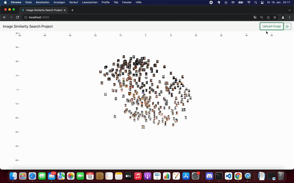<br>
*Image muss noch an Modaldialog angepasst werden*

<h3>Paul (@s82130)</h3>

<b>[#23](https://gitlab.bht-berlin.de/image-similarity-search/image-similarity-search-frontend/-/issues/23) Bilder Stack-Ansicht</b>

- Collision Detection verworfen, da Implementierung zu kompliziert
- Stattdessen: Einordnung in Raster 
- Raster erstellt und einzelne Zellen mit Koordinaten und ID in Array gespeichert
- Bilder bekommen jetzt ein cellID Attribut, welches entscheidet, ob sie angezeigt werden oder nicht
- Nächster Schritt: Dieses Attribut wird jedes Mal angepasst, wenn sich die Koordinaten der Bilder ändern

<br>

<h2>Fortschritte Backend</h2>

<h3>Joris (@s81764)</h3>

<b>#64 Anzahl der Clusterzentren durch eine Route beziehen</b>

+ Es wurde eine Route implementiert, über welche mit GET die Anzahl und Position der Clusterzentren aus #59 zurückgeben wird. 
+ Mit POST kann zur Laufzeit die Anzahl der Clusterzentren verändert werden  
```json
{
  "nr_of_centroids": 10,
  "cluster_centers": [
    {
      "id": 0,
      "cluster_center": [
        7.316447440723418,
        -1.5392057776407855
      ]
    },
    {
      "id": 1,
      "cluster_center": [
        -15.61662626312452,
        -9.611044041414424
      ]
    },
    {
      "id": 2,
      "cluster_center": [
        16.531871700518007,
        -0.9594768206022769
      ]
    },
…
}
```  
_Ausschnitt aus der Response von `/kmeans/centroids`_ 

<b>#63 ID für hochgeladene Bilder im Backend erstellen  </b>

+ Hochgeladenen Bildern soll abhängig von der Session eine fortlaufende ID zugewiesen werden
+ `/upload` gibt nun durch den Session Token aus #19 korrekte IDs zurück  
```python
def get_next_ids(self, key, amount=1):
    current_next_value = self._db["sessions"].find_one_and_update(
        { "key": key }, { "$inc": { "value": amount } }
    )
    if current_next_value is not None and "value" in current_next_value:
        current_next_value = int(current_next_value["value"])
        if amount == 1:
            return [current_next_value]
        else:
            return list(range(current_next_value, current_next_value + amount))
```  
_Ausschnitt aus `db.py`, in dem abhängig von der Session (`key`) neue IDs berechnet werden_  

<b>#19 Access Token</b>

+ Sessions sollen durch einen individuellen Token identifiziert werden, um Funktionen wie die fortlaufenden IDs (#63) zu verwirklichen
+ Mit  [M2Crypto](https://pypi.org/project/M2Crypto/) werden zufällige bytes erzeugt, welche anschließend base64 encoded werden
+ Vor Anfragen wird überprüft, ob das `Api-Session-Token` im Header ist und das gleiche Token wird in der Response wieder abgeschickt
+ Sessions werden in der Datenbank gespeichert  
+ Die Auslagerung der Generierung der Token und Einbindung in alle Routen wird derzeit in #65 in Zusammenarbeit mit Luke (@s82765) angepasst
```txt
access-control-allow-origin: http://localhost:8080 
access-control-expose-headers: Api-Session-Token,Content-Length,Content-Type 
Api-Session-Token: jfjtJ88/JRUzF2VaZHYzVA==
content-length: 37 
content-type: application/json 
```  
_Header einer Response von `/upload`_  

<b>#62 Route für mehrere/alle nächste Nachbarn der Bilder in der Datenbank</b>

+ Für den Datenexport von Anne (@s82881) werden die nächsten Nachbarn von allen `k` nächsten Nachbarn in der Datenbank benötigt.
+ Um den Traffic zu verringern wurde die Route `/faiss/getNN/multiple/k`erstellt, welche für alle (mit GET) oder die in einem Array von IDs spezifizierten (mit POST) Bilder in der Datenbank die nächsten `k` Nachbarn zurück gibt.  
```json
[
  {
    "id": 1,
    "filename": "1 (10).png",
    "position": {
      "x": "17.023328849888312",
      "y": "-4.958710797823259"
    },
    "cluster_center": "2",
    "neighbour_ids": [
      235,
      301,
      155
    ],
    "distances": [
      1997754496,
      2043924736,
      2043924736
    ],
    "similarities": [
      0.3335829973220825,
      0.3285232186317444,
      0.3285232186317444
    ],
    "neighbour_filenames": [
      "1 (661).jpg",
      "1 (878).jpg",
      "1 (433).jpg"
    ],
    "neighbour_cluster_centers": [
      2,
      2,
      2
    ]
  },
  {
    "id": 2,
…
  },
…
]
```  
_Ausschnitt aus der Response von `/faiss/getNN/multiple/3_ 

<b>#66 Clusterzentren in Rückgabe von Routen mit nächste Nachbarn-Berechnung</b>

+ Für den Datenexport von Anne (@s82881) werden die Clusterzentren der Bilder und der nächsten Nachbarn benötigt
+ Die Routen `/upload`, `faiss/getNN` und `faiss/getNN/multiple` geben nun die Clusterzentren der angefragten Bilder und der nächsten Nachbarn zurück  
```json
"neighbour_cluster_centers": [
    [
      5,
      1,
      2
    ],
    [
      2,
      1,
      9
    ]
```  
_Ausschnitt aus der Response von `/upload` mit den Clusterzentren der nächsten Nachbarn_

<b>#67 Datenbankabfragen für Spalten gesammelt ausführen</b>

+ Zuvor wurden Anfragen an die Datenbank oft entweder für jede Spalte oder jeden Datenpunkt einzeln ausgeführt
+ Nun können über eine Methode der Datenbank anhand der IDs beliebig viele Spalten und Dokumente in einer Abfrage ausgelesen werden
+ Dies verringert den Traffic und die Anfragezeiten  
```python
result = database.ids_to_various(ids, filename=True, cluster_center=True)
```  
_Möglicher Aufruf der Funktion mit den zu suchenden Spalten als kwargs_ 


<h1 id="dokumentation-08-kalenderwoche-4">Dokumentation 08 - Kalenderwoche 4</h1>

[Zurück zum Inhaltsverzeichnis](#image-similarity-search-project-documentation)<br>

<h2>Fortschritte Frontend</h2>

<h3>Anne (@s82881)</h3>

<b>[#69](https://gitlab.bht-berlin.de/image-similarity-search/image-similarity-search-frontend/-/issues/69) Ids & Filenames der uploaded images</b> 

*Problem:*<br>

Ids und Filenames von hochgeladenen Bildern wurden bislang nur im Frontend gesetzt:<br>

- Ids: wurden per for-loop fortgeführt
- Filenames: hardgecoded zu “uploaded_img” -> jedes hochgeladene Bild hatte identischen filename
Dank eines Updates von Joris (@s81764) werden neue Ids vom Backend generiert und zurückgegeben ebenso wie die ursprünglichen Filenames der Bilder. Diese wurden nun im Frontend integriert und werden in der Infoansicht sowie im Excel-Export benutzt.

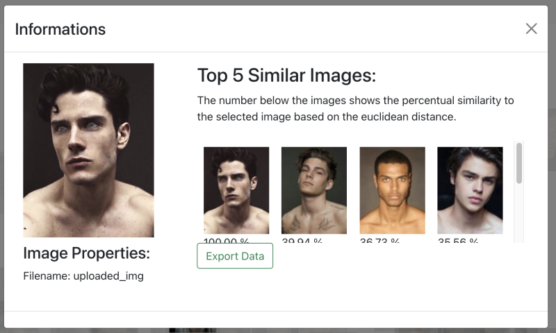<br>

<br>

<b>[#72](https://gitlab.bht-berlin.de/image-similarity-search/image-similarity-search-frontend/-/issues/72) Axios</b> 

*Problem:*<br>

- Requests an das Backend sollen angeglichen werden und alle mit Axios erfolgen. Bis auf “fetchAllThumbnails”.
- Requests erfolgen nun alle mit Axios. Überflüssige Methoden wurden entfernt.

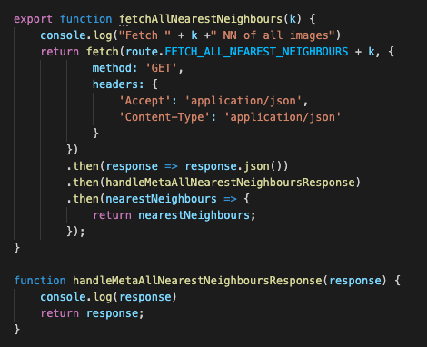<br>

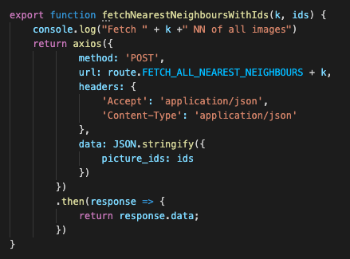<br>

<b>[#45](https://gitlab.bht-berlin.de/image-similarity-search/image-similarity-search-frontend/-/issues/45) Resize images after upload</b> 

- Zusammen mit Julia (@s75934) den state-Bug behoben, nachdem ein Bild gecropped wurde.


<h3>Fabian (@s78278)</h3>

<b>[#77](https://gitlab.bht-berlin.de/image-similarity-search/image-similarity-search-frontend/-/issues/77) Bugfixes Markierung nach Merge</b> 

- nach dem Merge mit den anderen Funktionen gab es lags bei der Markierfunktion
- außerdem behalten hochgeladen Bilder ihre Markierung nachdem Bilder markiert/demarkiert wurden

<b>[#63](https://gitlab.bht-berlin.de/image-similarity-search/image-similarity-search-frontend/-/issues/63) Cluster anzeigen</b> 

- Zugriff auf die Bilddaten konnte hergestellt werden
- über einen Switch im Header können jetzt die Cluster aktiviert werden
- Slider für das verstellen der Anzahl der Cluster wurde mit Anfrage an das Backend verbunden und verstellt die Anzahl
- Map wird noch nicht nach dem verstellen aktualisiert
- nach einem manuellen Refresh wird die zuvor gewählte Anzahl an Cluster übernommen und nach Aktivierung angezeigt

<br>
*Cluster-Ansicht*


<h3>Luke (@s82765)</h3>

<b>[#71](https://gitlab.bht-berlin.de/image-similarity-search/image-similarity-search-frontend/-/issues/71) Alle Bilder als blob einbinden, Sessiontokens in jeder Anfrage</b>

- Es werden nun alle Bilder als Blob eingebunden. 
- Alle Anfragen werden mit Session Token geschickt. 
- Zusätzlich werden die Thumbnails in der Info-View nun per Zip eingebunden. Dazu wird die von Joris (@s81764) im Backend zur Verfügung gestellte Route für multiple Thumbnails verwendet.
- Das asynchrone Entpacken der Zip-Verzeichnisse erschwerte das Einbinden der hochgeladenen Bilder, weshalb es zu mehreren Fehlern kam.
- Die Fehler wurden behoben. Unter anderem wurde auf die Next Neighbours zugegriffen, bevor diese im State gesetzt wurden.

```javascript
  /*
 * This function fetches on image.
 * @returns one fullsize image blob url 
 */
export function fetchOneImage(id, sessionToken) {
    var restUrl = route.FETCH_ONE_IMAGE + id;
    console.log("Fetch One Image from: " + restUrl);

    return fetch(restUrl, { 
        method: 'GET',
    headers: {
        'Api-Session-Token': sessionToken
    }})
        .then(response => response.blob())
        .then(blob => {
            return URL.createObjectURL(blob)
        })
}
```
_Request One Fullsize-Image - Erstellen des Blobs und der temporären URL_

<b>[#57](https://gitlab.bht-berlin.de/image-similarity-search/image-similarity-search-frontend/-/issues/57) Responsive Canvas</b>

- Ziel: Aktualisierung der Canvas-Size nach einem Resize des Windows

- Es wurden die Attribute

```javascript
.attr("viewBox", `0 0 ${canvasWidth} ${canvasHeight}`)
.attr("preserveAspectRatio", "xMinYMin meet")
```

dem `svgCanvas` Objekt hinzugefügt, um das gesamte Diagramm responsiv zu machen.
- Die Attribute `width` und `height` wurden durch die Viewbox ersetzt.
- Die Attribute `canvasWidth` und `canvasHeight` werden zum Start der Anwendung, wie zuvor von der Window-Size geholt.

<b>[#75](https://gitlab.bht-berlin.de/image-similarity-search/image-similarity-search-frontend/-/issues/75) Fix Bugs after Merge</b>

- Aufgrund einer falschen Reihenfolge der URLs aus der MultipleThumbnails-Zip, wurden die multipleThumbnail fetches zunächst entfernt. In Zukunft könnten diese jedoch wieder hinzugefügt werden.
- Des Weiteren musste das State-Attribut `uploadedImageCount` hinzugefügt werden, um die `ids` der hochgeladenen Bilder beim erstellen des `nN`-Objektes anzupassen, da die `ids` bei jedem hochgeladenen Bild erhöht wurden, jedoch die alten `uploadedImages` aus dem State entfernt wurden. So hatte jedes hochgeladene Bild eine zu hohe `id`, ab dem zweiten Hochladen von Bildern.

<b>[#66](https://gitlab.bht-berlin.de/image-similarity-search/image-similarity-search-frontend/-/issues/66) Submit Button - Error Handling (bei keinem Image)</b>

- Es erscheint eine Fehlermeldung, wenn der Sumbit Button betätigt, aber kein Image ausgewählt wurde.
- Wurde behoben :

```javascript
handleSubmit(e){
        e.preventDefault();
        const files = this.state.files;
        if (files === undefined){
            return
        }...
```

<b>#72 Dokumentation KW 04</b>

- Dokumentation der letzten Fortschritte aller Gruppenmitglieder für die Präsentation am 26.01.22

<h3>Julia (@s75934)</h3>    

<b>[#45](https://gitlab.bht-berlin.de/image-similarity-search/image-similarity-search-frontend/-/issues/45) Resize Images after Upload</b>
<br>

*UPDATE:*<br>

Problem von letzter Woche gelöst: <br>

- Modaldialog öffnet sich nicht direkt nach dem Öffnen der Seite, da dieses Feature nun in eine eigene Komponente ausgelagert wurde
- "Zuschneidungsrechteck" in richtiger Größe
- An Modaldialog anhand von CSS angepasst

<br>

- Nun öffnet sich der Modaldialog genau passend, wenn nur ein Bild ausgewählt wurde und nicht direkt beim Öffnen der Single Page App
- Nur leider konnte das Bild nicht hochgeladen werden, Filename usw. wurden erkannt, aber dennoch trat ein Problem auf, welches ich mit der Gruppe besprochen habe 

<br>
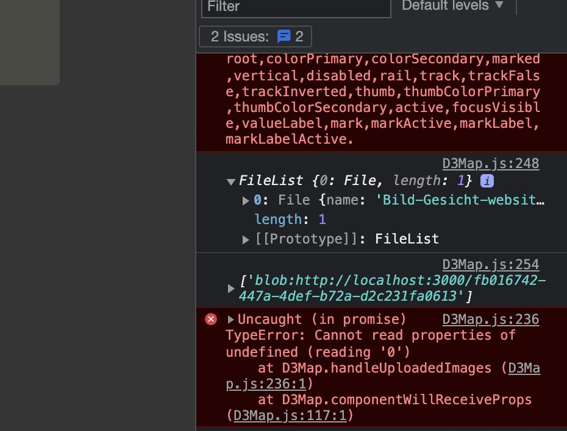<br>

- Joris (@s81764) hatte hier den Fehler behoben

*Weiterer Bug:*<br>

- Wenn man ein Bild ausgewählt hat, sich aber dann doch nochmal für ein anderes Bild entscheidet, erscheint dennoch die erste Auswahl.
- In Rücksprache mit Anne (@s82881) Fabian (@s78278) und Joris (@s81764) wurde das Problem mit dem State gelöst 

<br>
*hochgeladenes gecropptes Image*

<b>[#76](https://gitlab.bht-berlin.de/image-similarity-search/image-similarity-search-frontend/-/issues/76) Instructions/ Settings </b>

- Die Bedienungsanleitung ist gerade in Bearbeitung 

<h3>Paul (@s82130)</h3>

<b>[#23](https://gitlab.bht-berlin.de/image-similarity-search/image-similarity-search-frontend/-/issues/23) Bilder Stack-Ansicht (D3 Collision Detection) </b>

- Bisher wird über jede Zelle iteriert bei jeder neuen gelieferten Bildkoordinate
- Implementierung ausdenken, bei dem selektiver iteriert wird
- Quadtrees ausprobiert, aber dann hat man keine Kontrolle darüber, wie und wann welche Bilder angezeigt werden
- Bisher noch keine Lösung gefunden
- Aktueller Baustelle: Bilder nach Zellen gruppieren und berechnen, welches angezeigt wird und welches nicht

<br>

<h2>Fortschritte Backend</h2>

### Joris (@s81764)

#### **#65 Access Token für alle Routen**

+ Zuvor wurde das Token nur in der Route `/upload` verwendet
+ Das Token wird nun über die eigene Route `/authenticate` generiert und im header `Api-Session-Token` übergeben
+ Durch Einbindung des Tokens im Frontend durch Luke (@s82765) kann das Token nun in jeder Route übergeben werden  

```HTTP
HTTP/1.0 200 OK
Content-Type: text/html; charset=utf-8
Content-Length: 7
Api-Session-Token: Takukm9Xdx2DkS6j0bB7Rw==
Access-Control-Allow-Origin: *
Access-Control-Expose-Headers: Api-Session-Token, Content-Length, Content-Type
```  

__Ausschnitt aus den Response-Header von `/authenticate`__  

#### **#69 Refactor von Resourcen in app.py**

+ Zuvor wurden alle Resourcen in `app.py` angelegt
  + Dadurch wirkt die Datei unleserlich und ist unübersichtlich
+ Die Resourcen wurden in das Package `resources` in `api_package` ausgelagert und werden in app.py nur noch importiert  

<br>
__Ausschnitt aus der neuen Dateistruktur__  

#### **#70 Docstrings und typing**

+ Zum besseren Verständnis und um eine mögliche Weiterarbeit mit dem Backend zu ermöglichen, sollen in der finalen Version verschiedene Dokumentationsformen benutzt werden:
  + swagger: Dokumentation aller Routen mit Möglichkeit zum Testen
  + typing: Parameter und Rückgabewerte kennzeichnen
  + docstrings: Beschreibung von der Funktion aller Module, Packages, Klassen und Funktionen
  + pydoc: Aus docstrings generierte Übersicht aller Bestandteile des Backends
+ Die swagger-Dokumentation wurde in #47 realisiert
+ typing und docstrings wurden in diesem Issue bearbeitet
+ die pydoc-Dokumentation wird in #71 bearbeitet  

```py
def search(self, images: np.ndarray, k: int) -> 'Union[Tuple[np.ndarray, np.ndarray], None]':
    """Returns the k nearest neighbours and distances of the flat images in the images array using the current faiss index

    Args:
        images (np.ndarray): array containing the flat images, whose neighbours shall be found
        k (int): value indicating, how many neighbours shall be found. Should be 0 < k < Faiss.get_instance().faiss_index.ntotal

    Returns:
        np.array: Distances to the nearest neighbours
        np.array: Indices of the nearest neighbours
    """
    if not self.has_index: 
        print("No index present!")
        return None
    ...
```

__Ausschnitt aus `faiss.py` als Beispiel für typing und docstring__


<h1 id="dokumentation-09-kalenderwoche-5">Dokumentation 09 - Kalenderwoche 5</h1>

[Zurück zum Inhaltsverzeichnis](#image-similarity-search-project-documentation)<br>

<h2>Fortschritte Frontend</h2>

<h3>Anne (@s82881)</h3>

<b>[#80](https://gitlab.bht-berlin.de/image-similarity-search/image-similarity-search-frontend/-/issues/80) Code kommentieren</b> 

- Code mit Jsdoc dokumentiert
- Jsdoc Dokumentation erzeugt

<br>

<br>

<b>[#81](https://gitlab.bht-berlin.de/image-similarity-search/image-similarity-search-frontend/-/issues/81) Frontend Meeting</b> 

- aktuelle Branches gemerged
- Fehler in Clusteransicht besprochen

<h3>Fabian (@s78278)</h3>

<b>[#74](https://gitlab.bht-berlin.de/image-similarity-search/image-similarity-search-frontend/-/issues/74) Markierung entfernen falls auf anderes Bild geklickt wird</b> 

- mit einer weiteren if-else-Bedingung in der markImage-Funktion gelöst

<b>[#78](https://gitlab.bht-berlin.de/image-similarity-search/image-similarity-search-frontend/-/issues/78) Legende</b> 

- Legende wurde am rechten oberen Rand des Canvas hinzugefügt
- Legende beinhaltet Informationen zu den Markierungsfarben, Anzahl der eingestellten Cluster und deren Farbe
- Legende aktualisiert sich eigenständig sobald die Anzahl der der Cluster geändert wird
- Style der Legende wurde dem Style der Anwendung angepasst


<br>
*Legende*

<b>[#63](https://gitlab.bht-berlin.de/image-similarity-search/image-similarity-search-frontend/-/issues/63) Cluster anzeigen</b>

- Aktualisierungsproblem konnte durch asynchrone Funktion behoben werden.
- wurde in #81 (Frontend Meeting) gemeinsam berarbeit
- noch bestehender Bug:  beim Hochladen von Bildern werden die Images aus den props geschmissen und somit kommt es zu einem Absturz beim aktivieren der Cluster

<b>[#85](https://gitlab.bht-berlin.de/image-similarity-search/image-similarity-search-frontend/-/issues/85) Überarbeitung der StyleSheets</b>

Umsetzung mit SCSS:<br>
- vertikale Scrollbar im body wurde entfernt
- erstellen einer color-scheme-datei (in bearbeitung)
- bisher wurden folgen Dateien angepasst: marksStyle, legendStyle und clusterStyle^

<h3>Luke (@s82765)</h3>

<b>[#79](https://gitlab.bht-berlin.de/image-similarity-search/image-similarity-search-frontend/-/issues/79) fetchmultipleThumbnails in der Infoview</b>

- Das Entpacken und Einbinden wurde bereits implementiert. Es ist allerdings aufgefallen, dass die Thumbnails in einer falschen Reihenfolge ankamen und das zu falschen Darstellung führt.
- Die Thumbnails werden jetzt in korrekter Reihenfolge eingebunden. Die in der Zip mitgeschickten Filenames (die ebenfalls die Ids enthalten) werden nun mit den Ids verglichen, so das diese übereinstimmen.

```javascript
var thumbnailId = regexId.exec(zipEntry)[0];
...
let url = URL.createObjectURL(blob)
var thumbnailData = {url: url, thumbnailId: thumbnailId}
return thumbnailData
```
*Die `thumbnailId` wird aus jeder `zipEntry` gelesen und mit zurückgegeben. Dadurch wird garantiert, dass das Bild mit der Id übereinstimmt.*<br>

<b>#13 Flowchart - Diagramm für die Präsentation</b>

- Ablaufdiagramm erstellt, zur besseren Übersicht der gesamten Anwendung und deren Prozesse


<b>[#81](https://gitlab.bht-berlin.de/image-similarity-search/image-similarity-search-frontend/-/issues/81) Frontend Meeting</b> 

- aktuelle Branches gemerged
- Fehler in Clusteransicht besprochen

<b>#73 Dokumentation KW 05</b>

- Dokumentation der letzten Fortschritte aller Gruppenmitglieder für die Präsentation am 02.02.22

<h3>Julia (@s75934)</h3>    

<b>[#76](https://gitlab.bht-berlin.de/image-similarity-search/image-similarity-search-frontend/-/issues/76) Instructions/ Settings </b>

- Neue Komponente mit Modaldialog erstellt
- In der Navigationsleiste anklickbar
- Kleine Bedienungsanleitung

<br>
*Instructions*

<h3>Paul (@s82130)</h3>

<b>[#23](https://gitlab.bht-berlin.de/image-similarity-search/image-similarity-search-frontend/-/issues/23) Bilder Stack-Ansicht (D3 Collision Detection) </b>

26.01.2022:

- Einfachere Implementierung von Quadtree nach Tutorialreihe: https://youtu.be/OJxEcs0w_kE
- Neuer Ansatz: Raster + Quadtree kombinieren
- Einarbeitung in https://github.com/d3/d3-quadtree
- Fehler bei Erstellung des Rasters:
<br>
- Fehler zunächst ignoriert und mit Quadtree Implementierung weitergemacht.
- Zunächst habe ich einen D3.js Quadtree implementiert und die Daten der Bilder eingefügt
- Neuer Fehler:
<br>
- Fehler durch Entfernen einer alten Funktion gefixt.
- Bilderdaten erfolgreich in Quadtree eingefügt, aber suche nach Bildern in bestimmten Rechteck gibt Fehler zurück:
<br>
- Entsprechende Funktion fürs erste auskommentiert, um an Zeichnung des Quadtrees zu arbeiten
- Fehler nach Implementierung von Zeichenfunktion: 
<br>

<br>

<h2>Fortschritte Backend</h2>

### Joris (@s81764)

#### **#71 pydoc Dokumentation**

+ Als zusätzliche Dokumentationsform soll [Sphinx](https://www.sphinx-doc.org/en/master/) verwendet werden.
+ Dokumentation wird aus den docstrings generiert, welche teilweise noch angepasst werden müssen

_Noch nicht abgeschlossen_

#### **#74 Server-Start mit Makefile**

+ Für einfacheres Starten des Servers und Bearbeiten der Umgebung werden Befehle in einem Makefile gesammelt.

_Noch nicht abgeschlossen_

<h1 id="dokumentation-10-kalenderwoche-6">Dokumentation 10 - Kalenderwoche 6</h1>

[Zurück zum Inhaltsverzeichnis](#image-similarity-search-project-documentation)<br>

<h2>Fortschritte Frontend</h2>

<h3>Anne (@s82881)</h3>

<b>[#88](https://gitlab.bht-berlin.de/image-similarity-search/image-similarity-search-frontend/-/issues/63) Clusterzentren im Excel Export</b>

- beim Excel Export in der Informationsview wird nun das Clusterzentrum des ausgewählten Bildes im Dokumentheader angezeigt
- bei hochgeladenen Bildern wird kein Clusterzentrum angezeigt


<b>[#80](https://gitlab.bht-berlin.de/image-similarity-search/image-similarity-search-frontend/-/issues/80) Code kommentieren</b>

- fehlende Kommentare ergänzt die durch neue Updates und Merges entstanden sind

Backend:<br>

<b>#75: Anderen Datensatz verwenden</b>

- Datensatz: https://www.kaggle.com/scribbless/another-anime-face-dataset
- ursprünglich 38.000 Bilder verwendet -> Serverabsturz
- mit 9000 Bildern: ca. 45 min. Ladezeit im Backend, Anwendung nicht mehr navigierbar (sehr langsam / verzögert)


- mit ca. 2000 Bildern: noch gut benutzbar / navigierbar


<h3>Fabian (@s78278)</h3>

<b>[#63](https://gitlab.bht-berlin.de/image-similarity-search/image-similarity-search-frontend/-/issues/63) Clusterzentren im Excel Export</b>

- letzter bug beim hochladen von Bildern konnte behoben werden. 

- beim Bildupload wurde der aktuelle State nicht mit an den Redux-Store gesendet

<b>[#90](https://gitlab.bht-berlin.de/image-similarity-search/image-similarity-search-frontend/-/issues/90) Anpassung der Clusteranzeige und Konfliktlösung beim aktualisieren </b>

- Beim Markieren von Bildern im Cluster-Modus sollen die anderen Clustermarkierungen entfallen.
- Wenn die Anzahl der Cluster über den Slider in den Setting verstellt wird, gibt es Probleme mit den Clustermarkierungen, da diese nicht richtig aktualisiert werden. Generell gibt viele Überschneidungen zwischen Clustermarkierungen und der Markierung der nächsten Nachbarn.
- Nachdem ich selbst zu keiner Lösung kommen konnte, wurde das Problem im Team-Metting #86 (closed) besprochen und gemeinsam an einer Lösung gearbeitet
- Problemlösung: verhindern des verstellens der Cluster- und Nachbaranzahl während die Markierfunktion aktiviert ist.


<b>[#85](https://gitlab.bht-berlin.de/image-similarity-search/image-similarity-search-frontend/-/issues/85) Überarbeitung der StyleSheets </b>

- Color scheme wurde überarbeitet fertiggestellt
- Im Header wurden die Positionen der Icons, Schrift und Hintergrund angepasst
- Farbe der Überschrift und Position der Items und der Legende wurde geändert
- Folgende Modaldialoge wurden überarbeitet: Informationsview-, Imageupload -, Settings- und Cropmodal 
- Tooltips wurden den Iconbuttons angehängt


Beim überarbeiten des Stylesheets habe ich mich mit Paul (@s82130) gemeinsam abgesprochen.<br>
Dabei sind wir auf die Markiermethode der Cluster und eine andere Möglichkeit dies über Dropshadows umzusetzen gekommen.<br>
Leider war dies nicht kompatibel mit dem interagieren des Datensatzen. Zoom und pan konnte nicht mehr ruckelfrei ausgeführt werden.<br>
<br>


Leider habe ich bis zu dem Zeitpunkt der Deadline keine Möglichkeit gefunden den Style des Clustersliders zu verändern. Generell gab es auch immer wieder Überschneidungen mit Bootstrap und der eigenen Anpassung der Komponenten.

<h3>Luke (@s82765)</h3>

<b>[#87](https://gitlab.bht-berlin.de/image-similarity-search/image-similarity-search-frontend/-/issues/87) Merge development and cluster</b>

- Viele Überschneidungen im Code
- u.A falsches Markieren oder falsche Farben der Cluster-Zentren
- Infoview konnte nicht geöffnet werden aufgrund von der uploaded Image id
- Die Fehler wurden in der neusten Version gelöst

<b>#86 Frontend Meeting</b>

- Es wurde zusammen versucht Probleme bei der Markierungsfunktion zu lösen.
- Besonders die Cluster-Markierungen wurden besprochen.

<b>#73 Dokumentation KW 05</b>

- Dokumentation der letzten Fortschritte aller Gruppenmitglieder für die Präsentation am 02.02.22

<b>#75: Anderen Datensatz verwenden</b>

- Pokemon Datensatz: https://www.kaggle.com/vishalsubbiah/pokemon-images-and-types
- 810 Bilder werden verwendet -> sehr flüssige Nutzung der Anwendung


<h3>Julia (@s75934)</h3>    

<b>[#76](https://gitlab.bht-berlin.de/image-similarity-search/image-similarity-search-frontend/-/issues/76) Instructions/ Settings </b>

- Kleines Update nach letzter Woche 
- Hinzufügen eines Icons, der darauf hinweisen soll, dass der Modaldialog scrollbar ist
- Detailliertere Formulierungen
- Anpassen der Schriftgröße
- Hinzufügen allgemeiner Hinweise

    <br>
    *Instructions*

<b>[#98](https://gitlab.bht-berlin.de/image-similarity-search/image-similarity-search-frontend/-/issues/98) Frontend Merge CSS </b>

<b>[#83](https://gitlab.bht-berlin.de/image-similarity-search/image-similarity-search-frontend/-/issues/83) Vorbereitung der Abschlusspräsentation </b>


<h3>Paul (@s82130)</h3>

<b>[#23](https://gitlab.bht-berlin.de/image-similarity-search/image-similarity-search-frontend/-/issues/23) Bilder Stack-Ansicht (D3 Collision Detection) </b>

- Mapping von Koordinaten muss angepasst werden, da Koordinaten der Bilder nicht zu den Quadtree Koordinaten passen
- Fehler: Koordinaten werden nicht richtig im Quadtree gespeichert.
- Lösung: Koordinaten müssen als Tupel gespeichert werden.
- Fehler: Nach Mapping werden Koordinaten nicht mehr im Quadtree gespeichert und Der Quadtree bleibt ein leeres Array

<br>

- Fix: Koordinaten sind original Strings und wurden daher fehlerhaft geremapt, werden nun zu Number geparst.
- Fehler: Geremapte Koordinaten entsprechen nicht den Bildkoordinaten (Rote Kreise wurden zur Darstellung an den geremapten Koordinaten gezeichnet):

<br>

- Damit ich die Koordinaten der Bilder richtig für den Quadtree remappen kann, muss ich irgendwie den Scale der D3 Canvas verändern, auf welcher der Quadtree angelegt wird. Sonst sind die Punkte viel enger beieinander, als es die eigentlichen Bilder sind.
04.02.2022: Feature aufgegeben, da das Problem so kurz vor Ende des Projekts nicht mehr gelöst werden konnte.


<b>[#82](https://gitlab.bht-berlin.de/image-similarity-search/image-similarity-search-frontend/-/issues/82) CSS/Logo/fav icon </b>


Logo Varianten erstellt:<br>

<br>

<br>

<br>


Logo und favicon eingessetzt:<br>


- Instructions Aufteilung überarbeitet
- Eigene Icons für Anwendung erstellt und eingesetzt:

<br>


<h2>Fortschritte Backend</h2>

### Joris (@s81764)

#### **#71 pdoc Dokumentation**  

+ Statt sphinx wurde nun [pdoc3](https://pdoc3.github.io/pdoc/doc/pdoc/#gsc.tab=0) für die Dokumentation verwendet.
+ Zusätzlich wurde das Modul `doc.py` geschrieben, welches mit den Funktionen von pdoc die Dokumentation aus den docstrings erstellt und die richtige Ordnerstruktur erzeugt. Durch Ausführung dieses Moduls kann die Dokumentation immer wieder erzeugt werden.  

```python
def recursive_htmls(mod):
    yield mod.name, mod.html()
    for submod in mod.submodules():
        yield from recursive_htmls(submod)
```

_Generator-Funktion für das Erzeugen von html Dokumentationen mit pdoc3_

<br> 

_Screenshot einer Seite der Dokumentation_  

#### **#74 Server-Start mit Makefile**  

+ Das Makefile wurde angelegt und funktioniert auf Windows wie erwartet.
+ Probleme bei Computern mit MacOS konnten nicht behoben werden. Deshalb ist hier der Start über `run.py` weiterhin benötigt.  

```shell
run:
	@echo $(ROOT_DIR)run.py
	$(PYRUN) $(ROOT_DIR)run.py
```

_Ausschnitt aus dem Makefile_


<h1 id="fazit">Fazit</h1>

[Zurück zum Inhaltsverzeichnis](#image-similarity-search-project-documentation)<br>

<h2>Individuelle Erfahrungen :</h2>

<h3>Anne (@s82881)</h3>

<h3>Fabian (@s78278)</h3>

<h3>Paul (@s82130)</h3>

<h3>Luke (@s82765)</h3>

Für mich war es das erste Mal ein Projekt dieser Größenordnung zu bearbeiten. Vor allem war es am Anfang schwierig, die Organisation und Aufgabenteilung strukturiert umzusetzen. Zu Beginn hatte ich den Arbeitsaufwand pro Woche und Allgemein stark unterschätzt, was dazu führte, dass ich/wir einen vergleichsweise eher holprigen Start in dieses Projekt hatten. Nachdem wir aber in einem Gespräch nocheinmal von unseren Betreuern motiviert wurden, lief es dann auch viel besser. Die Absprache in der Gruppe verlief immer harmonisch und wenn sich Gruppenmitglieder mal nicht einig waren, wurde in der gesamten Gruppe abgestimmt. Jeder hat dann diese Entscheidungen respektiert. Alle Mitglieder haben versucht sich für einander Zeit zu nehmen und gegenseitig zu helfen, sollte jemand mal Probleme bei der Bearbeitung der eigenen Aufgaben gehabt haben.<br>

Während diesem Projekt konnte ich meine Kenntnisse vor allem in React und D3.js verbessern. Die Implementierung des Zooms war mein größter Aufgabenbereich und auch der, der mir am meisten Spaß gemacht hat. Für den Zoom hatten wir weitere Ideen, wie eine erweiterte Steuerung mit Pfeiltasten und 'Zoom-Rechteck', die es leider aufgrund von Komplexität nicht in das finale Produkt geschafft haben.<br>
Des Weiteren konnte ich viele Erfahrungen mit Git sammeln. Vor allem fällt es mir nun viel einfacher Merges und Merge-Konflikte zu bearbeiten.<br>
Da ich mich ein wenig um die Organisation und Dokumentation gekümmert habe, denke ich, dass ich ebenfalls einen guten Einblick in die Prozesse der Projektplanung bekommen habe.<br>

Ich bin sehr zufrieden mit dem Produkt, welches wir zusammen erstellt haben und würde gerne in Zukunft wieder mit der Gruppe zusammenarbeiten.<br>

<h3>Julia (@s75934)</h3>  

<h3> Joris (@s81764)</h3>

<h2>Gruppenfazit :</h2>

